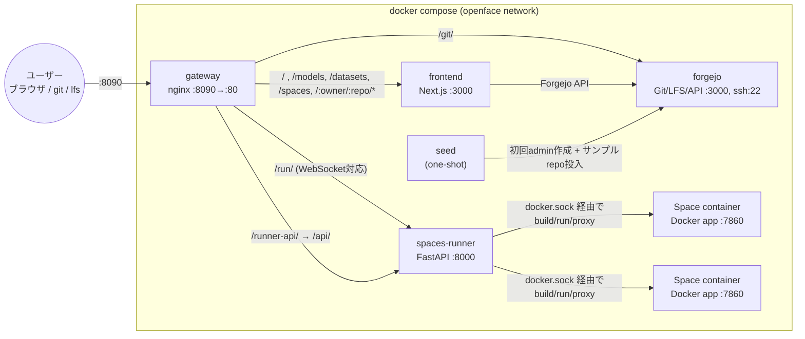

# OpenFace

セルフホスト版 HuggingFace ライクなプラットフォームです。Forgejo（Git + LFS）を土台に、HuggingFace 風の Web ポータルと、Dockerfile ベースのアプリ（Spaces）をその場でビルド・実行できるランナーを組み合わせています。`docker compose up -d --build` だけで、自分の LAN / サーバー内に「モデル・データセット・Spaces を公開できる場所」を丸ごと立ち上げられます。

<p align="center">
  
</p>

計画: Claude Fable 5 / 実装: Claude Sonnet 5

## プロジェクト概要

OpenFace は次の4つのサービスで構成されています。

| サービス | 役割 | 内部ポート |
|---|---|---|
| `gateway` | nginx リバースプロキシ（唯一の公開口） | 80 (公開: 8090) |
| `frontend` | HF風ポータル (Next.js + Tailwind) | 3000 |
| `forgejo` | 改造版 Forgejo（Git + LFS + API + 認証） | 3000 (http), 22 (ssh) |
| `spaces-runner` | Docker Space のビルド・起動・プロキシ (FastAPI + Docker SDK) | 8000 |
| `seed` | 初回起動時に admin ユーザーとサンプルrepoを作成する one-shot ジョブ | - |

リポジトリの種別（モデル / データセット / Space）は Forgejo の **topics**（`model` / `dataset` / `space`）で判定します。モデルカード・データセットカードはリポジトリ直下の `README.md`（HuggingFace互換の YAML frontmatter）をそのまま使います。

### アーキテクチャ図



## 📸 スクリーンショット

以下はローカルで起動した OpenFace の実画面です。Spaces は CPU 上で稼働し、Gradio に加えて静的 HTML、React、Vue、Next.js、Streamlit、FastAPI、Node.js などの Dockerfile ベースのアプリを同じ画面内で公開できます。

| Spaces ディレクトリ | 埋め込みアプリ |
|---|---|
|  |  |

| ホーム | リポジトリの Files 画面 |
|---|---|
|  |  |

## ⚙️ Spacesのスケーラビリティ

サービスやDBを増やさず、現在のDocker Compose・Forgejo・SQLite構成のまま、リポジトリ数が増えても一覧処理量がほぼ一定になるようにしています。

- 一覧は **48件単位**。`/spaces?page=2` の形式で前後移動できます。
- カードの閲覧数・いいね数は **1回のバッチAPI**、Docker状態は **`/runner-api/spaces` 1回**で取得します。
- Space絵文字用READMEは現在ページの最大48件だけを対象に、既定 **5分間**メモリキャッシュします。
- 同時起動は既定 **24件**。25件目を開くと自動起動し、最終アクセスが最も古いSpaceを1件だけ停止します。
- 停止中のSpaceは `Paused` ではなく **`On demand`** と表示します。

実ブラウザでの検証画像とリクエスト数の記録は [Spaces scalability verification evidence](docs/evidence/scalability/README.md) にまとめています。

## 必要要件

- Docker
- Docker Compose (v2, `docker compose` サブコマンド)

それ以外の依存関係は全て compose がビルドするコンテナ内に閉じています。

## クイックスタート

```bash
cp .env.example .env
# 必要なら .env を編集（admin資格情報、公開URLなど）

docker compose up -d --build
```

起動後、ブラウザで [http://localhost:8090](http://localhost:8090) を開いてください。

- 初期 admin ユーザーの資格情報は `.env` の `OPENFACE_ADMIN_USER` / `OPENFACE_ADMIN_PASSWORD`（デフォルト: `openface-admin` / `openface1234`。※`admin`はForgejoの予約名のため使用不可）です。初回ログイン後にパスワードを変更することを推奨します。
- `seed` サービスが初回起動時に自動的にサンプルリポジトリ（`openface/sample-model`, `openface/sample-dataset`, `openface/hello-space`）を作成します。トップページや `/models` `/datasets` `/spaces` で確認できます。

## 使い方

### モデル/データセットの公開手順

1. Forgejo の Web UI（`/git/repo/create` 、またはトップページの「新規作成」導線）でリポジトリを作成します。
2. リポジトリ設定画面から **topic** に `model` または `dataset` を追加します（これで OpenFace 上での種別が決まります）。
3. `README.md` に HuggingFace 互換の YAML frontmatter（`license`, `tags`, `pipeline_tag`, `language` など）を書くと、frontend がバッジとして表示します。
4. 大きなファイルは Git LFS でpushします。

```bash
git clone http://localhost:8090/git/<owner>/<repo>.git
cd <repo>

git lfs install
git lfs track "*.bin" "*.safetensors"
git add .gitattributes
git add model.safetensors README.md
git commit -m "add model weights"
git push origin main
```

### Spaces の作り方

1. Forgejo でリポジトリを作成し、topic に `space` を追加します。
2. リポジトリ直下に `app.py`（Gradio アプリのエントリポイント）と `requirements.txt` を置きます（`Dockerfile` を置けばそちらを優先してビルドします）。

Spaceカードの絵文字は、`README.md` のYAML frontmatterにHugging Face互換の `emoji` を設定できます。

```yaml
---
title: Realtime Voice
emoji: "🎙️"
sdk: gradio
---
```

未設定の場合はリポジトリ名・説明・topicsから絵文字を自動選択します。

```python
# app.py の最小例
import gradio as gr

def greet(name):
    return f"Hello, {name}!"

demo = gr.Interface(fn=greet, inputs="text", outputs="text")

if __name__ == "__main__":
    demo.launch()
```

```
gradio
```

3. OpenFace の該当 Space ページを開くと、停止中のSpaceは自動的にオンデマンド起動します。`spaces-runner` がリポジトリを clone → イメージビルド → コンテナ起動し、`/run/{owner}/{repo}/` 配下で埋め込み表示します。ビルドには数十秒〜数分かかることがあります（ステータスは building → running / error で確認可能）。
4. 同時起動数は `MAX_RUNNING_SPACES`（既定24）で制限されます。上限到達時は、最終アクセスが最も古いSpaceを停止してから新しいSpaceを起動します。
5. `IDLE_TIMEOUT_MINUTES` は既定0（時間による自動停止なし）です。必要な環境だけ正の分数を設定できます。

## ポート一覧

| ポート | 用途 |
|---|---|
| `8090` | gateway（Web UI・API・Git・Spaces、すべてここ経由） |
| `2222` | Forgejo への直接 SSH（`git clone ssh://git@localhost:2222/...`） |

それ以外のポート（frontend:3000, forgejo:3000, spaces-runner:8000）はコンテナネットワーク内部のみで公開されません。

## ディレクトリ構成

```
OpenFace/
├── docker-compose.yml
├── .env.example
├── README.md            # 本ファイル
├── PLAN.md              # 設計書
├── gateway/nginx.conf
├── forgejo/              # Dockerfile + custom/ (templates, assets)
├── frontend/             # Next.js アプリ
├── spaces-runner/         # FastAPI + Dockerfile（Spaceのビルド・実行・プロキシ）
├── seed/                  # seed.sh + Dockerfile（初回ブートストラップ）
└── docs/evidence/         # 実ブラウザ検証のスクリーンショットと計測記録
```

## トラブルシューティング

- **初回起動がうまくいかない / サンプルrepoが出てこない**: `docker compose logs seed` でログを確認してください。Forgejo の起動待ち・admin作成・token発行・サンプルrepo投入の各ステップがログに出力されます。
- **API tokenを再生成したい**: `seed` は `/shared/token`（共有ボリューム `shared-token`）に一度だけ書き込みます。作り直したい場合はボリュームを削除して `docker compose up -d --build` を再実行するか、Forgejo の Web UI（設定 → アプリケーション）からトークンを再発行し、`/shared/token` を手動で書き換えてください。
- **Space が起動しない / building のまま止まる**: `docker compose logs spaces-runner` を確認してください。多くの場合 `requirements.txt` の依存解決失敗か、`app.py` の実行時エラーです。`GET /runner-api/spaces/{owner}/{repo}/status` のレスポンスにエラーメッセージが入ります。
- **セキュリティ上の注意（重要）**: `spaces-runner` はホストの `/var/run/docker.sock` をマウントしており、任意の Docker イメージのビルド・実行が可能な強い権限を持っています。信頼できないユーザーにリポジトリ作成を許可する環境（`DISABLE_REGISTRATION=false`）では、実質的にホスト上で任意コード実行が可能になることを理解した上で運用してください。インターネットに直接公開せず、信頼できるLAN内での利用を強く推奨します。
- **ランナーAPIには認証がありません**: `spaces-runner` の `/api/*`（gateway経由では `/runner-api/*`）にはユーザー認証・アクセス制御が一切実装されていません。LAN内のツールとして設計されているため、外部に公開する場合は別途リバースプロキシでのIP制限やBasic認証などを追加してください。

## ライセンス

TBD
