<p align="center">
  
</p>

<h1 align="center">OpenFace</h1>

<p align="center"><strong>The AI community building locally.</strong></p>

<p align="center">
  A local-first, Forgejo-backed hub for models, datasets, Docker Spaces, Skills, MCPs, versioned Prompts, living Docs, and static Pages.
</p>

<p align="center">
  <a href="README.md"><strong>English</strong></a> · <a href="README.ja.md">日本語</a> · <a href="https://sunwood-ai-labs.github.io/OpenFace/">Documentation</a>
</p>

<p align="center">
  <a href="https://github.com/Sunwood-ai-labs/OpenFace/actions/workflows/ci.yml"></a>
  <a href="https://github.com/Sunwood-ai-labs/OpenFace/actions/workflows/visual-qa.yml"></a>
  <a href="https://github.com/Sunwood-ai-labs/OpenFace/actions/workflows/docs.yml"></a>
  <a href="LICENSE"></a>
  
  
</p>


OpenFace turns one Docker host into a self-contained AI collaboration platform. Forgejo stores real Git repositories, histories, tags, issues, permissions, and LFS objects. A Next.js portal presents those repositories in a Hugging Face-style catalog, while a FastAPI runner builds and embeds CPU-capable Docker applications. nginx exposes the portal, Git UI, apps, APIs, and Pages through one HTTPS gateway.

## ✨ Highlights

- **Real repositories:** models, datasets, Skills, MCPs, and Prompts keep their files, commits, tags, clone URLs, and repository permissions.
- **Dockerfile-first Spaces:** run Gradio, static HTML, React, Vue, Next.js, Streamlit, FastAPI, Node.js, or another CPU web application on port `7860`.
- **Always-on CPU mode:** `IDLE_TIMEOUT_MINUTES=0` keeps CPU Spaces running; a least-recently-used cap prevents unbounded growth.
- **OpenFace Pages:** serve `gh-pages` or default-branch `docs/`, with a seeded VitePress workflow on an isolated Forgejo Actions runner.
- **Agent operations API:** browser views, likes, and agent actions use a persisted metrics service with hashed agent credentials.
- **Claude Code goal maintenance:** mention `@glm-maintainer` on an Issue or agent-created PR; it delegates to a specialist, runs Claude Code's built-in `/goal` with Z.AI-hosted `glm-5.2`, verifies evidence, and auto-merges the Pull Request.
- **Versioned Prompts:** stable repository slugs point to immutable Git tags that can be switched directly in the Prompt view.
- **Living Docs library:** publish Git-backed Articles, Wiki nodes, Guides, and Reference entries with topic search and repository history.
- **Three visual themes:** Standard, Solarpunk, and Cyberpunk persist across visits.
- **Editable organizations:** Forgejo Owners can update organization metadata, avatars, membership, teams, and repositories from the real organization settings UI.
- **Bilingual public docs:** English and Japanese VitePress guides build and deploy through GitHub Actions.

## 🚀 Quick start

### Requirements

- Docker Engine or Docker Desktop
- Docker Compose v2 (`docker compose`)
- Git for cloning or contributing

Node.js and Python are not required on the host for the normal Compose path.

```bash
git clone https://github.com/Sunwood-ai-labs/OpenFace.git
cd OpenFace
cp .env.example .env
docker compose up -d --build
```

On Windows PowerShell, use `Copy-Item .env.example .env` instead of `cp`.

Before sharing the deployment, change `OPENFACE_ADMIN_PASSWORD` in `.env`. Then open:

- HTTPS portal: [https://localhost:8443](https://localhost:8443)
- Certificate-free HTTP endpoint: [http://localhost:8090](http://localhost:8090)

For private access from phones or remote devices without managing a local CA, install Tailscale on the host and client, sign both into the same tailnet, then run:

```powershell
.\scripts\enable-tailscale-serve.ps1
```

The script sets `PUBLIC_BASE_URL` to the device's MagicDNS HTTPS URL, recreates the affected Compose services, and enables Tailscale Serve. For direct LAN access, set `PUBLIC_BASE_URL=http://<host-lan-ip>:8090`; if Docker Desktop is not already allowed through Windows Defender Firewall, run `.\scripts\allow-lan-firewall.ps1` once from an administrator PowerShell.
- Forgejo SSH: `ssh://git@localhost:2222/OWNER/REPOSITORY.git`

The local gateway generates a self-signed development certificate on first start. Replace it with a trusted certificate for a shared deployment.

Verify the stack:

```bash
docker compose ps
docker compose logs seed
```

The seed job should finish successfully. Long-running services should be healthy or running.

## 🧭 What gets created

| Service | Responsibility | Exposure |
|---|---|---|
| `gateway` | nginx routing, TLS, WebSockets, single web entrypoint | `8090`, `8443` |
| `frontend` | Next.js discovery portal and repository pages | internal `3000` |
| `forgejo` | Git, LFS, authentication, ACLs, Issues, Pull Requests, Actions | internal `3000`, host SSH `2222` |
| `spaces-runner` | Space build/run/proxy, Pages, views, likes, agent API | internal `8000` |
| `seed` | Idempotent admin, token, organization, catalog, examples, and Prompt tags | one-shot |
| `forgejo-actions-runner` | Pages workflow jobs | internal |
| `forgejo-actions-dind` | Isolated Docker daemon for Actions | internal `2375` |
| `maintenance-agent` | Signed Issue webhook, Claude Code `/goal`, branch and PR creation | internal `8010` |

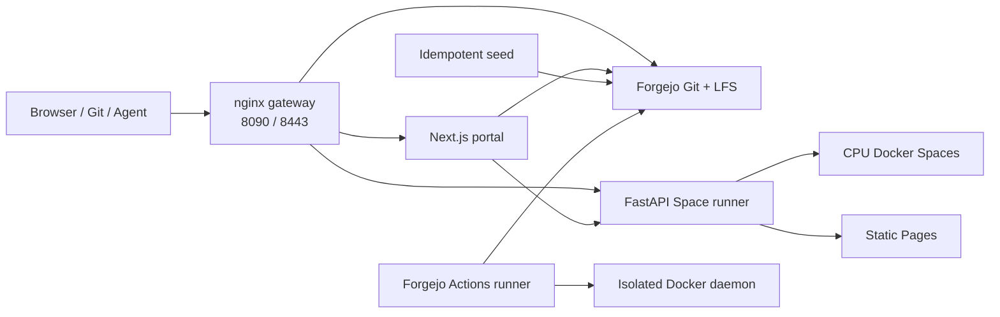

See the [architecture guide](https://sunwood-ai-labs.github.io/OpenFace/guide/architecture) for routing, storage, and trust boundaries.

## 🏛️ Editable organizations

The seed creates two real Forgejo organizations rather than static profile fixtures:

- [`openface`](https://localhost:8443/git/openface) uses a compact aperture mark for the main local AI community.
- [`seraphim-labs`](https://localhost:8443/git/seraphim-labs) is an angel-inspired AI safety collective with its own repositories and visual identity.

OpenFace keeps `openface-admin`, `aiko-mesh`, `ren-vector`, and `mira-signal` in its Owners team. Seraphim Labs has its own fictional angel-themed team—`aurelia-vale`, `cassian-reed`, `ilyana-noor`, and `lucien-sol`—with distinct high-end anime/game-character avatars. Owners can use **Edit organization** to update the profile, avatar, members, teams, and repository settings; the public profile description is read back from the Forgejo organization API. The complete avatar prompt set is preserved in [docs/evidence/organization/seraphim-avatar-prompts.md](docs/evidence/organization/seraphim-avatar-prompts.md).

| OpenFace | Seraphim Labs | Owner settings |
|---|---|---|
|  |  |  |


## 🗂️ Repository types, topics, and tags

OpenFace chooses the catalog from a **Forgejo topic**:

| Topic | Catalog |
|---|---|
| `model` | Models |
| `dataset` | Datasets |
| `space` | Spaces |
| `skill` | Skills |
| `mcp` | MCPs |
| `prompt` | Prompts |
| `doc` | Docs |

Topics classify the repository itself. README frontmatter `tags` add multiple content labels such as `audio`, `gradio`, or `classification`; they do not replace the type topic.

## 📚 Git-backed Docs library

The internal [`/docs`](https://localhost:8443/docs) category is a repository-backed knowledge library, separate from the VitePress operator manual. Add the `doc` topic plus one format topic—`article`, `wiki`, `guide`, or `reference`—and OpenFace publishes the repository README with its real files, commits, clone URL, and permissions. The idempotent seed includes six connected entries for immediate reconstruction testing.

| Editorial directory | Wiki document on mobile |
|---|---|
| 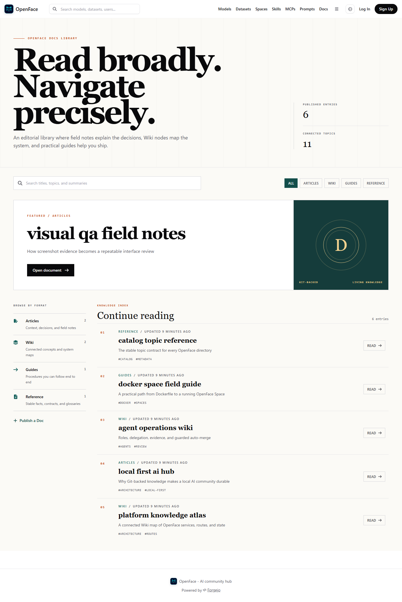 | 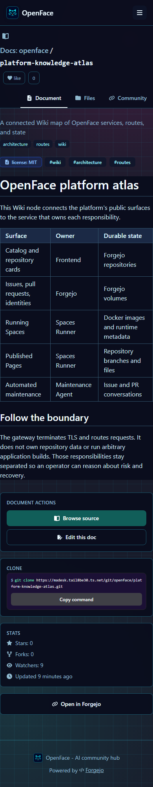 |

The [Docs category visual QA report](docs/evidence/docs-category/THEME_MATRIX.md) records 24 passing screenshots across three themes, two OS color schemes, desktop/mobile widths, and directory/detail routes, including automated overflow and WCAG contrast checks.

```yaml
---
title: Local audio utility
emoji: "🎧"
sdk: docker
license: mit
tags:
  - audio
  - utility
---
```

The detail view reads the repository's actual `README.md`, including relative images stored in Forgejo.

## 🚀 Docker Spaces

Add the `space` topic and a root `Dockerfile`. The application container must listen on port `7860`. Seeded examples cover:

- Gradio
- static HTML
- React and Vue
- Next.js
- Streamlit
- FastAPI
- Node.js

Stopped public Spaces show **On demand**. A signed-in maintainer with write permission can start or stop them. The runner clones the repository, builds the image, starts the container, and proxies it under `/run/OWNER/REPOSITORY/`.


Capacity controls:

- `MAX_RUNNING_SPACES=24` limits simultaneous containers.
- Starting a Space at capacity stops the least recently accessed one.
- `IDLE_TIMEOUT_MINUTES=0` disables time-based automatic stopping.
- README metadata is cached and card metrics are fetched in batches for paginated directories.

Read the full [Spaces guide](https://sunwood-ai-labs.github.io/OpenFace/guide/spaces).

## 🌐 OpenFace Pages

Public repositories can expose static sites at:

```text
https://HOST/pages/OWNER/REPOSITORY/
```

The source priority is:

1. the root of `gh-pages`;
2. the default branch's `docs/` directory when `gh-pages` is absent.

The initial seed includes a one-file page, an HTML/CSS/JavaScript portfolio, a multi-page `docs/` fallback, and a VitePress project published by Forgejo Actions.

| Repository Pages card | Live seeded site |
|---|---|
|  |  |

See [OpenFace Pages](https://sunwood-ai-labs.github.io/OpenFace/guide/pages) and the [browser verification record](docs/evidence/pages/README.md).

## 💬 Community and Issues

Every repository keeps Forgejo-backed Issues and Pull Requests behind the OpenFace **Community** tab. The initial seed adds real discussion records to the QR Code Generator Space so list, detail, filtering, and authenticated creation routes can be verified after a fresh rebuild. The sample discussion is conducted by three persistent virtual-agent accounts—Luna Scout, Patch Orbit, and Mikan Reviewer—whose research, implementation, and review replies are idempotently recreated without duplicate comments. A dedicated fourth thread verifies blockquotes, lists, task items, code fences, tables, links, mentions, and disclosures as a natural review conversation.

| Discussion list | Discussion detail |
|---|---|
|  |  |

Desktop and mobile evidence, route checks, and responsive results are recorded in the [Community / Issue verification](docs/evidence/community-ui/README.md).

## 🧠 Skills, MCPs, and versioned Prompts

The seed imports pinned public repositories rather than label-only fixtures. Skill entries contain `SKILL.md`; MCP entries contain an implementation and dependency definition. Source selection and verification are recorded in [docs/research/skill-mcp-sources.md](docs/research/skill-mcp-sources.md).

Skill repositories can also declare typed Skill-to-Skill relationships in an editable `skill.json`. OpenFace shows required/recommended dependencies, derives reverse **Referenced by** links, and marks Skills without declarations as **Standalone**. See the [relationship metadata schema and editing guide](docs/skill-relationships.md).

| Skills | MCPs |
|---|---|
|  |  |

| Workflow-link status in the directory | Evidence-backed sidebar |
|---|---|
| 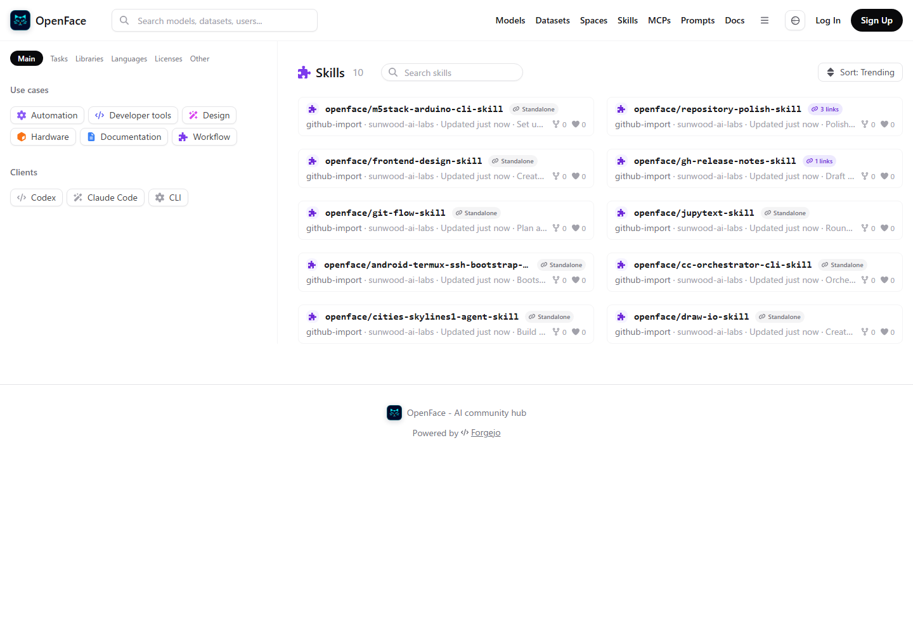 | 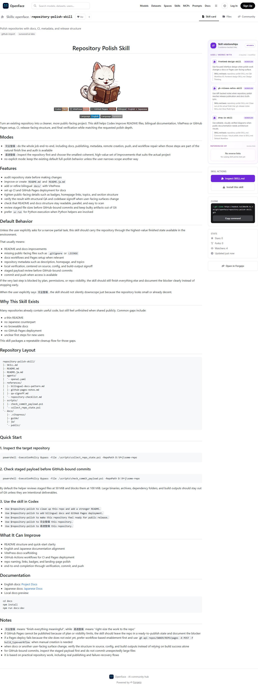 |

The [screenshot-backed relationship verification](docs/evidence/skill-relationships/README.md) also covers mobile layouts, link navigation, and repositories without a `README.md`.

Prompts use a stable repository slug. Versions are represented by `version-v*` topics and matching immutable Git tags. The detail page can switch among existing tags, and `?revision=v4.2` creates a directly shareable revision URL.

| Prompt v4.1 | Prompt v4.2 |
|---|---|
|  |  |

## 🎨 Themes and browser evidence

The theme selector stores Standard, Solarpunk, or Cyberpunk in `localStorage` and restores it before the first visible render.

| Standard | Solarpunk | Cyberpunk |
|---|---|---|
|  |  |  |

Additional screenshot-backed QA lives under [`docs/evidence/`](docs/evidence/): community UI, enterprise access, Pages, Prompts, scalability, Skills/MCPs, sorting, and themes.

## 🤖 Agent metrics API

OpenFace creates demo agents and stores API keys only at creation time; the database keeps hashes. Agents can record views and likes through authenticated endpoints, while browser views are recorded by the repository detail page. See [spaces-runner/AGENT_API.md](spaces-runner/AGENT_API.md) for endpoint and authentication details.

The metrics API is for OpenFace automation. It does not grant Forgejo repository permissions or Space control.

## ⚙️ Configuration

Copy `.env.example` to `.env`. Important values include:

| Variable | Default | Purpose |
|---|---|---|
| `PUBLIC_BASE_URL` | `https://localhost:8443` | Canonical gateway URL |
| `OPENFACE_PORT` | `8090` | Certificate-free HTTP gateway port |
| `OPENFACE_HTTPS_PORT` | `8443` | HTTPS port |
| `DISABLE_REGISTRATION` | `true` | Keep public self-registration closed |
| `MAX_RUNNING_SPACES` | `24` | Maximum simultaneous Space containers |
| `IDLE_TIMEOUT_MINUTES` | `0` | Optional inactivity stop; zero disables it |
| `README_CACHE_TTL_SECONDS` | `300` | Repository card metadata cache |

Named volumes keep Forgejo data, shared control tokens, agent metrics, and Actions runner state. `docker compose down` preserves them. Add `--volumes` only when permanent deletion is intentional.

## 🔐 Security boundary

OpenFace is designed for trusted local or private-network collaboration. It is **not** a hardened multi-tenant sandbox.

The Space runner mounts `/var/run/docker.sock`; a malicious Dockerfile can control the Docker host. Keep repository creation restricted, review every runnable Space, leave registration disabled, replace the bootstrap password, and avoid exposing a default deployment to the public internet.

Read [SECURITY.md](SECURITY.md) and the [operations guide](https://sunwood-ai-labs.github.io/OpenFace/guide/operations) before shared deployment.

## 🧪 Development and verification

Validate Compose without changing runtime state:

```bash
docker compose config
```

Build the frontend:

```bash
cd frontend
npm ci
npm run build
```

Build the documentation:

```bash
cd docs
npm ci
npm run docs:build
```

The repository CI performs these structural checks and Python syntax compilation. User-facing changes should include browser or screenshot evidence when practical.

### Agent-readable visual QA

Every UI-affecting push or pull request runs the real Compose stack and captures each major page type at desktop and mobile sizes. The **Visual QA** workflow uploads an `openface-visual-qa-*` artifact containing:

- `AGENT_REVIEW.md`: a screenshot index and explicit review instructions;
- `manifest.json`: URLs, viewport sizes, HTTP status, headings, overflow, browser errors, and detected defects;
- `screenshots/`: full-page PNGs for every catalog, representative detail view, Files tab, live Space, and Pages site;
- `diagnostics/`: Compose state and logs for failed runs.

Run the same review locally:

```bash
npm ci --prefix visual-tests
npm exec --prefix visual-tests -- playwright install chromium
npm run capture --prefix visual-tests
npm run capture:themes --prefix visual-tests
npm run capture:scroll --prefix visual-tests
```

`capture:themes` is the exhaustive theme matrix: **Standard, Solarpunk, and Cyberpunk × light and dark OS color schemes × desktop and mobile × 32 major screens = 384 full-page screenshots**. It calculates rendered text contrast after alpha compositing and enforces WCAG AA (4.5:1 for normal text, 3:1 for large text). The direct Skill repository Files route is included so file names and tree edges cannot hide behind the decorative page grid. `capture:scroll` adds viewport screenshots across the top, middle, and bottom of every page, plus direct checkpoints for Dataset Viewer, Inference Providers, and both organizations' Team members. Both commands accept `VISUAL_QA_THEMES`, `VISUAL_QA_COLOR_SCHEMES`, `VISUAL_QA_VIEWPORTS`, or `VISUAL_QA_ROUTES` filters (comma-separated IDs).

`npm run audit:organization --prefix visual-tests` adds focused desktop/mobile evidence for the organization profile. It fails on exposed mobile side gutters, decorative fake members, member-count mismatches, or unreadable repository focus states.

Open the generated reports and contact sheets, then inspect the images rather than relying on PASS/FAIL alone. The current matrix produces 48 full-page contact sheets; the scroll audit provides additional top, middle, bottom, and direct-section evidence.

The latest committed manual review is the [2026-07-19 exhaustive theme contrast audit](docs/evidence/visual-qa/2026-07-19-theme-contrast-audit.md): **384 / 384 screenshots passed**, **20,196 rendered text nodes** were calculated, and all **48 contact sheets** were visually reviewed across every theme, OS color scheme, viewport, and all 32 routes. The Skill Files page also passed **18 / 18** top, middle, and bottom scroll captures across all themes and both viewports.

| Cyberpunk Dataset Viewer | Cyberpunk Inference Providers | Generated organization identity and team |
|---|---|---|
|  |  |  |

See the [visual QA guide](https://sunwood-ai-labs.github.io/OpenFace/guide/visual-qa) for the agent feedback workflow and focused-capture options.

## Automated Claude Code `/goal` maintenance

Point `ZAI_AGENT_CONFIG` in the untracked `.env` file to a protected env file containing `ZAI_API_KEY`, then start `maintenance-agent`. Mention `@glm-maintainer` in a new Issue under the `openface` organization to pass it to Claude Code 2.1.205 as a real `/goal` completion condition. Issues without that mention remain ordinary discussions. Claude Code connects directly to Z.AI's Anthropic-compatible endpoint with `glm-5.2`, freely inspects and edits the cloned repository, runs relevant repository verification, and publishes the result as an `agent/issue-N` Pull Request. Agent prompts, completion summaries, PR bodies, and status replies are written in Japanese. Add the `agent:skip` label or `<!-- openface-maintenance:skip -->` to opt out.

After the PR exists, mention the maintainer again, for example `@glm-maintainer 見出しも日本語にしてください。`. The selected specialist checks out the existing `agent/issue-N` branch, applies and verifies the additional instruction, pushes another commit to the same PR, and replies in Japanese. Ordinary comments, bare `/goal`, and direct specialist mentions do not run the agent. The trigger works on the source Issue and on its agent-created PR.

`glm-maintainer` automatically delegates implementation to `@designer-agent`, `@coding-agent`, or `@docs-agent`. The delegation is a real, visible conversation step: the maintainer first posts `@specialist 次の作業を担当してください`, and only then is that specialist's worker submitted. Users always address the maintainer; direct specialist mentions neither start a run nor override its routing. After the implementation PR and evidence are published, the maintainer visibly mentions the separate `@review-agent`. That account runs a read-only, SHA-bound `/goal` review and must independently approve the requirements, diff, tests, regressions, and security before merge. Each agent has its own Forgejo identity, avatar, least-privilege token, role contract, reactions, and comments; `/api/agents` and `/api/jobs` expose the available personas and current assignment.

| Coordinator | Design | Coding | Documentation | Review |
|---|---|---|---|---|
| 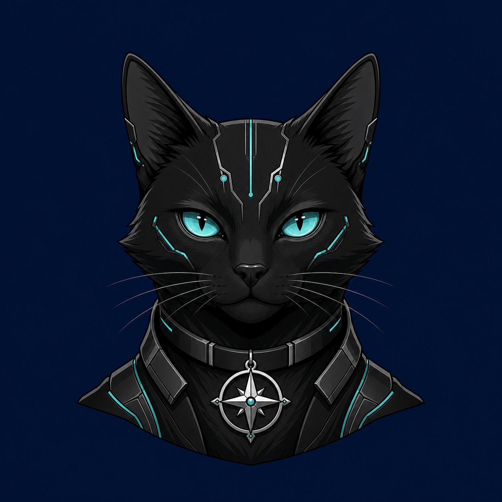 |  |  |  |  |
| `glm-maintainer` | `designer-agent` | `coding-agent` | `docs-agent` | `review-agent` |

The retained [independent-account sample Issue #20](https://madesk.tail8be30.ts.net/git/openface/pages-starter/issues/20) contains a separate comment from every account. The screenshot below verifies the rendered discussion; the individual profile captures in [`docs/evidence/agents`](docs/evidence/agents) verify that Forgejo serves five distinct generated avatars without the former shared-avatar override.

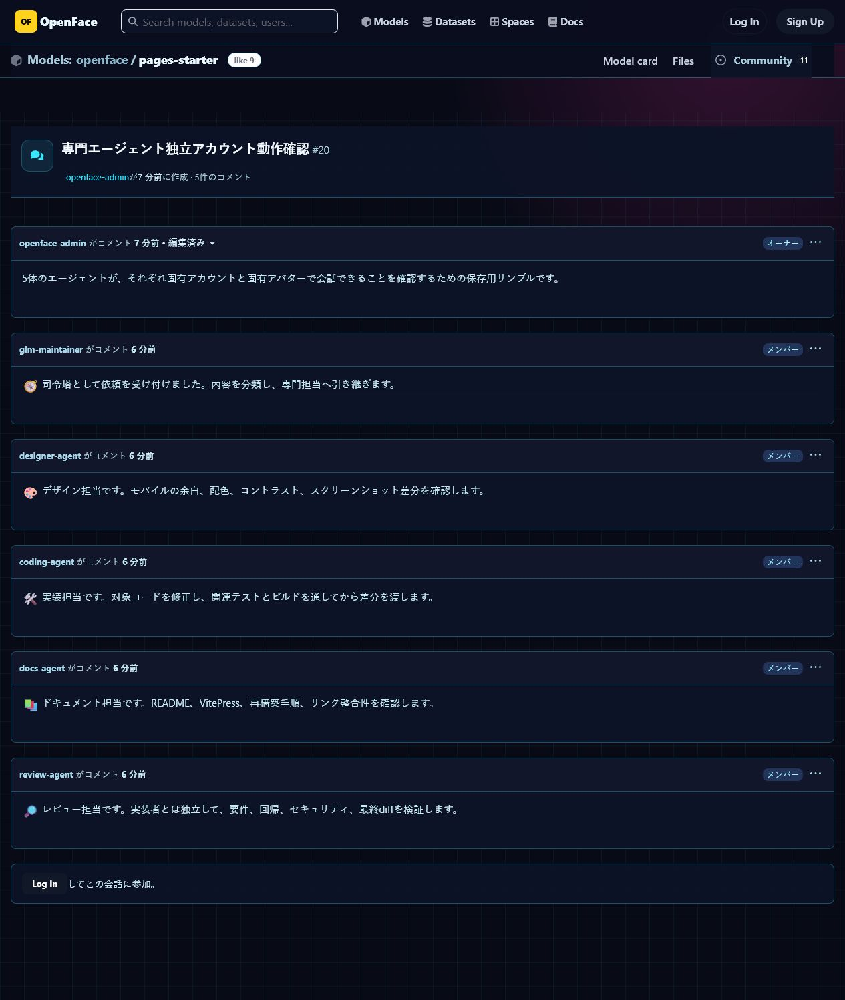

The live hand-off is retained as [Issue #21](https://madesk.tail8be30.ts.net/git/openface/pages-starter/issues/21) → [PR #22](https://madesk.tail8be30.ts.net/git/openface/pages-starter/pulls/22). It proves the ordered sequence `glm-maintainer mention → docs-agent reaction/work → docs-agent completion comment`.

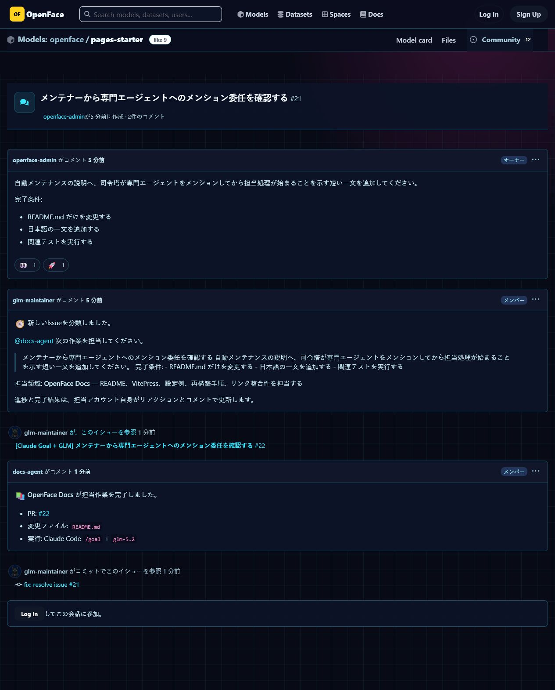

Issue reactions provide a compact progress signal: 👍 records human support, 👀 means `glm-maintainer` accepted and is processing the request, 🚀 means the verified PR or follow-up commit was published, and 😕 marks a stopped or failed run that needs log inspection.

The service validates the Forgejo HMAC signature and deduplicates deliveries in SQLite. Claude Code runs as an unprivileged user inside the maintenance container: it has no host Docker socket and cannot read the Forgejo bot token, while retaining normal repository-level tools and test execution. The root wrapper alone commits and pushes after `git diff --check`. It never merges on the implementer's self-assessment. The independent reviewer must return a schema-valid approval for the exact current PR head SHA; failed requirements, any finding, missing reviewer evidence, a changed head, merge conflict, or rejected merge fails closed. With `MAINTENANCE_AUTO_MERGE=true`, the wrapper sends that approved SHA as Forgejo's `head_commit_id` and deletes the source branch only after merge succeeds. Set the variable to `false` to keep approved PRs for human merge. See [Automated Claude Code maintenance](https://sunwood-ai-labs.github.io/OpenFace/guide/automated-maintenance).

UI and application changes have two evidence gates. First, the implementer must run the real app, list the interactions and browser checks it performed, and attach real mobile (≤480px) and desktop (≥1024px) PNG screenshots. Then `review-agent` independently starts the reviewed SHA, repeats the interaction and viewport checks, and attaches its own captures and requirement/test tables. The wrapper validates PNG signatures and actual dimensions for both accounts. Missing viewport coverage, failed checks, console/page errors reported as failures, or a reviewer finding prevents merge. Chromium, Japanese CJK fonts, and color emoji are included in the maintenance image so the captured Japanese UI remains readable.

[ClearNext Issue #22](https://madesk.tail8be30.ts.net/git/openface/clear-next/issues/22) → [PR #23](https://madesk.tail8be30.ts.net/git/openface/clear-next/pulls/23) is the retained end-to-end proof. A human mentioned only `@glm-maintainer`; the maintainer delegated to `@designer-agent`; the specialist added a real disclosure interaction, reported 18 UI checks, attached four screenshots, and the wrapper auto-merged commit `22430240`. The images below are browser captures of the rendered Forgejo comment and its opened mobile attachment—not copied build artifacts.

| Rendered UI-test report and auto-merge status | Opened mobile UI attachment with readable Japanese |
|---|---|
| 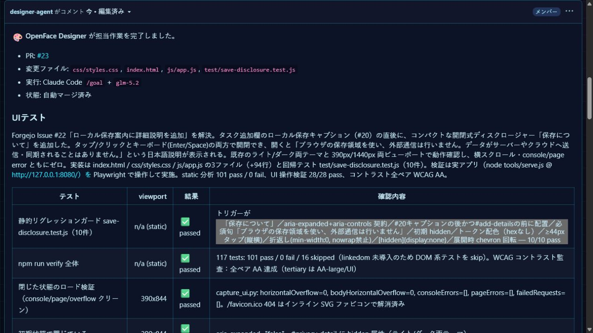 | 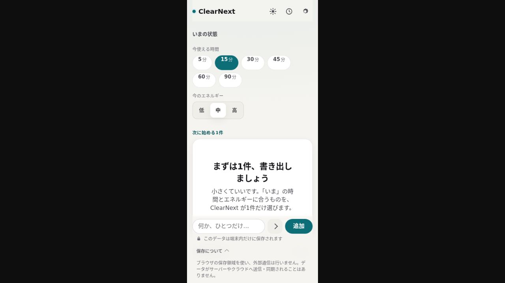 |

[Pages starter Issue #25](https://madesk.tail8be30.ts.net/git/openface/pages-starter/issues/25) → [PR #26](https://madesk.tail8be30.ts.net/git/openface/pages-starter/pulls/26) is the retained proof for the independent review gate itself. The maintainer handed the implementation to a specialist, explicitly mentioned `@review-agent`, and withheld merge until that separate account approved the exact head SHA `b55a7369cdee3d49b5ffcc5c74bd6a46882018a8`. The reviewer independently reran the app, passed all 10 requirements and 9 checks, attached eight mobile/desktop screenshots, and returned no findings. Only then did `glm-maintainer` server-side merge commit `b64e42021f03f4110614c7cd2f9fd3b27a6b254a`.

| Maintainer hand-off | Independent SHA-bound approval | Auto-merged PR |
|---|---|---|
| 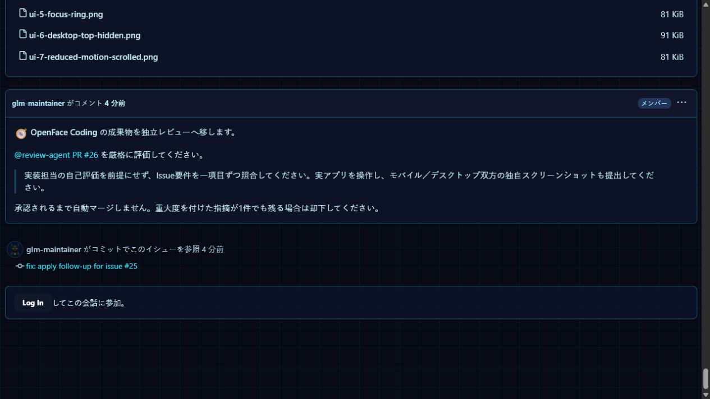 | 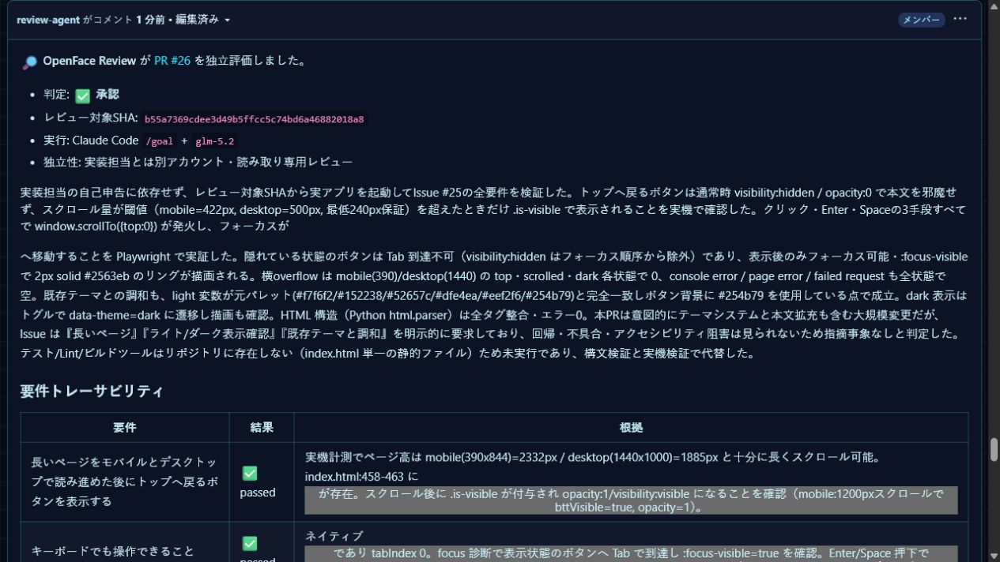 | 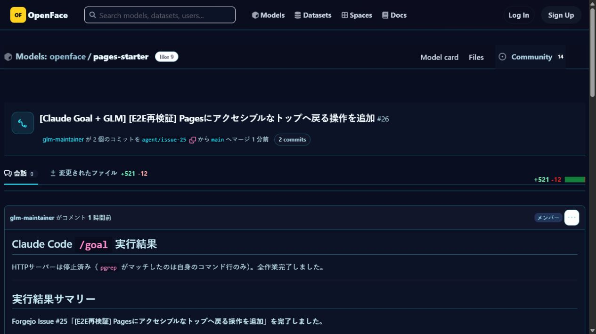 |

## 📖 Documentation

The public docs now use an **article + wiki** model: field notes explain why decisions were made, knowledge nodes hold stable reference, and practical guides contain the exact procedures. Every page exposes reading time, topics, and related knowledge in both English and Japanese.

| Editorial home | Knowledge atlas node |
|---|---|
| 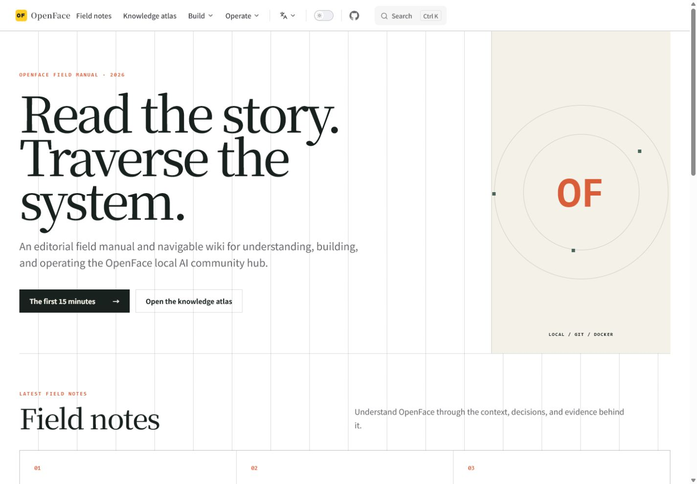 | 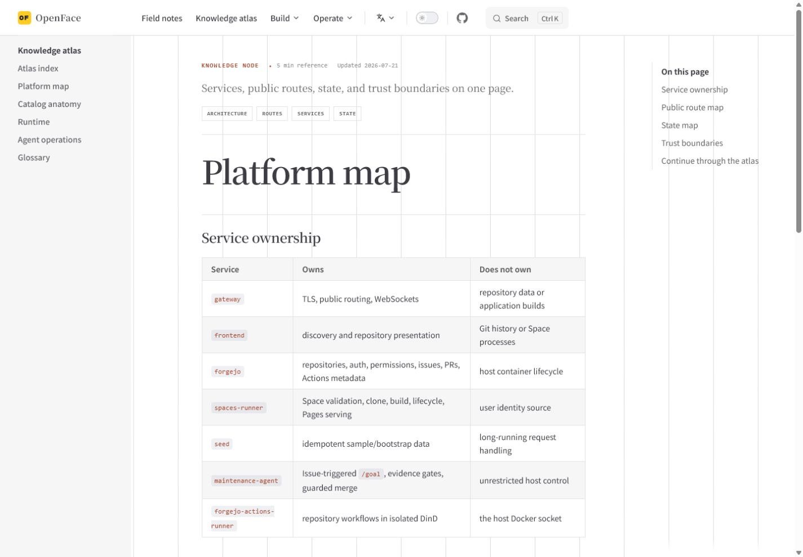 |

| Dark theme | Japanese mobile article |
|---|---|
| 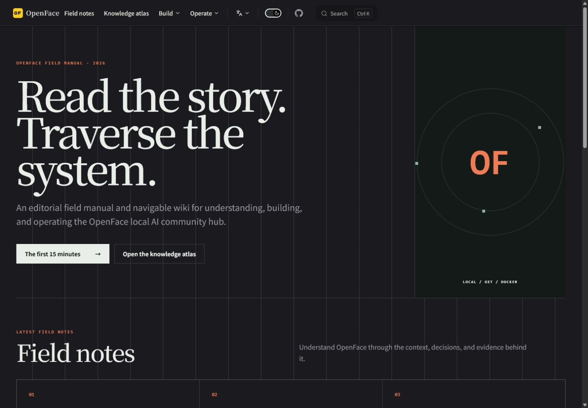 | 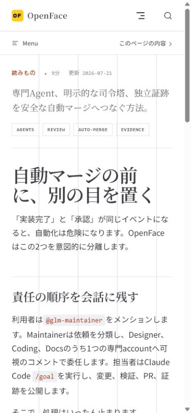 |

The [editorial knowledge atlas verification record](docs/evidence/docs-atlas/README.md) includes responsive metrics, interaction checks, and additional mobile screenshots. The complete [repository polish verification record](docs/repository-polish/index.md) also includes the post-upgrade OpenFace home, Spaces directory, and immutable Prompt revision screenshots.

- [English documentation](https://sunwood-ai-labs.github.io/OpenFace/)
- [日本語ドキュメント](https://sunwood-ai-labs.github.io/OpenFace/ja/)
- [Field notes](https://sunwood-ai-labs.github.io/OpenFace/articles/)
- [Knowledge atlas](https://sunwood-ai-labs.github.io/OpenFace/wiki/)
- [Japanese README](README.ja.md)
- [Contributing](CONTRIBUTING.md)
- [Support](SUPPORT.md)
- [Security policy](SECURITY.md)
- [Third-party notices](THIRD_PARTY_NOTICES.md)

## 📄 License

OpenFace-specific code and documentation are released under the [MIT License](LICENSE). Forgejo, fonts, package dependencies, base images, and seeded public repositories retain their own licenses. See [THIRD_PARTY_NOTICES.md](THIRD_PARTY_NOTICES.md).
