<p align="center">
  
</p>

<h1 align="center">OpenFace</h1>

<p align="center"><strong>The AI community building locally.</strong></p>

<p align="center">
  A local-first, Forgejo-backed hub for models, datasets, Docker Spaces, Skills, MCPs, versioned Prompts, and static Pages.
</p>

<p align="center">
  <a href="README.md"><strong>English</strong></a> · <a href="README.ja.md">日本語</a> · <a href="https://sunwood-ai-labs.github.io/OpenFace/">Documentation</a>
</p>

<p align="center">
  <a href="https://github.com/Sunwood-ai-labs/OpenFace/actions/workflows/ci.yml"></a>
  <a href="https://github.com/Sunwood-ai-labs/OpenFace/actions/workflows/visual-qa.yml"></a>
  <a href="https://github.com/Sunwood-ai-labs/OpenFace/actions/workflows/docs.yml"></a>
  <a href="LICENSE"></a>
  
  
</p>

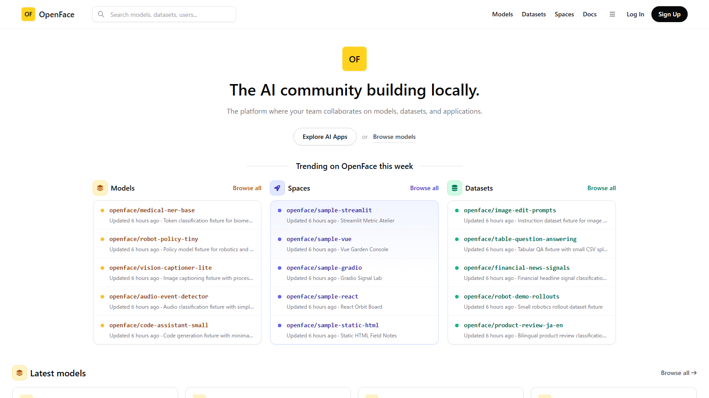

OpenFace turns one Docker host into a self-contained AI collaboration platform. Forgejo stores real Git repositories, histories, tags, issues, permissions, and LFS objects. A Next.js portal presents those repositories in a Hugging Face-style catalog, while a FastAPI runner builds and embeds CPU-capable Docker applications. nginx exposes the portal, Git UI, apps, APIs, and Pages through one HTTPS gateway.

## ✨ Highlights

- **Real repositories:** models, datasets, Skills, MCPs, and Prompts keep their files, commits, tags, clone URLs, and repository permissions.
- **Dockerfile-first Spaces:** run Gradio, static HTML, React, Vue, Next.js, Streamlit, FastAPI, Node.js, or another CPU web application on port `7860`.
- **Always-on CPU mode:** `IDLE_TIMEOUT_MINUTES=0` keeps CPU Spaces running; a least-recently-used cap prevents unbounded growth.
- **OpenFace Pages:** serve `gh-pages` or default-branch `docs/`, with a seeded VitePress workflow on an isolated Forgejo Actions runner.
- **Agent operations API:** browser views, likes, and agent actions use a persisted metrics service with hashed agent credentials.
- **Versioned Prompts:** stable repository slugs point to immutable Git tags that can be switched directly in the Prompt view.
- **Three visual themes:** Standard, Solarpunk, and Cyberpunk persist across visits.
- **Editable organizations:** Forgejo Owners can update organization metadata, avatars, membership, teams, and repositories from the real organization settings UI.
- **Bilingual public docs:** English and Japanese VitePress guides build and deploy through GitHub Actions.

## 🚀 Quick start

### Requirements

- Docker Engine or Docker Desktop
- Docker Compose v2 (`docker compose`)
- Git for cloning or contributing

Node.js and Python are not required on the host for the normal Compose path.

```bash
git clone https://github.com/Sunwood-ai-labs/OpenFace.git
cd OpenFace
cp .env.example .env
docker compose up -d --build
```

On Windows PowerShell, use `Copy-Item .env.example .env` instead of `cp`.

Before sharing the deployment, change `OPENFACE_ADMIN_PASSWORD` in `.env`. Then open:

- HTTPS portal: [https://localhost:8443](https://localhost:8443)
- Certificate-free HTTP endpoint: [http://localhost:8090](http://localhost:8090)

For private access from phones or remote devices without managing a local CA, install Tailscale on the host and client, sign both into the same tailnet, then run:

```powershell
.\scripts\enable-tailscale-serve.ps1
```

The script sets `PUBLIC_BASE_URL` to the device's MagicDNS HTTPS URL, recreates the affected Compose services, and enables Tailscale Serve. For direct LAN access, set `PUBLIC_BASE_URL=http://<host-lan-ip>:8090`; if Docker Desktop is not already allowed through Windows Defender Firewall, run `.\scripts\allow-lan-firewall.ps1` once from an administrator PowerShell.
- Forgejo SSH: `ssh://git@localhost:2222/OWNER/REPOSITORY.git`

The local gateway generates a self-signed development certificate on first start. Replace it with a trusted certificate for a shared deployment.

Verify the stack:

```bash
docker compose ps
docker compose logs seed
```

The seed job should finish successfully. Long-running services should be healthy or running.

## 🧭 What gets created

| Service | Responsibility | Exposure |
|---|---|---|
| `gateway` | nginx routing, TLS, WebSockets, single web entrypoint | `8090`, `8443` |
| `frontend` | Next.js discovery portal and repository pages | internal `3000` |
| `forgejo` | Git, LFS, authentication, ACLs, Issues, Pull Requests, Actions | internal `3000`, host SSH `2222` |
| `spaces-runner` | Space build/run/proxy, Pages, views, likes, agent API | internal `8000` |
| `seed` | Idempotent admin, token, organization, catalog, examples, and Prompt tags | one-shot |
| `forgejo-actions-runner` | Pages workflow jobs | internal |
| `forgejo-actions-dind` | Isolated Docker daemon for Actions | internal `2375` |

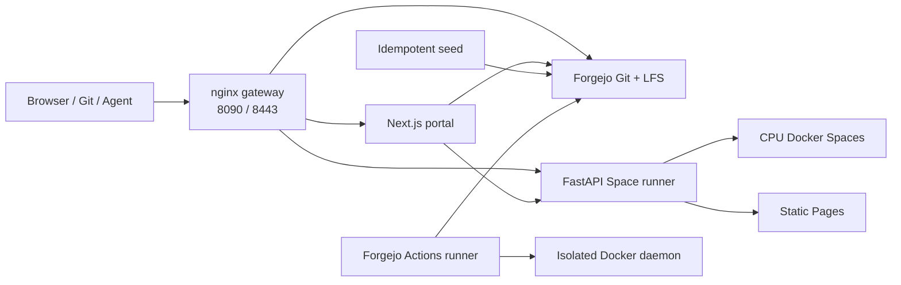
```mermaid
flowchart LR
    User["Browser / Git / Agent"] --> Gateway["nginx gateway<br/>8090 / 8443"]
    Gateway --> Frontend["Next.js portal"]
    Gateway --> Forgejo["Forgejo Git + LFS"]
    Gateway --> Runner["FastAPI Space runner"]
    Frontend --> Forgejo
    Frontend --> Runner
    Runner --> Space["CPU Docker Spaces"]
    Runner --> Pages["Static Pages"]
    Seed["Idempotent seed"] --> Forgejo
    Actions["Forgejo Actions runner"] --> Dind["Isolated Docker daemon"]
    Actions --> Forgejo
```

See the [architecture guide](https://sunwood-ai-labs.github.io/OpenFace/guide/architecture) for routing, storage, and trust boundaries.

## 🏛️ Editable organizations

The seed creates two real Forgejo organizations rather than static profile fixtures:

- [`openface`](https://localhost:8443/git/openface) uses a compact aperture mark for the main local AI community.
- [`seraphim-labs`](https://localhost:8443/git/seraphim-labs) is an angel-inspired AI safety collective with its own repositories and visual identity.

OpenFace keeps `openface-admin`, `aiko-mesh`, `ren-vector`, and `mira-signal` in its Owners team. Seraphim Labs has its own fictional angel-themed team—`aurelia-vale`, `cassian-reed`, `ilyana-noor`, and `lucien-sol`—with distinct photorealistic generated avatars. Owners can use **Edit organization** to update the profile, avatar, members, teams, and repository settings; the public profile description is read back from the Forgejo organization API. The complete avatar prompt set is preserved in [docs/evidence/organization/seraphim-avatar-prompts.md](docs/evidence/organization/seraphim-avatar-prompts.md).

| OpenFace | Seraphim Labs | Owner settings |
|---|---|---|
| 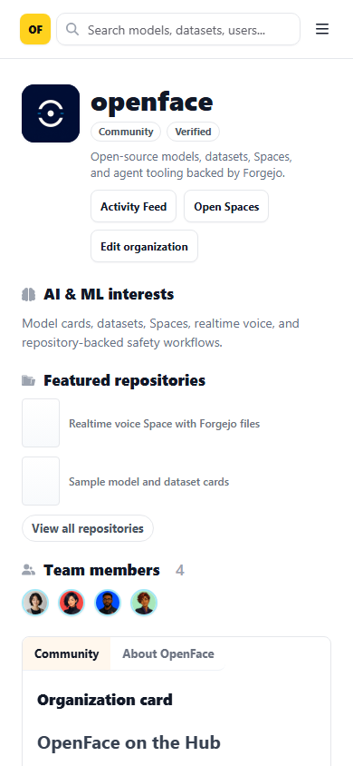 | 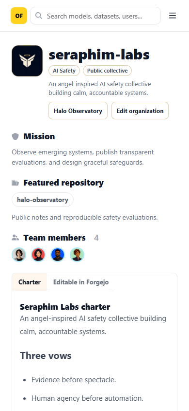 | 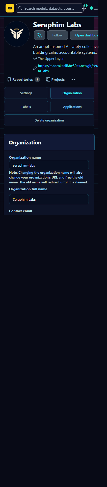 |

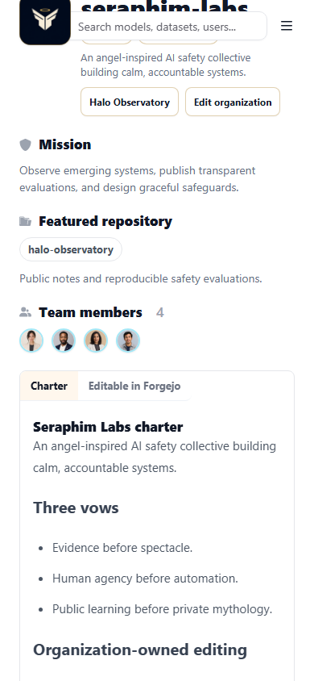


## 🗂️ Repository types, topics, and tags

OpenFace chooses the catalog from a **Forgejo topic**:

| Topic | Catalog |
|---|---|
| `model` | Models |
| `dataset` | Datasets |
| `space` | Spaces |
| `skill` | Skills |
| `mcp` | MCPs |
| `prompt` | Prompts |

Topics classify the repository itself. README frontmatter `tags` add multiple content labels such as `audio`, `gradio`, or `classification`; they do not replace the type topic.

```yaml
---
title: Local audio utility
emoji: "🎧"
sdk: docker
license: mit
tags:
  - audio
  - utility
---
```

The detail view reads the repository's actual `README.md`, including relative images stored in Forgejo.

## 🚀 Docker Spaces

Add the `space` topic and a root `Dockerfile`. The application container must listen on port `7860`. Seeded examples cover:

- Gradio
- static HTML
- React and Vue
- Next.js
- Streamlit
- FastAPI
- Node.js

Stopped public Spaces show **On demand**. A signed-in maintainer with write permission can start or stop them. The runner clones the repository, builds the image, starts the container, and proxies it under `/run/OWNER/REPOSITORY/`.

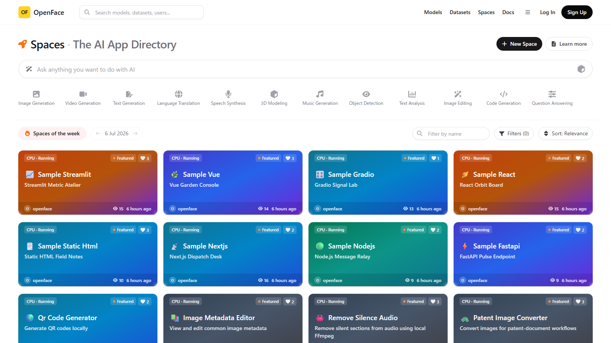

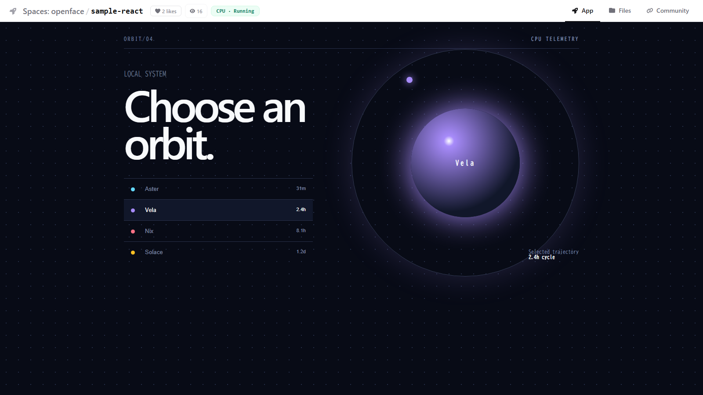

Capacity controls:

- `MAX_RUNNING_SPACES=24` limits simultaneous containers.
- Starting a Space at capacity stops the least recently accessed one.
- `IDLE_TIMEOUT_MINUTES=0` disables time-based automatic stopping.
- README metadata is cached and card metrics are fetched in batches for paginated directories.

Read the full [Spaces guide](https://sunwood-ai-labs.github.io/OpenFace/guide/spaces).

## 🌐 OpenFace Pages

Public repositories can expose static sites at:

```text
https://HOST/pages/OWNER/REPOSITORY/
```

The source priority is:

1. the root of `gh-pages`;
2. the default branch's `docs/` directory when `gh-pages` is absent.

The initial seed includes a one-file page, an HTML/CSS/JavaScript portfolio, a multi-page `docs/` fallback, and a VitePress project published by Forgejo Actions.

| Repository Pages card | Live seeded site |
|---|---|
| 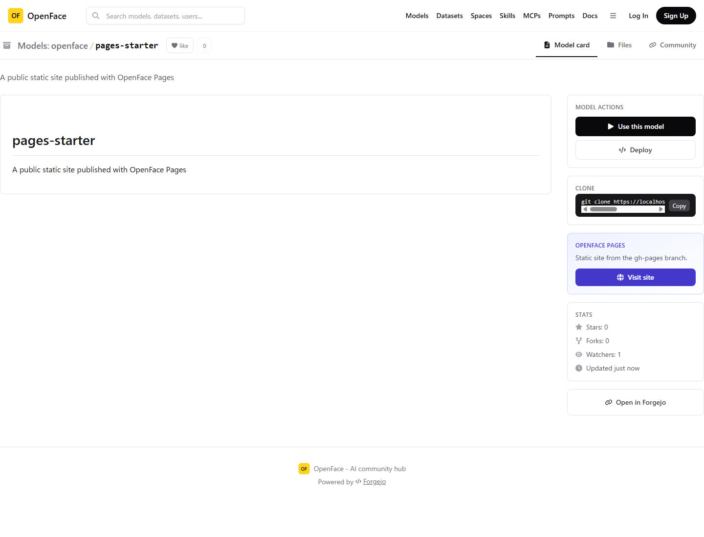 | 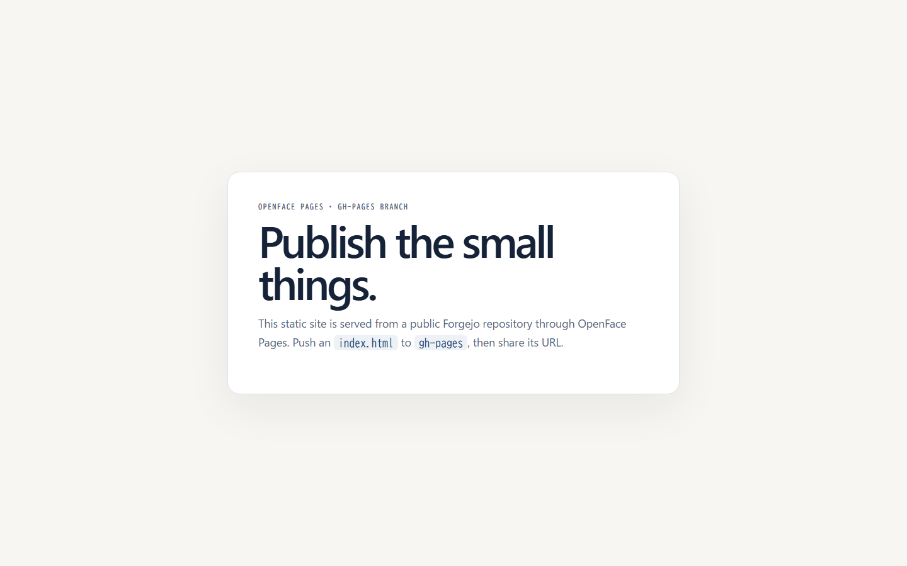 |

See [OpenFace Pages](https://sunwood-ai-labs.github.io/OpenFace/guide/pages) and the [browser verification record](docs/evidence/pages/README.md).

## 💬 Community and Issues

Every repository keeps Forgejo-backed Issues and Pull Requests behind the OpenFace **Community** tab. The initial seed adds real discussion records to the QR Code Generator Space so list, detail, filtering, and authenticated creation routes can be verified after a fresh rebuild. The sample discussion is conducted by three persistent virtual-agent accounts—Luna Scout, Patch Orbit, and Mikan Reviewer—whose research, implementation, and review replies are idempotently recreated without duplicate comments. A dedicated fourth thread verifies blockquotes, lists, task items, code fences, tables, links, mentions, and disclosures as a natural review conversation.

| Discussion list | Discussion detail |
|---|---|
| 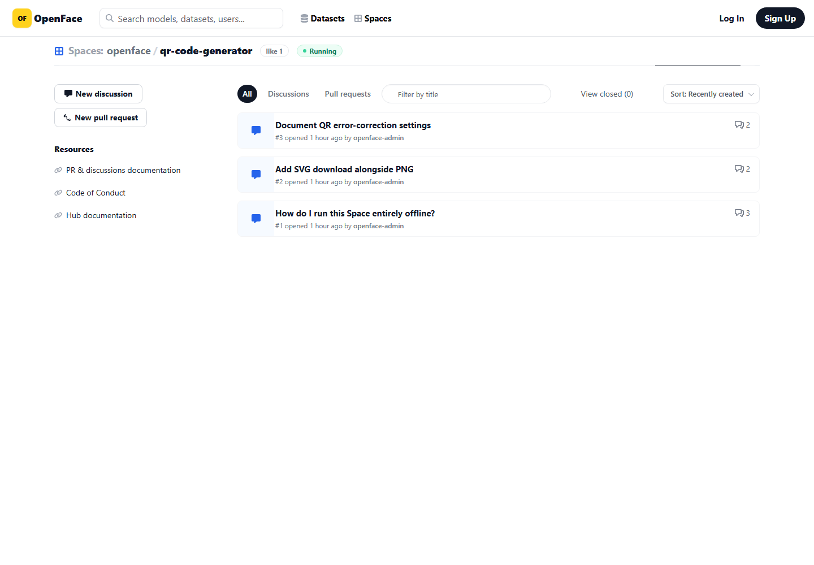 | 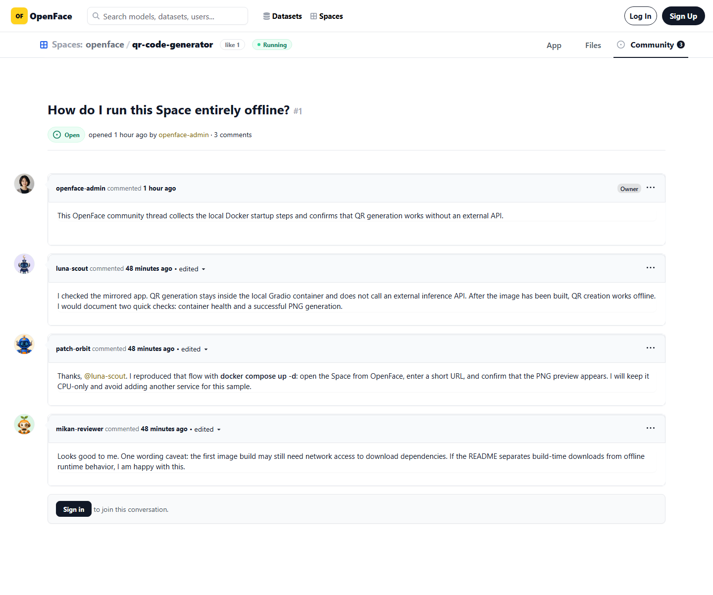 |

Desktop and mobile evidence, route checks, and responsive results are recorded in the [Community / Issue verification](docs/evidence/community-ui/README.md).

## 🧠 Skills, MCPs, and versioned Prompts

The seed imports pinned public repositories rather than label-only fixtures. Skill entries contain `SKILL.md`; MCP entries contain an implementation and dependency definition. Source selection and verification are recorded in [docs/research/skill-mcp-sources.md](docs/research/skill-mcp-sources.md).

| Skills | MCPs |
|---|---|
| 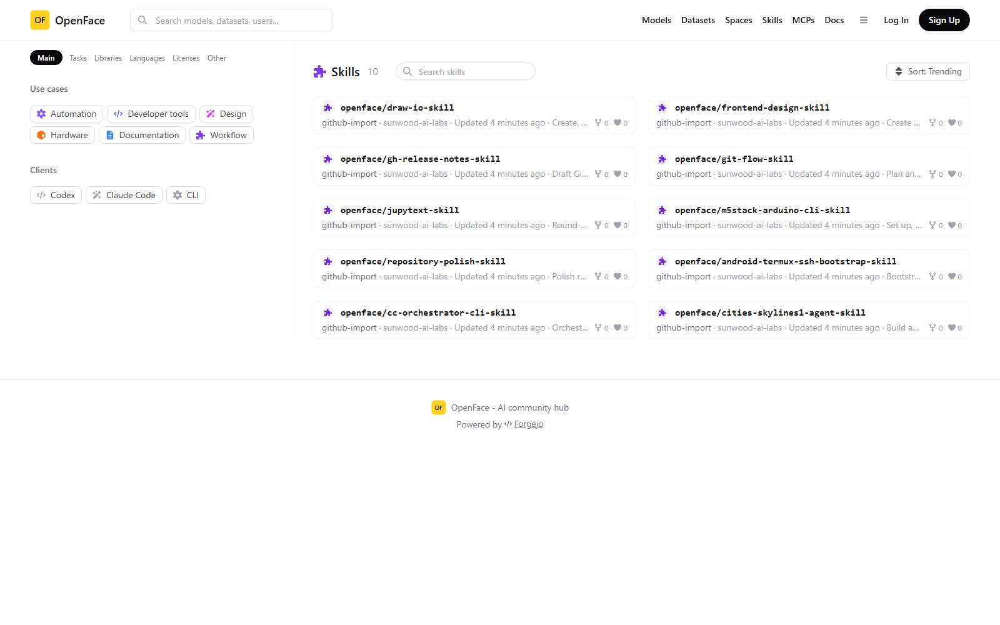 | 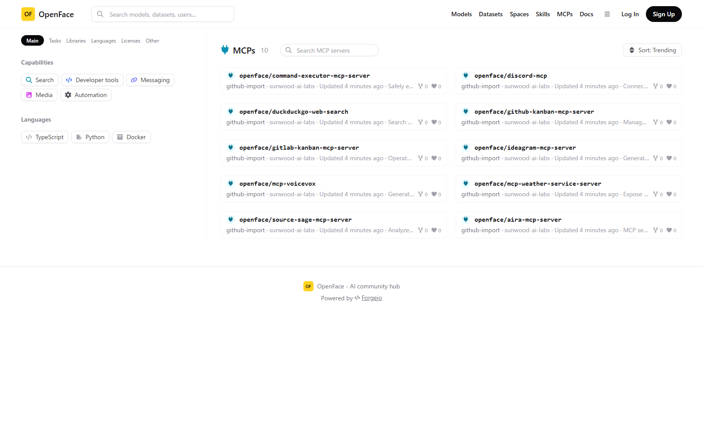 |

Prompts use a stable repository slug. Versions are represented by `version-v*` topics and matching immutable Git tags. The detail page can switch among existing tags, and `?revision=v4.2` creates a directly shareable revision URL.

| Prompt v4.1 | Prompt v4.2 |
|---|---|
| 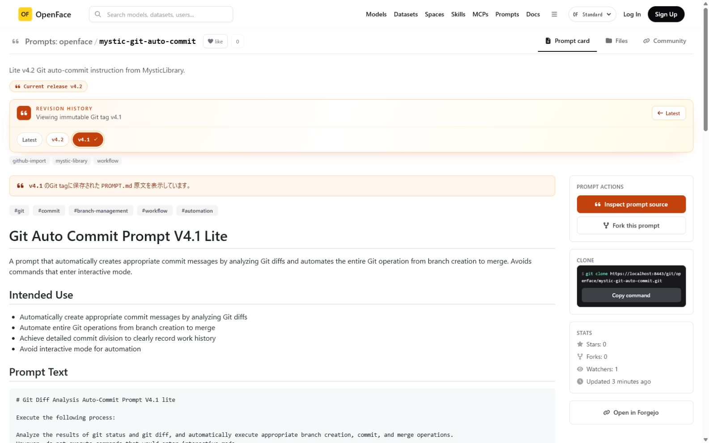 | 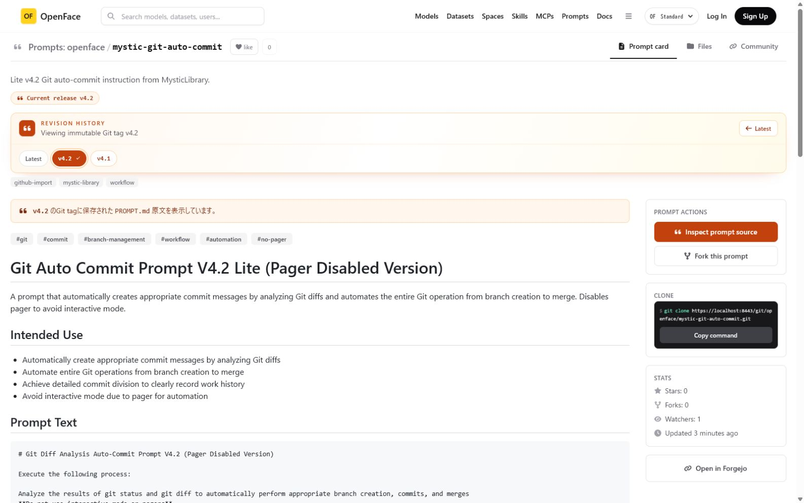 |

## 🎨 Themes and browser evidence

The theme selector stores Standard, Solarpunk, or Cyberpunk in `localStorage` and restores it before the first visible render.

| Standard | Solarpunk | Cyberpunk |
|---|---|---|
|  |  |  |

Additional screenshot-backed QA lives under [`docs/evidence/`](docs/evidence/): community UI, enterprise access, Pages, Prompts, scalability, Skills/MCPs, sorting, and themes.

## 🤖 Agent metrics API

OpenFace creates demo agents and stores API keys only at creation time; the database keeps hashes. Agents can record views and likes through authenticated endpoints, while browser views are recorded by the repository detail page. See [spaces-runner/AGENT_API.md](spaces-runner/AGENT_API.md) for endpoint and authentication details.

The metrics API is for OpenFace automation. It does not grant Forgejo repository permissions or Space control.

## ⚙️ Configuration

Copy `.env.example` to `.env`. Important values include:

| Variable | Default | Purpose |
|---|---|---|
| `PUBLIC_BASE_URL` | `https://localhost:8443` | Canonical gateway URL |
| `OPENFACE_PORT` | `8090` | Certificate-free HTTP gateway port |
| `OPENFACE_HTTPS_PORT` | `8443` | HTTPS port |
| `DISABLE_REGISTRATION` | `true` | Keep public self-registration closed |
| `MAX_RUNNING_SPACES` | `24` | Maximum simultaneous Space containers |
| `IDLE_TIMEOUT_MINUTES` | `0` | Optional inactivity stop; zero disables it |
| `README_CACHE_TTL_SECONDS` | `300` | Repository card metadata cache |

Named volumes keep Forgejo data, shared control tokens, agent metrics, and Actions runner state. `docker compose down` preserves them. Add `--volumes` only when permanent deletion is intentional.

## 🔐 Security boundary

OpenFace is designed for trusted local or private-network collaboration. It is **not** a hardened multi-tenant sandbox.

The Space runner mounts `/var/run/docker.sock`; a malicious Dockerfile can control the Docker host. Keep repository creation restricted, review every runnable Space, leave registration disabled, replace the bootstrap password, and avoid exposing a default deployment to the public internet.

Read [SECURITY.md](SECURITY.md) and the [operations guide](https://sunwood-ai-labs.github.io/OpenFace/guide/operations) before shared deployment.

## 🧪 Development and verification

Validate Compose without changing runtime state:

```bash
docker compose config
```

Build the frontend:

```bash
cd frontend
npm ci
npm run build
```

Build the documentation:

```bash
cd docs
npm ci
npm run docs:build
```

The repository CI performs these structural checks and Python syntax compilation. User-facing changes should include browser or screenshot evidence when practical.

### Agent-readable visual QA

Every UI-affecting push or pull request runs the real Compose stack and captures each major page type at desktop and mobile sizes. The **Visual QA** workflow uploads an `openface-visual-qa-*` artifact containing:

- `AGENT_REVIEW.md`: a screenshot index and explicit review instructions;
- `manifest.json`: URLs, viewport sizes, HTTP status, headings, overflow, browser errors, and detected defects;
- `screenshots/`: full-page PNGs for every catalog, representative detail view, Files tab, live Space, and Pages site;
- `diagnostics/`: Compose state and logs for failed runs.

Run the same review locally:

```bash
npm ci --prefix visual-tests
npm exec --prefix visual-tests -- playwright install chromium
npm run capture --prefix visual-tests
npm run capture:themes --prefix visual-tests
npm run capture:scroll --prefix visual-tests
```

`capture:themes` is the exhaustive theme matrix: **Standard, Solarpunk, and Cyberpunk × desktop and mobile × 30 major screens = 180 full-page screenshots**. `capture:scroll` adds **564 viewport screenshots** across the top, middle, and bottom of every page, plus direct checkpoints for Dataset Viewer, Inference Providers, and both organizations' Team members. It detects light-theme surfaces leaking into Cyberpunk even when they only appear after scrolling. Both commands accept `VISUAL_QA_THEMES`, `VISUAL_QA_VIEWPORTS`, or `VISUAL_QA_ROUTES` filters (comma-separated IDs).

`npm run audit:organization --prefix visual-tests` adds focused desktop/mobile evidence for the organization profile. It fails on exposed mobile side gutters, decorative fake members, member-count mismatches, or unreadable repository focus states.

Open the generated reports and contact sheets, then inspect the images rather than relying on PASS/FAIL alone. The current matrix produces 24 full-page contact sheets; the scroll audit produces 66 more.

| Cyberpunk Dataset Viewer | Cyberpunk Inference Providers | Generated organization identity and team |
|---|---|---|
| 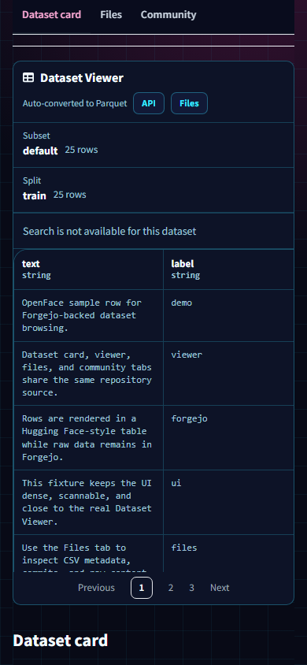 | 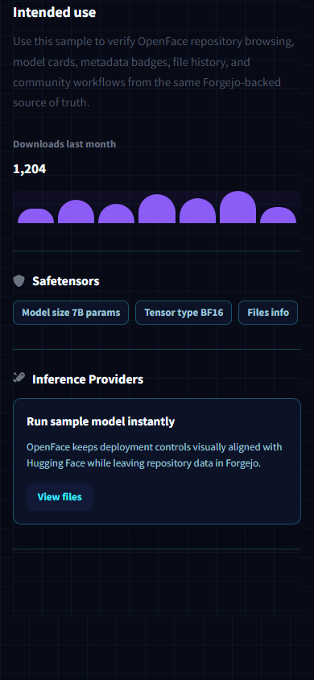 | 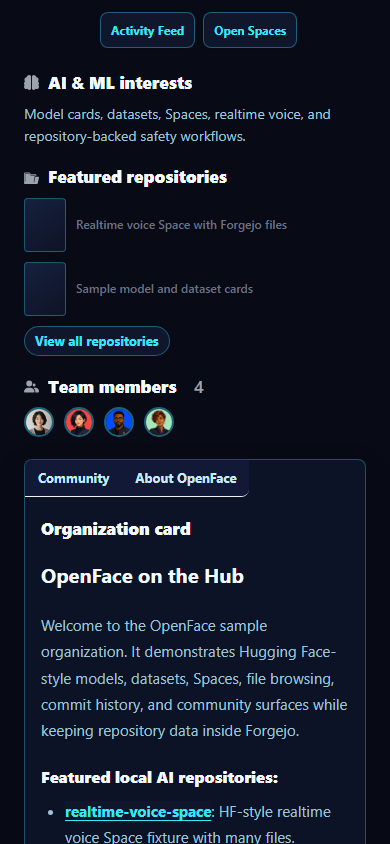 |

See the [visual QA guide](https://sunwood-ai-labs.github.io/OpenFace/guide/visual-qa) for the agent feedback workflow and focused-capture options.

## 📖 Documentation

| Published English Docs | Published Japanese Docs |
|---|---|
| 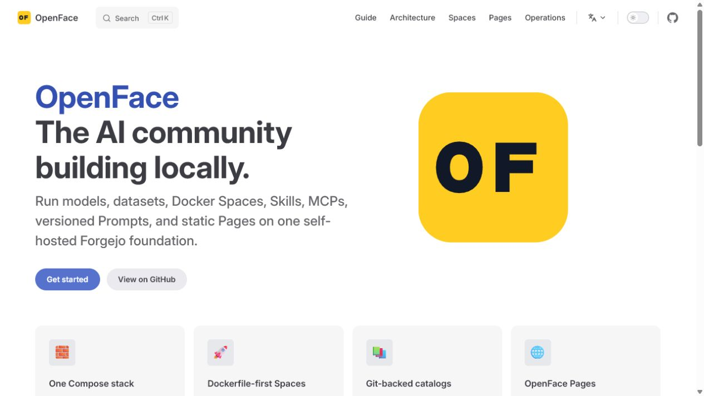 | 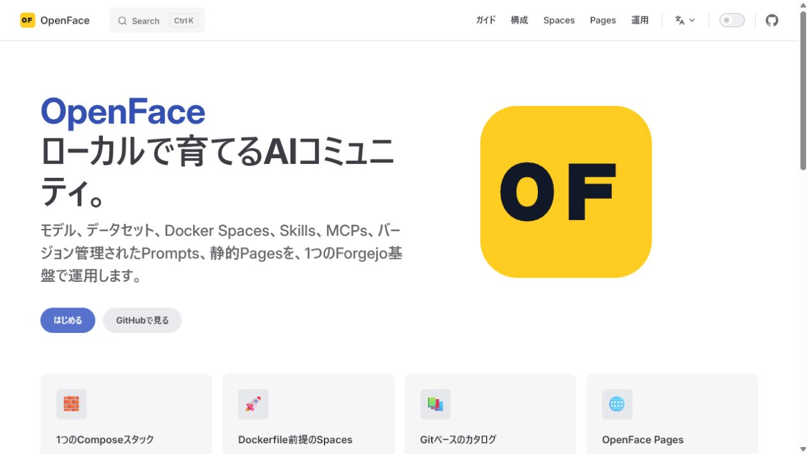 |

The complete [repository polish verification record](docs/repository-polish/index.md) also includes the post-upgrade OpenFace home, Spaces directory, and immutable Prompt revision screenshots.

- [English documentation](https://sunwood-ai-labs.github.io/OpenFace/)
- [日本語ドキュメント](https://sunwood-ai-labs.github.io/OpenFace/ja/)
- [Japanese README](README.ja.md)
- [Contributing](CONTRIBUTING.md)
- [Support](SUPPORT.md)
- [Security policy](SECURITY.md)
- [Third-party notices](THIRD_PARTY_NOTICES.md)

## 📄 License

OpenFace-specific code and documentation are released under the [MIT License](LICENSE). Forgejo, fonts, package dependencies, base images, and seeded public repositories retain their own licenses. See [THIRD_PARTY_NOTICES.md](THIRD_PARTY_NOTICES.md).
