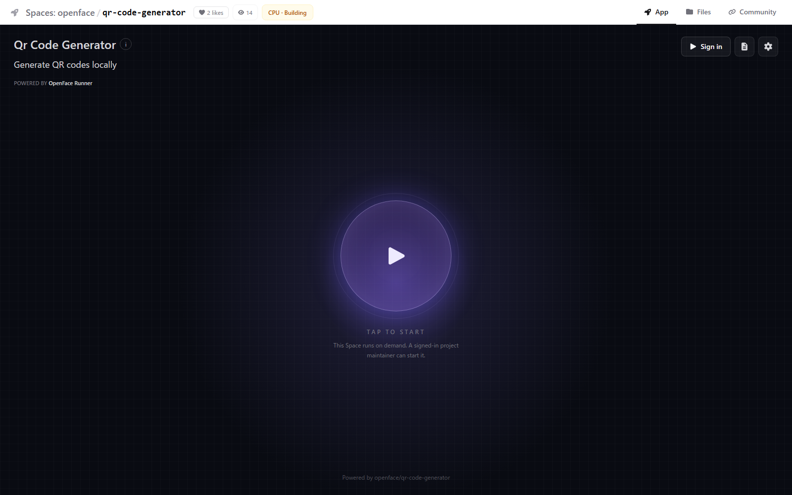

# Enterprise access control

OpenFace uses Forgejo as the source of truth for repository membership.  The public catalog only exposes public repositories; Space execution is deliberately restricted further.

| Use case | Expected result | Verification |
| --- | --- | --- |
| Visitor / unauthenticated employee | Can browse public Spaces but cannot start or stop one. | `POST /api/spaces/.../start` returns **401**. |
| Project viewer | Can inspect the public repository but cannot consume runner capacity. | A Forgejo collaborator with `read` access receives **403**. |
| Project maintainer | Can start and stop the public CPU Space attached to their project. | A collaborator with `write` access receives **200** and the runner enters `building` / `running`. |
| Confidential project | Is not listed in OpenFace's public catalog and cannot be executed by the shared runner. | Private Space start is rejected (**403** through control API, **404** at runner verification). |

The browser-facing control API validates the Forgejo session through its read-only new-file permission page; Forgejo's REST API intentionally does not accept browser session cookies. The runner accepts management requests only from this internal control API through a shared control token.

Private Space execution is intentionally disabled by `OPENFACE_ALLOW_PRIVATE_SPACES=false`. For confidential code, keep the repository private and use Forgejo's native team/repository ACL. Enabling private execution needs an identity-aware app proxy and a dedicated runner isolation design; it is not enabled by this local deployment.

## Browser evidence

The stopped CPU Space visibly states that a signed-in project maintainer is required before it can be started.

