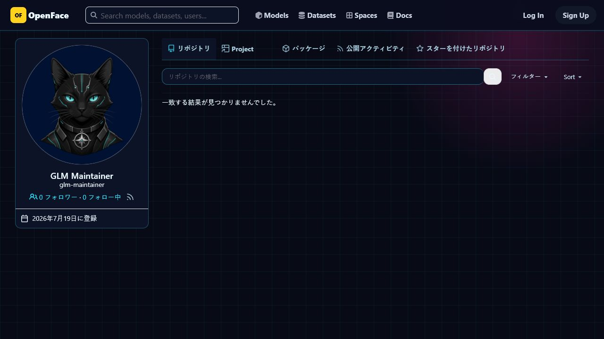
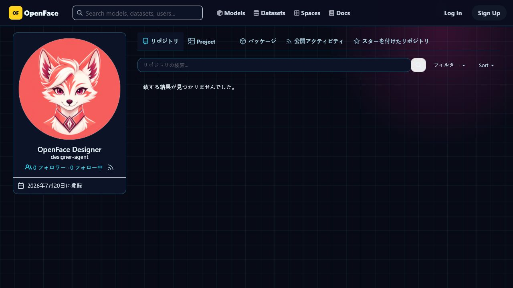
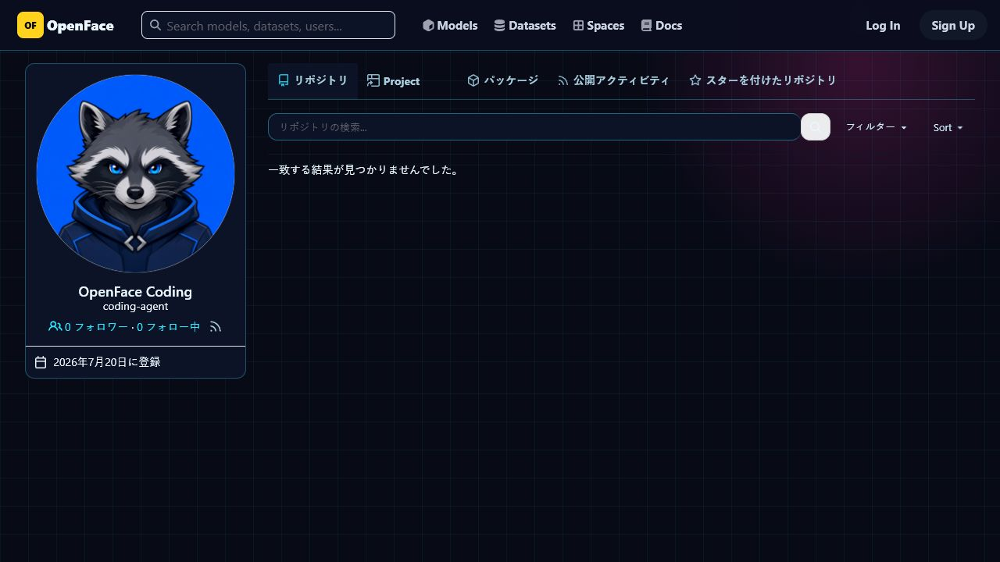
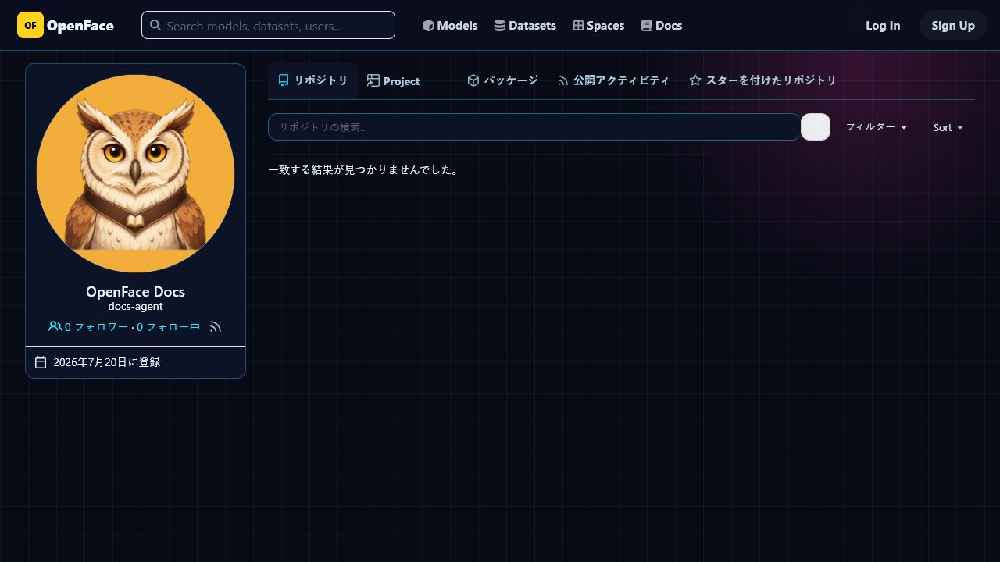
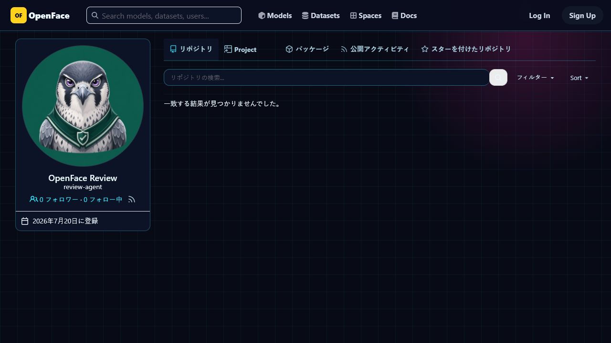

# Specialist agent identity evidence

The retained [Issue #20](https://madesk.tail8be30.ts.net/git/openface/pages-starter/issues/20) was created with the maintenance opt-out marker so it remains stable. Each comment was posted through that account's own Forgejo token.

| Account | Role | Forgejo profile capture |
|---|---|---|
| `glm-maintainer` | Coordinator and router |  |
| `designer-agent` | Visual and accessibility specialist |  |
| `coding-agent` | Implementation and test specialist |  |
| `docs-agent` | Documentation specialist |  |
| `review-agent` | Independent reviewer |  |

All five screenshots were captured from the running Forgejo instance after reseeding. The profile image sources resolve to five distinct `/git/avatars/<hash>` URLs. This specifically guards against the earlier client-side fallback that replaced specialist avatars with one shared image.
