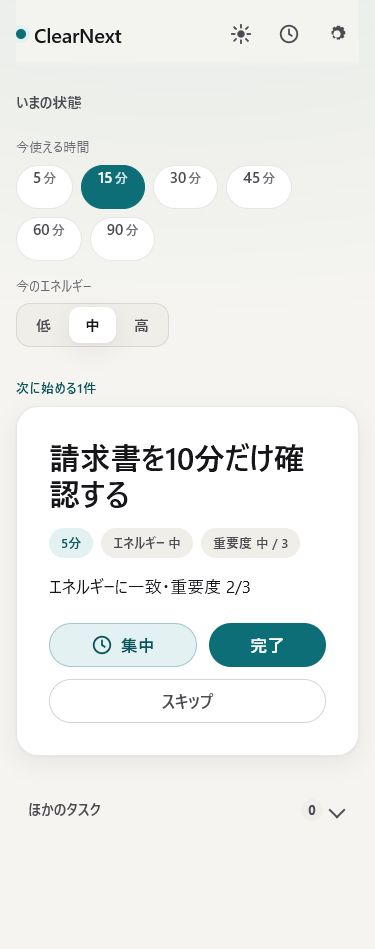
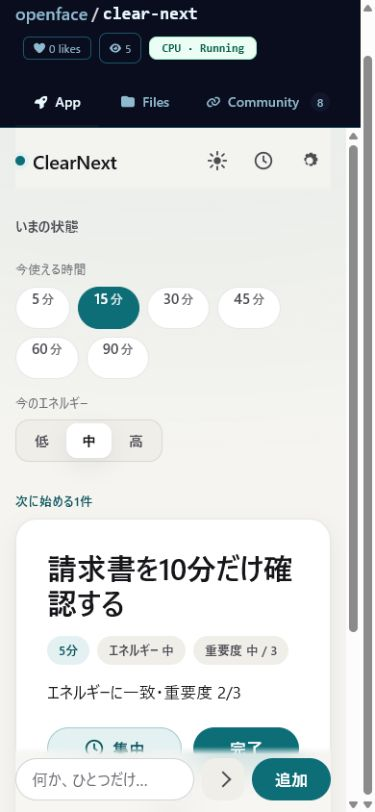
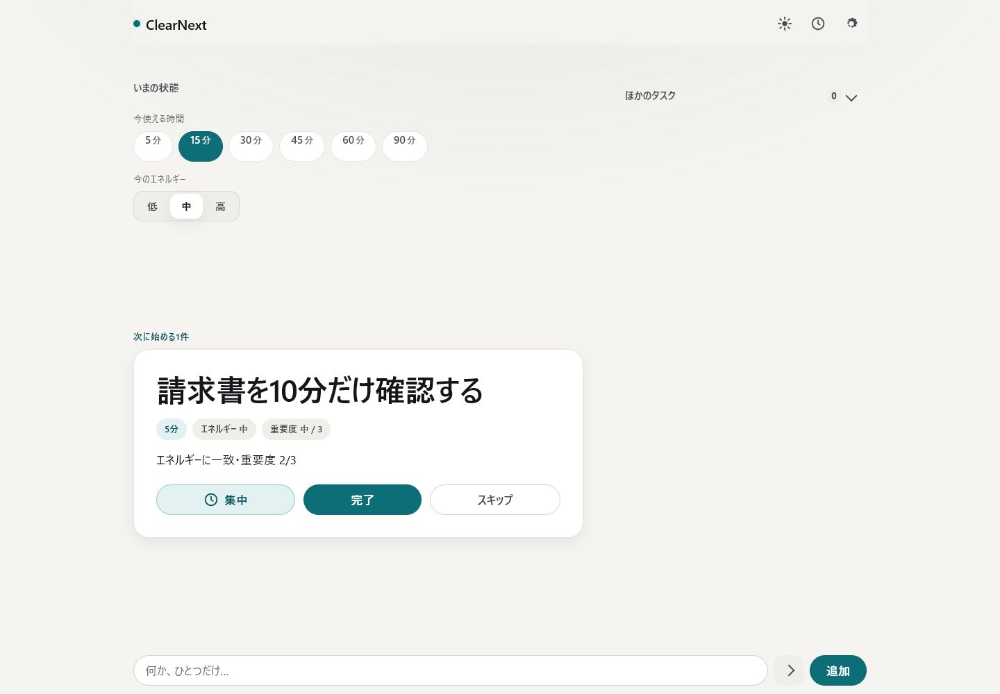
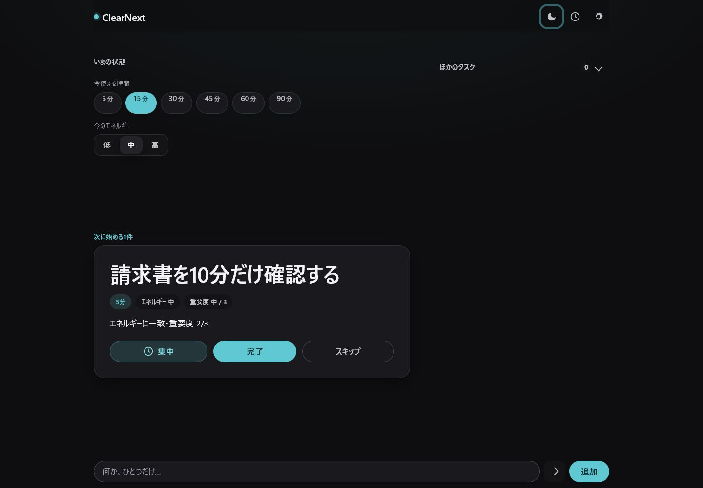

# ClearNext 自動メンテナンス E2E

OpenFace の自動メンテナンス機構を使い、空の公開リポジトリからローカル完結アプリ **ClearNext** を設計・実装・検証・公開した実証記録です。

- Forgejo: [openface/clear-next](https://madesk.tail8be30.ts.net/git/openface/clear-next)
- OpenFace Space: [openface/clear-next](https://madesk.tail8be30.ts.net/openface/clear-next)
- Runner: [ClearNext live app](https://madesk.tail8be30.ts.net/run/openface/clear-next/)

## 実行チェーン

各作業は日本語 Issue から独立した専門エージェントへ委任しました。初回Design PR #2は自動マージ導入前のため手動でマージし、機構を有効化した後のPR #4〜#16は検証成功後に自動マージしました。

| Issue | 担当 | PR | merge commit | 結果 |
|---|---|---|---|---|
| [#1 Design](https://madesk.tail8be30.ts.net/git/openface/clear-next/issues/1) | designer-agent | [#2](https://madesk.tail8be30.ts.net/git/openface/clear-next/pulls/2) | `f83cd146` | Apple HIG を基準に体験設計（手動マージ） |
| [#3 実装](https://madesk.tail8be30.ts.net/git/openface/clear-next/issues/3) | docs-agent | [#4](https://madesk.tail8be30.ts.net/git/openface/clear-next/pulls/4) | `5d414ed1` | ローカル完結アプリを実装 |
| [#5 品質](https://madesk.tail8be30.ts.net/git/openface/clear-next/issues/5) | coding-agent | [#6](https://madesk.tail8be30.ts.net/git/openface/clear-next/pulls/6) | `d1fcf28d` | Windows / Linux の検証を統一 |
| [#7 Windows修正](https://madesk.tail8be30.ts.net/git/openface/clear-next/issues/7) | coding-agent | [#8](https://madesk.tail8be30.ts.net/git/openface/clear-next/pulls/8) | `1f0b4d68` | 開発サーバーの403を修正 |
| [#9 Runner統合](https://madesk.tail8be30.ts.net/git/openface/clear-next/issues/9) | coding-agent | [#10](https://madesk.tail8be30.ts.net/git/openface/clear-next/pulls/10) | `4c869376` | Docker内部portを7860へ統一 |
| [#11 モバイル修正](https://madesk.tail8be30.ts.net/git/openface/clear-next/issues/11) | designer-agent | [#12](https://madesk.tail8be30.ts.net/git/openface/clear-next/pulls/12) | `c1075b0f` | 横overflowを解消 |
| [#13 公開文書](https://madesk.tail8be30.ts.net/git/openface/clear-next/issues/13) | docs-agent | [#14](https://madesk.tail8be30.ts.net/git/openface/clear-next/pulls/14) | `2c1b86b3` | README・MIT License・実画面を整備 |
| [#15 独立レビュー](https://madesk.tail8be30.ts.net/git/openface/clear-next/issues/15) | review-agent | [#16](https://madesk.tail8be30.ts.net/git/openface/clear-next/pulls/16) | `532d1b9b` | 実装担当とは別アカウントで最終監査 |

## 実画面

### モバイル・ライト

### OpenFace Space 埋め込み・モバイル

### デスクトップ・ライト

### デスクトップ・ダーク

## 手元での独立検証

- `npm ci && npm run verify`: 84 tests、fail 0、skip 0
- WCAG AA コントラスト監査: 全13組合格
- Docker build: 成功
- Docker healthcheck: `healthy`
- `/healthz`: HTTP 200
- 実ブラウザ: タスク追加、推薦、設定、集中タイマー、テーマ切替を操作
- モバイル / デスクトップ: `scrollWidth == clientWidth`
- ブラウザ console: error / warning 0件

スクリーンショットはダミー画像ではなく、OpenFace Runner が配信する実アプリを撮影しています。
