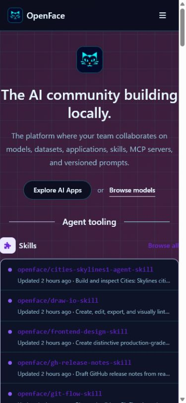
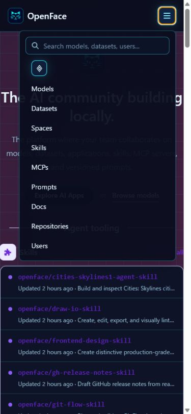
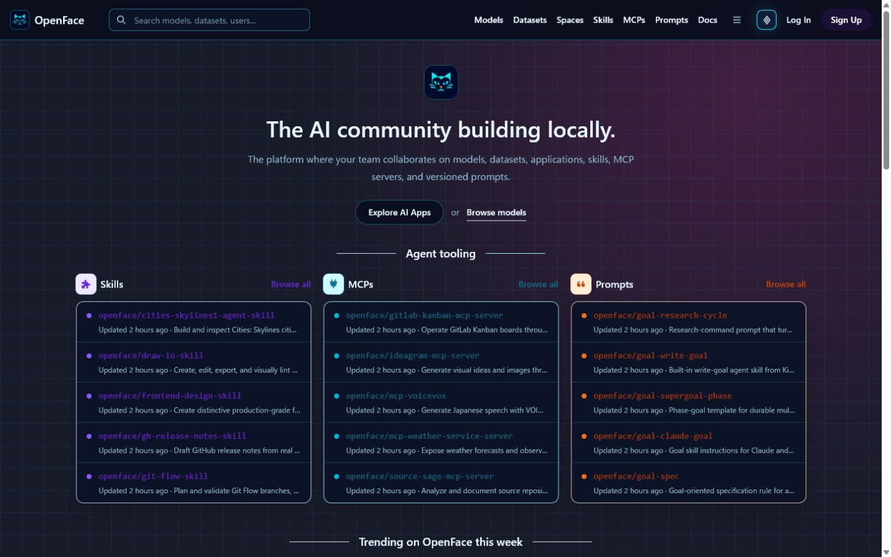

# Image-generated OpenFace cat logo

OpenFace uses an AI-generated cat-face mark as its platform identity. The same
source asset is used for the navbar, hero mark, favicon, and Apple touch icon so
the brand remains recognizable from 24 px upward.

## Generation

- Mode: built-in image generation
- Use case: logo / brand identity
- Source asset: `frontend/public/brand/openface-cat-logo.png`

### Prompt

> Create a world-class, memorable logo icon for a platform named OpenFace,
> themed around a cat face. The icon itself must contain no letters and no
> words. Use a highly simplified, confident cat face built from bold geometric
> shapes; subtly suggest openness, connection, and intelligence through the
> eyes and negative space. Make it friendly but not childish, with a premium
> technology-brand finish and a distinctive silhouette. Center it in a square
> app icon with generous padding and strong readability at 24 px and 32 px.
> Use a deep midnight navy background, a luminous turquoise/cyan cat mark, and
> one restrained warm amber micro-accent. Keep the treatment mostly flat with
> crisp edges. No typography, watermark, mockup frame, device, extra objects,
> photorealism, fur texture, generic paw print, busy detail, thin strokes, or
> white outer border.

## Visual verification

### Mobile

### Mobile menu

### Desktop

