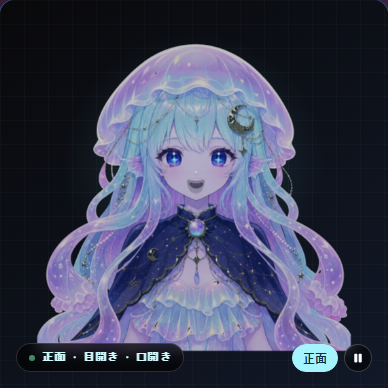
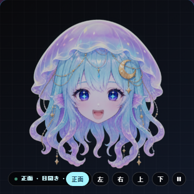
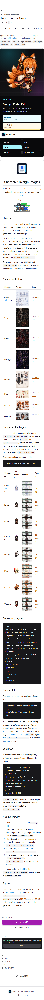

# Characters catalog verification

OpenFaceの`Characters`は、単なるtopic分類ではなく、Forgejoへ取り込んだ実リポジトリのファイル構造を検査して表示します。

## 取り込み済みリポジトリ

| リポジトリ | 検出規格 | 検証対象 |
|---|---|---|
| `openface/lumi-jelly-pngtuber` | PuruPuru PNGTuber | `avatar/default-settings.json`と正面6状態のPNG |
| `openface/lumi-jelly-head-motion-pngtuber` | PuruPuru head motion | 5方向・30状態とdirection-control patch |
| `openface/character-design-images` | Character sheets / Codex Pet | 8キャラクター、8 pet packageを個別検出し、各`pet.json`・`spritesheet.webp`・アニメーションWebPを確認 |

一覧カードと詳細パネルは、上記ファイルをForgejo Contents APIで読み取った結果を使用します。Codex Petはリポジトリ単位にまとめず、Ayano Yukimura、Fuhyo、Hisha、Kakugyo、Kohaku、Maki、Momiji、Onizukaの8体を独立カードとして表示します。PuruPuruは実際の状態PNGを順番に切り替え、詳細画面では再生／停止と方向切替を操作できます。状態遷移は旧フレームと新フレームを重ね、360msかけて不透明度を逆方向へ補間するアルファクロスフェードです。

## スクリーンショット

<table>
  <tr>
    <th>Standard mobile</th>
    <th>Solarpunk desktop</th>
    <th>Cyberpunk mobile</th>
  </tr>
  <tr>
    <td valign="top"></td>
    <td valign="top"></td>
    <td valign="top"></td>
  </tr>
</table>

### PuruPuru upper body: 6 states

### PuruPuru head motion: 5 directions / 30 states

### アルファクロスフェードの途中フレーム

下記は自動監査が切替開始から約90ms後にプレビュー領域だけを撮影したものです。撮影時にDOM上の旧・新2レイヤーを確認し、代表ケースでは旧フレーム`opacity: 0.84`、新フレーム`opacity: 0.16`（合計1.00）を実測しています。

| Upper body | Head motion |
|---|---|
|  |  |

### Codex Pet: Momijiを個別選択

## 自動監査

2026-07-24にDocker Composeの実環境へPlaywrightでアクセスし、次を確認しました。

- `npm run audit:characters`: 3テーマ × 2 viewport × 4 route = **24 / 24 PASS**
- Characters向けtheme matrix: 3テーマ × OS配色2種 × 2 viewport × 4 route = **48 / 48 PASS**
- theme matrixは横方向overflowとWCAGテキストコントラストを計算
- `npm run audit:i18n`: 日本語／英語 × 2 viewport × 12 route = **48 / 48 PASS**
- 8体のPet固有ID、Momijiの`pet.json`／`spritesheet.webp`リンク、全アニメーションWebPの画像応答を確認
- PuruPuruの表示フレームURLが時間経過で変化すること、切替途中に旧・新2レイヤーが同時表示され両方のopacityが0より大きいこと、頭部版の方向ボタンが`right`状態へ切り替わることを確認
- 全対象でコンソールエラー、ページ例外、横方向overflowなし

監査実装は[`visual-tests/character-audit.mjs`](../../../visual-tests/character-audit.mjs)、対象routeは[`visual-tests/routes.mjs`](../../../visual-tests/routes.mjs)にあります。
