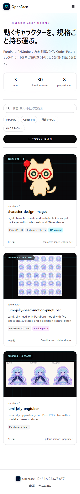
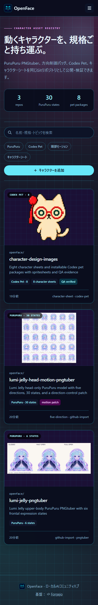
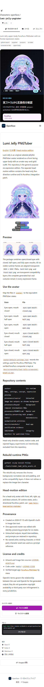
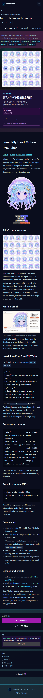
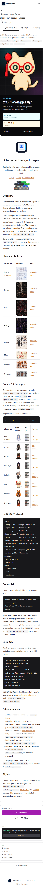

# Characters catalog verification

OpenFaceの`Characters`は、単なるtopic分類ではなく、Forgejoへ取り込んだ実リポジトリのファイル構造を検査して表示します。

## 取り込み済みリポジトリ

| リポジトリ | 検出規格 | 検証対象 |
|---|---|---|
| `openface/lumi-jelly-pngtuber` | PuruPuru PNGTuber | `avatar/default-settings.json`と正面6状態のPNG |
| `openface/lumi-jelly-head-motion-pngtuber` | PuruPuru head motion | 5方向・30状態とdirection-control patch |
| `openface/character-design-images` | Character sheets / Codex Pet | 8キャラクター、8 pet package、Makiの`pet.json`と`spritesheet.webp` |

一覧カードと詳細パネルは、上記ファイルをForgejo Contents APIで読み取った結果を使用します。作成画面にはPuruPuru、Codex Pet、Character sheets用のスターターテンプレートを用意しています。

## スクリーンショット

<table>
  <tr>
    <th>Standard mobile</th>
    <th>Solarpunk desktop</th>
    <th>Cyberpunk mobile</th>
  </tr>
  <tr>
    <td valign="top"></td>
    <td valign="top"></td>
    <td valign="top"></td>
  </tr>
</table>

### PuruPuru upper body: 6 states

### PuruPuru head motion: 5 directions / 30 states

### Codex Pet: Maki package

## 自動監査

2026-07-23にDocker Composeの実環境へPlaywrightでアクセスし、次を確認しました。

- `npm run audit:characters`: 3テーマ × 2 viewport × 4 route = **24 / 24 PASS**
- Characters向けtheme matrix: 3テーマ × OS配色2種 × 2 viewport × 4 route = **48 / 48 PASS**
- theme matrixは横方向overflowとWCAGテキストコントラストを計算
- `npm run audit:i18n`: 日本語／英語 × 2 viewport × 12 route = **48 / 48 PASS**
- PuruPuru設定、motion patch、Maki `pet.json`、Maki `spritesheet.webp`のリンクと画像応答を確認
- 全対象でコンソールエラー、ページ例外、横方向overflowなし

監査実装は[`visual-tests/character-audit.mjs`](../../../visual-tests/character-audit.mjs)、対象routeは[`visual-tests/routes.mjs`](../../../visual-tests/routes.mjs)にあります。
