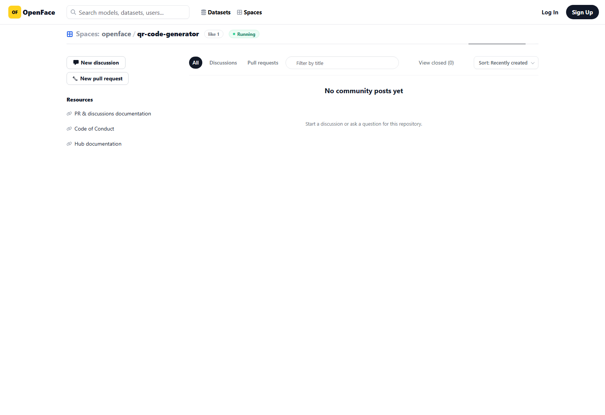

# Community / Issue UI verification

Verified at `https://localhost:8443/git/openface/qr-code-generator/issues` after the Forgejo skin rebuild.

The page keeps Forgejo's working issue and pull-request routes while presenting them as an OpenFace Community surface: repository context, discussion / PR tabs, title filter, closed-state link, sorting, empty state, and resource links are visible in one desktop view.

Interaction refinements applied to the same surface:

- primary discussion and submit controls lift subtly on hover and compress on press;
- secondary controls receive a light border/shadow response;
- issue rows gain a warm, two-pixel hover cue;
- visible keyboard focus rings use the OpenFace yellow accent;
- all motion is disabled under `prefers-reduced-motion`.
