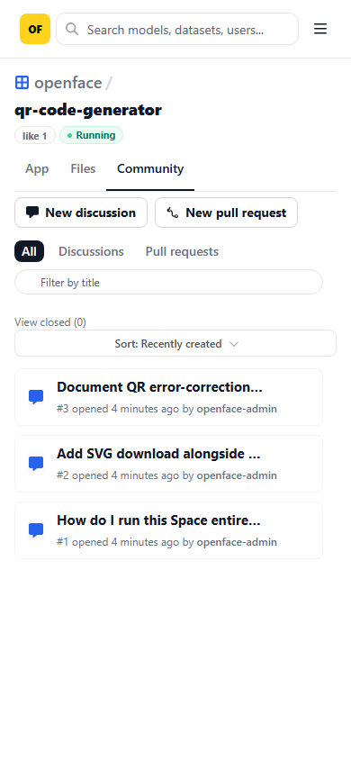
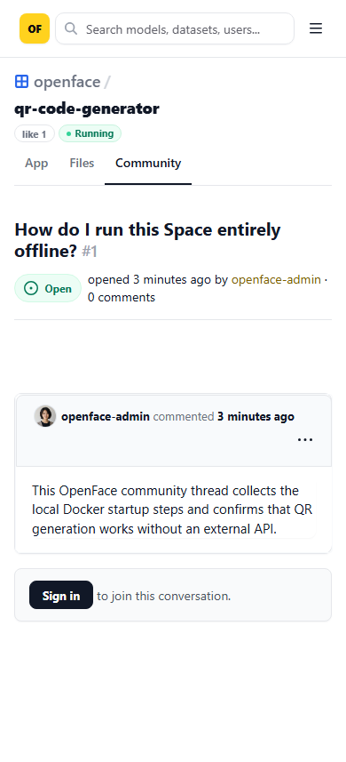

# Community / Issue UI verification

Verified on the running Docker Compose stack at:

- `https://localhost:8443/git/openface/qr-code-generator/issues`
- `https://localhost:8443/git/openface/qr-code-generator/issues/1`

| Discussion list | Discussion detail |
|---|---|
|  |  |
|  |  |

The idempotent seed creates three real Forgejo Issues for the mirrored QR Code Generator Space. The OpenFace Community surface keeps Forgejo's working list and detail routes while adding repository context, App / Files / Community tabs, title filtering, closed-state navigation, sorting, and responsive discussion cards.

Verification results:

- list and detail routes returned HTTP `200`;
- the repository API reported three open Issues and the list rendered three rows;
- desktop and mobile screenshots had `0px` horizontal overflow;
- Playwright reported no console, page, failed-request, or HTTP resource errors;
- the Space tab is labelled **App** on both viewport sizes;
- Issue `#1` reports zero comments consistently in the list and detail views;
- **New discussion** resolves to Forgejo's authenticated creation route and redirects signed-out visitors to Log In;
- all four desktop/mobile captures are part of the recurring Visual QA workflow.

Interaction refinements on the same surface include hover feedback for rows and actions, press feedback for primary controls, yellow keyboard focus rings, and a `prefers-reduced-motion` fallback.
