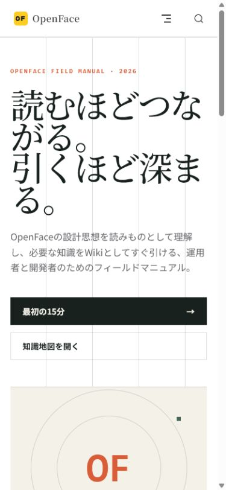
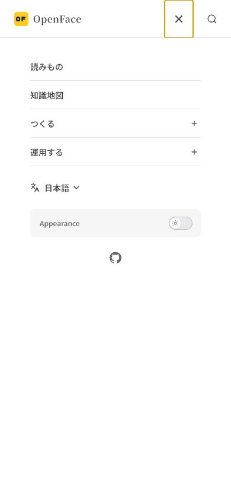

# Editorial knowledge atlas verification

Verified: 2026-07-21

OpenFace documentation now combines three reading modes instead of treating every page as an undifferentiated manual:

- **Field notes** explain context, decisions, and evidence.
- **Knowledge atlas nodes** provide stable concept reference.
- **Practical guides** provide commands and procedures.

English and Japanese pages share the same slug inventory, frontmatter contract, navigation model, and related-reading graph.

## Automated checks

```text
npm run docs:check  PASS
npm run docs:build  PASS
browser console     0 errors / 0 warnings
desktop overflow    false at 1440 × 1000
mobile overflow     false at 390 × 844
```

The mobile platform-map table uses a local horizontal scroll container; the page itself does not overflow.

## Browser evidence

| English desktop | English dark theme |
|---|---|
|  |  |

| Japanese mobile home | Japanese mobile article |
|---|---|
|  |  |

| Knowledge node | Mobile navigation |
|---|---|
|  |  |

Additional captures preserve the scrolled Japanese home and the mobile Wiki table. The dark-theme switch and mobile navigation were clicked in the real VitePress site before the screenshots were recorded.
