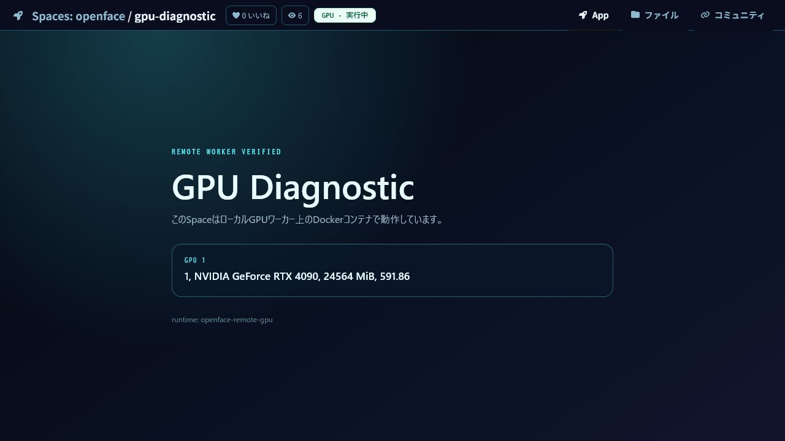

# Remote GPU worker evidence

Captured on 2026-07-24 against the production OpenFace route:

`https://madesk.tail8be30.ts.net/openface/gpu-diagnostic`

The control plane ran on `openface-lxc`, while the Docker worker and Space
container ran on `madesk-gpu-01`. The page was loaded through the normal
OpenFace `/run/openface/gpu-diagnostic/` iframe route.

Verified in the rendered page:

- header state: `GPU · 実行中`;
- worker discovery: two installed GPUs;
- assigned Space device only: NVIDIA GeForce RTX 4090 with 24,564 MiB;
- runtime marker: `openface-remote-gpu`.

