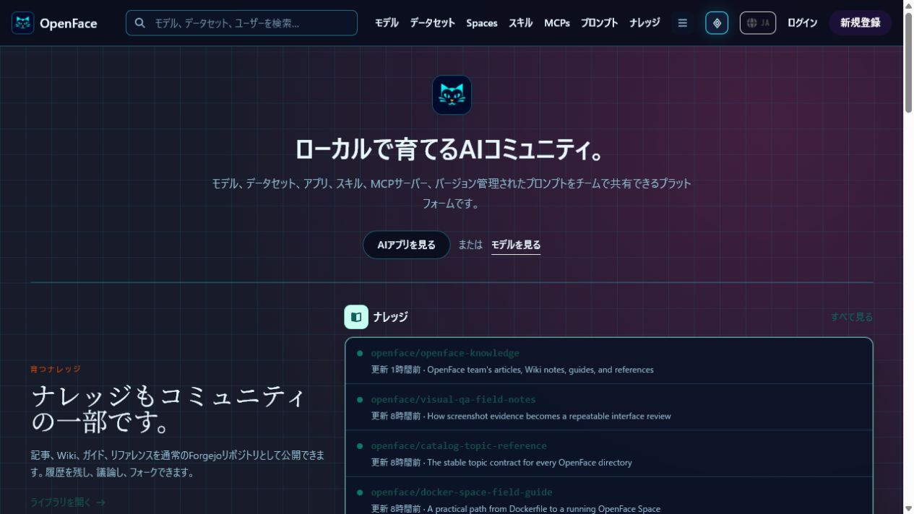
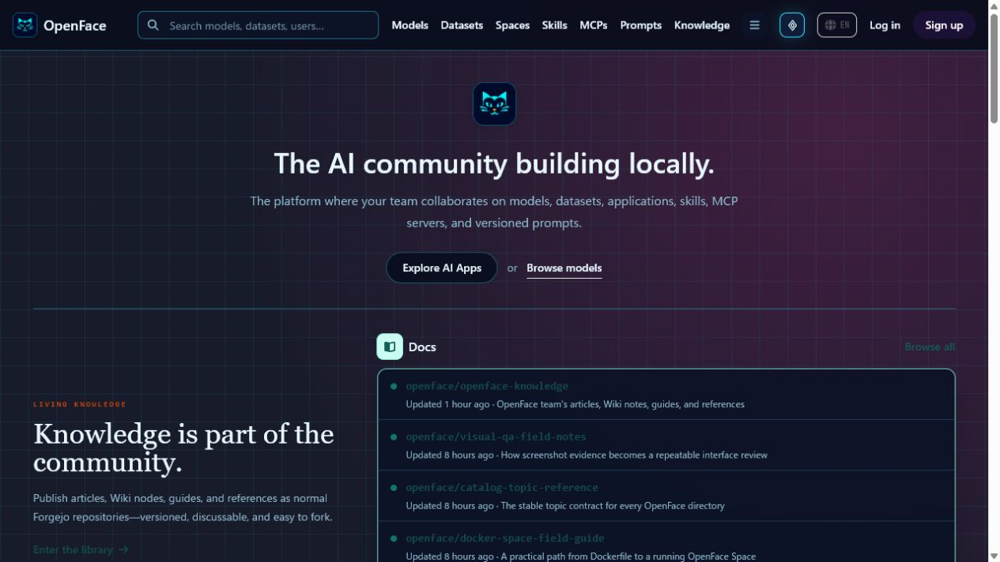
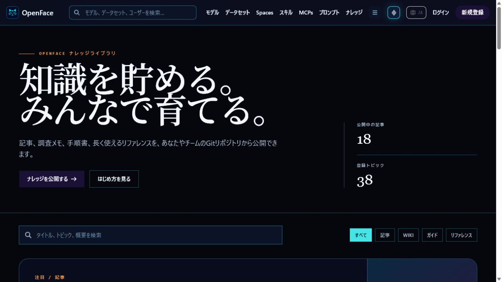
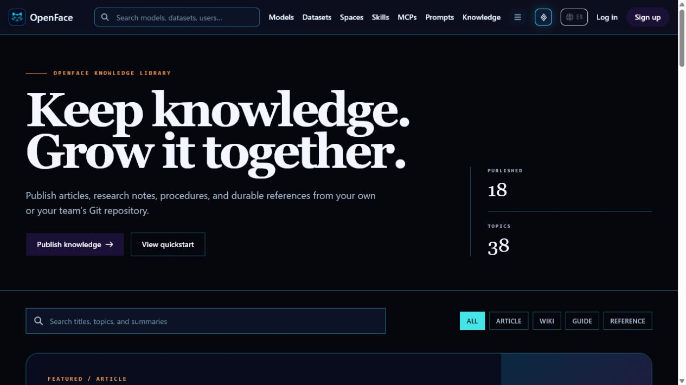

# 日本語／英語UI検証

OpenFaceの共通ナビゲーション、一覧、詳細、Space、ファイル表示、新規作成、ナレッジ画面は、日本語と英語を切り替えられます。選択内容は `openface-locale` Cookieへ保存され、ページ移動と再読み込み後も保持されます。

## 実ブラウザでの切替

| 日本語ホーム | English home |
| --- | --- |
|  |  |

| 日本語ナレッジ | English knowledge |
| --- | --- |
|  |  |

実際の言語切替ボタンを `JA → EN → JA` の順に操作し、次を確認しました。

- `<html lang>` が `ja` / `en` に切り替わる
- ページタイトルと操作文言が選択言語へ切り替わる
- `/` から `/docs` へ移動しても選択言語が保持される
- 再読み込み後も日本語へ戻した設定が保持される
- 390px幅で横方向のはみ出しがなく、コンソールエラーがない

## 自動スクリーンショット監査

`visual-tests/i18n-audit.mjs` は次の11画面を、日本語／英語 × PC／スマートフォンで撮影します。

`/`, `/models`, `/datasets`, `/spaces`, `/skills`, `/mcps`, `/prompts`, `/docs`, `/new?type=doc`, リポジトリ詳細、ファイル一覧

```bash
npm run audit:i18n --prefix visual-tests
```

現在の実行結果は **44 / 44 成功**です。HTTP状態、`lang`、ナビゲーション言語、横はみ出し、コンソールエラーを検査し、全ケースのPNGとJSONレポートを `visual-tests/artifacts/i18n/` に生成します。
