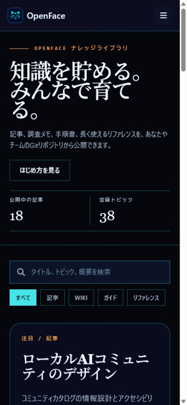
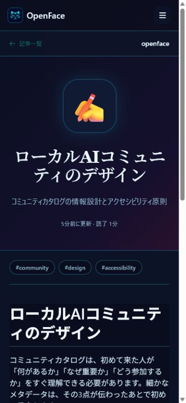
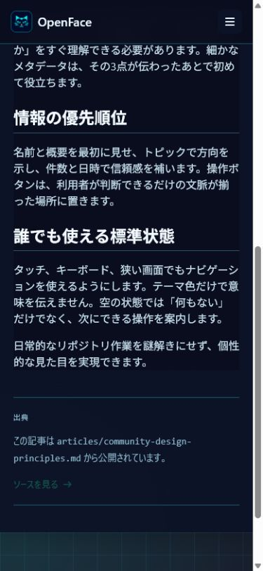
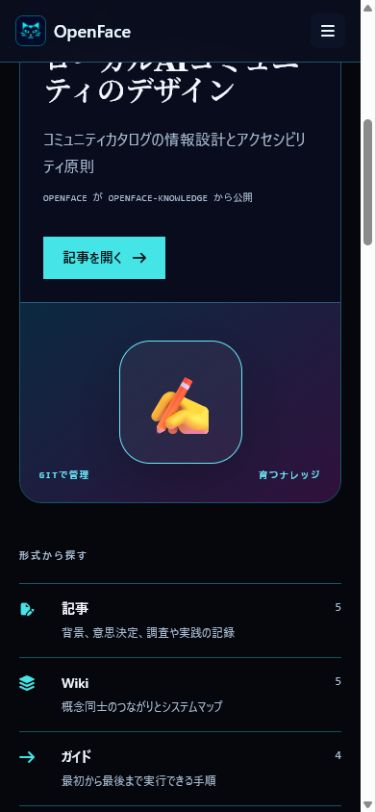

# Knowledge library — theme and interaction QA

## 日本語表示の確認

ナレッジ一覧、記事詳細、ナビゲーション、フッター、18件のサンプル記事を日本語化しました。公開中のモバイル画面を375px幅で再確認し、`html lang="ja"`、横方向のオーバーフローなし、ブラウザーの警告・エラーなしを確認しています。

| 日本語の記事一覧 | 日本語の記事詳細 | スクロール後の本文 |
|---|---|---|
|  |  |  |

注目記事カードの絵文字まわりは、同心円装飾とタイルが重ならないよう単一の角丸タイルへ整理しました。

OpenFace uses its own editorial reading hierarchy: a compact author/time line, an emoji cover, unboxed knowledge rows, topic pills, a centered title, and a narrow reading column.

The focused review led to two deliberate changes:

- the setup guide moved below the reading index so articles are no longer pushed out of the first browsing flow;
- the repository source panel follows the Markdown body on mobile instead of interrupting the article before it starts.

## OpenFace theme comparison

| Standard | Solarpunk | Cyberpunk |
|---|---|---|
|  |  |  |
|  |  |  |

## Exhaustive verification

### 2026-07-24 separated-library verification

The current publication repository stores **5 articles**, **4 procedures**, and
**9 Wiki pages** in separate directories. The obsolete procedure/Wiki copies
under `articles/` were removed. Browser checks confirmed:

- opening an article increased its metric from 0 to 1;
- reloading counted a second real page load;
- the directory promoted that article into the view-ranked trending feature;
- the Procedure tab returned only procedures;
- the `architecture` tag returned exactly three matching entries;
- desktop and 390px mobile views had no horizontal overflow.

The latest [24-screen theme matrix](2026-07-24/THEME_MATRIX.md) passed after
checking all three themes, light/dark OS preferences, desktop/mobile viewports,
the directory, and article detail. It audited 4,076 text nodes with zero
remaining contrast failures.

The focused visual matrix covers:

- Standard, Solarpunk, and Cyberpunk;
- light and dark OS color schemes;
- 1440×1000 desktop and 390×844 mobile viewports;
- the `/docs` publication index and `/docs/openface/community-design-principles` article route.

Result: **24 / 24 screenshots passed**, **0 horizontal overflow**, and **0 WCAG text-contrast failures** after checking 3,106 rendered text nodes. The first run correctly caught Standard-dark emoji-tile contrast and the Solarpunk primary-action contrast; the committed palette fixes were then rerun through the complete matrix.

Open the [full theme matrix](theme-matrix/THEME_MATRIX.md) for every screenshot and computed result. Representative contact sheets:

| Standard | Solarpunk | Cyberpunk |
|---|---|---|
|  |  |  |

## GitHub README render

The public README is verified using OpenFace-owned screenshots only. External product screenshots are intentionally excluded.
