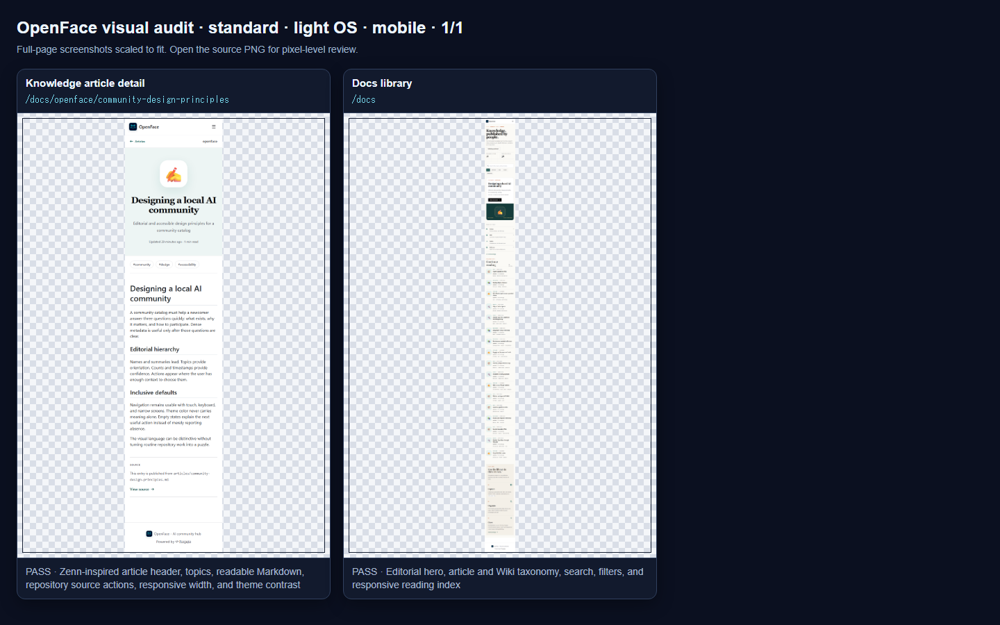
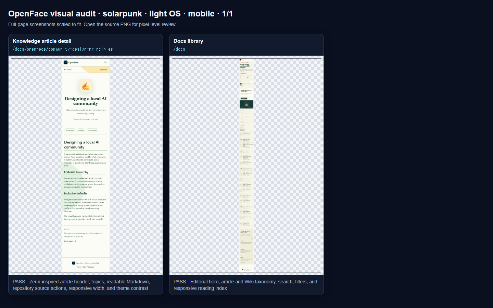
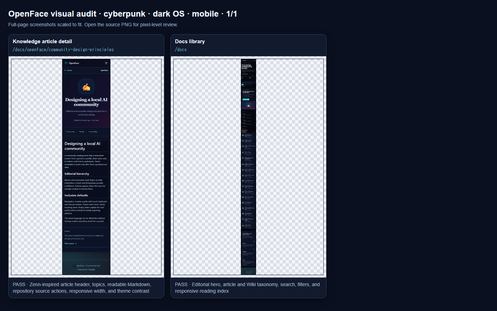

# Knowledge library — Zenn comparison and theme QA

OpenFace uses Zenn's reading hierarchy as a reference without copying its product identity. The implementation keeps the OpenFace typography and theme tokens while adopting the parts that make a publication easy to scan: a compact author/time line, an emoji cover, unboxed article rows, topic pills, a centered article header, and a narrow reading column.

Reference pages: [Zenn Articles](https://zenn.dev/articles) and a live [Zenn article detail](https://zenn.dev/mk0bayashi/articles/2a6ee4123e671f).

## Side-by-side comparison

| Zenn reference | OpenFace Standard |
|---|---|
|  |  |
|  |  |

The layout comparison led to two deliberate changes:

- the setup guide moved below the reading index so articles are no longer pushed out of the first browsing flow;
- the repository source panel follows the Markdown body on mobile instead of interrupting the article before it starts.

## OpenFace theme comparison

| Standard | Solarpunk | Cyberpunk |
|---|---|---|
|  |  |  |
|  |  |  |

## Exhaustive verification

The focused visual matrix covers:

- Standard, Solarpunk, and Cyberpunk;
- light and dark OS color schemes;
- 1440×1000 desktop and 390×844 mobile viewports;
- the `/docs` publication index and `/docs/openface/community-design-principles` article route.

Result: **24 / 24 screenshots passed**, **0 horizontal overflow**, and **0 WCAG text-contrast failures** after checking 3,106 rendered text nodes. The first run correctly caught Standard-dark emoji-tile contrast and the Solarpunk primary-action contrast; the committed palette fixes were then rerun through the complete matrix.

Open the [full theme matrix](theme-matrix/THEME_MATRIX.md) for every screenshot and computed result. Representative contact sheets:

| Standard | Solarpunk | Cyberpunk |
|---|---|---|
|  |  |  |

## GitHub README render

The pushed public README was opened again on GitHub. Both comparison columns render their real PNGs at the intended size; no broken-image placeholder or Markdown fallback is present.

