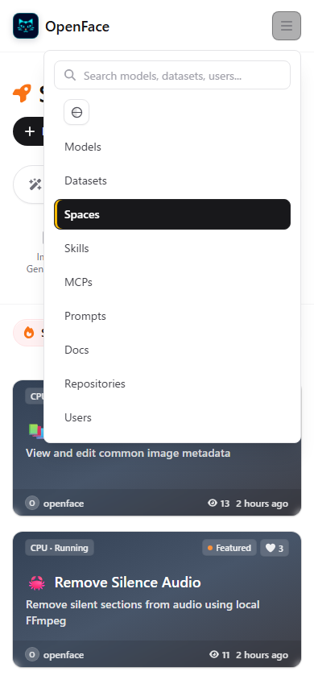
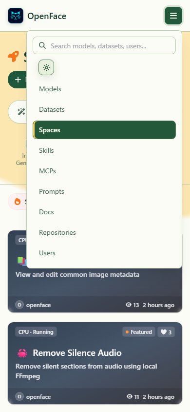
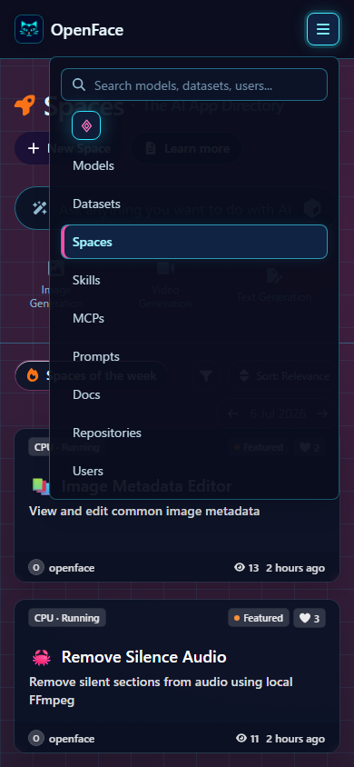

# Mobile current-page highlight

The mobile menu uses a dedicated current-page state instead of relying on a
touch-hover utility. This prevents iOS browsers from retaining a white hover
surface with white text after navigation.

Automated checks open `/spaces`, expand the menu, cycle through every theme,
verify the `aria-current="page"` target, measure its contrast, and reject
horizontal overflow.

| Theme | Contrast | Screenshot |
| --- | ---: | --- |
| Standard | 17.72:1 | [Open](./mobile-current-page-standard.png) |
| Solarpunk | 8.06:1 | [Open](./mobile-current-page-solarpunk.png) |
| Cyberpunk | 12.57:1 | [Open](./mobile-current-page-cyberpunk.png) |

## Standard

## Solarpunk

## Cyberpunk

