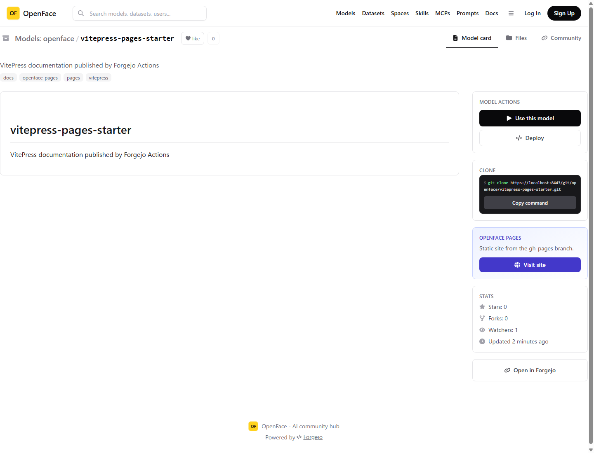

# OpenFace Pages verification

OpenFace Pages is a GitHub Pages-compatible static hosting path backed by
Forgejo repository files. It does not start a Docker Space and does not expose
private repository content.

## URL and source selection

- Published URL: `https://<host>:<https-port>/pages/<owner>/<repo>/`
- Source priority: the repository's public `gh-pages` branch, then `docs/` on
  the default branch when no `gh-pages` branch exists.
- The seed job creates `openface/pages-starter` and its `gh-pages` branch, so a
  clean `docker compose up -d --build` has a reproducible live example.

## Screenshot evidence

| Repository detection | Published static page |
|---|---|
|  |  |

The left capture shows that the repository detail detected `gh-pages` and
rendered the **Visit site** button. The right capture is the page rendered at
`/pages/openface/pages-starter/`; it is a real static HTML document, not a
Space pause screen or an iframe placeholder.

## VitePress automation evidence

| Forgejo Actions result | Clone UI after layout fix |
|---|---|
|  |  |

`openface/vitepress-pages-starter` was seeded with the workflow at
`.forgejo/workflows/publish-pages.yml`. Its first `main` push ran successfully
on `openface-pages-runner`, built VitePress, and pushed commit
`453dff90f67316798e7ca76037fd27c8ed6cb707` to `gh-pages`. The left capture is
the resulting `200 text/html` page at
`/pages/openface/vitepress-pages-starter/`.

The runner has one `node20` slot and executes job containers through
`forgejo-actions-dind`; it does not mount OpenFace's host Docker socket. The
right capture verifies that the Clone command now wraps within its card and
uses a full-width copy action instead of exposing a horizontal scrollbar.

## Additional Pages examples

| HTML + CSS + JavaScript | `docs/` fallback |
|---|---|
|  |  |

- `openface/pages-portfolio` is served from `gh-pages`; its `styles.css` and
  `app.js` both returned `200` with `text/css` and `text/javascript` MIME
  types. The button uses the linked JavaScript at runtime.
- `openface/pages-docs-fallback` deliberately has no `gh-pages` branch. Its
  `main/docs/index.html` and relative `guide.html` both returned `200`, proving
  the fallback source and multi-page relative links work.

## Runtime checks

The final local checks were made against the HTTPS gateway:

| Request | Expected result | Observed result |
|---|---:|---:|
| `/pages/openface/pages-starter/` | HTML static site | `200`, `text/html; charset=utf-8` |
| `/pages/openface/enterprise-private-space/` | private content hidden | `404` |
| `/pages/openface/pages-starter/../README.md` | path traversal rejected | `404` |

`spaces-runner` obtains the file through Forgejo's authenticated API only after
checking the repository visibility. nginx exposes this handler only under
`/pages/`; all other OpenFace and Forgejo routes are unchanged.
