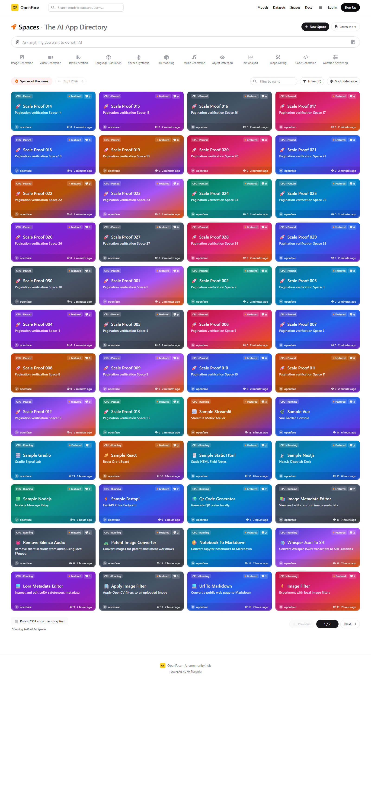
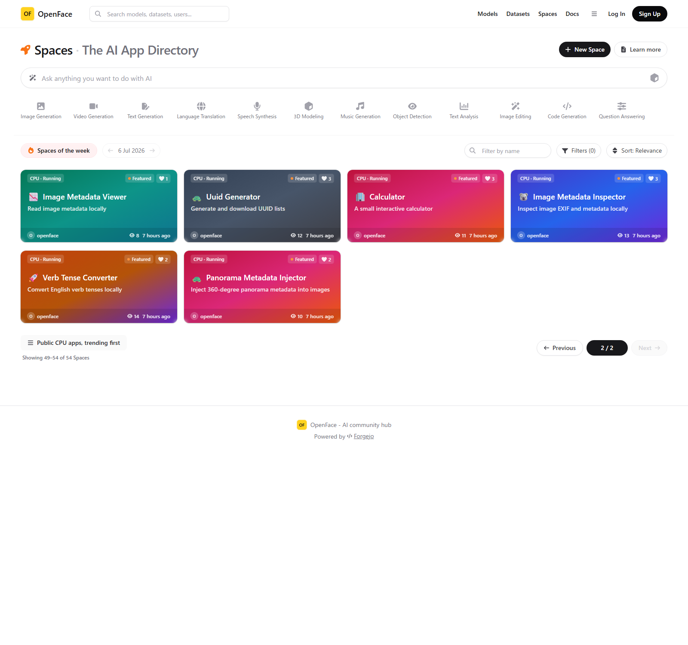
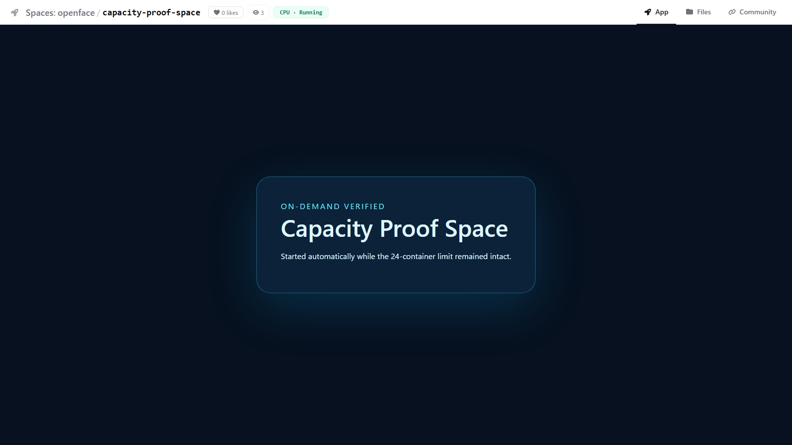
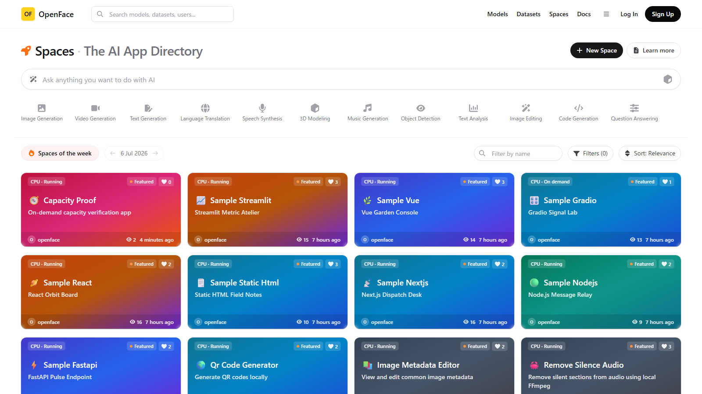
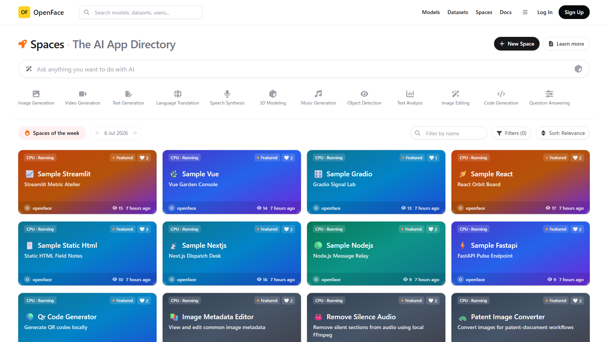
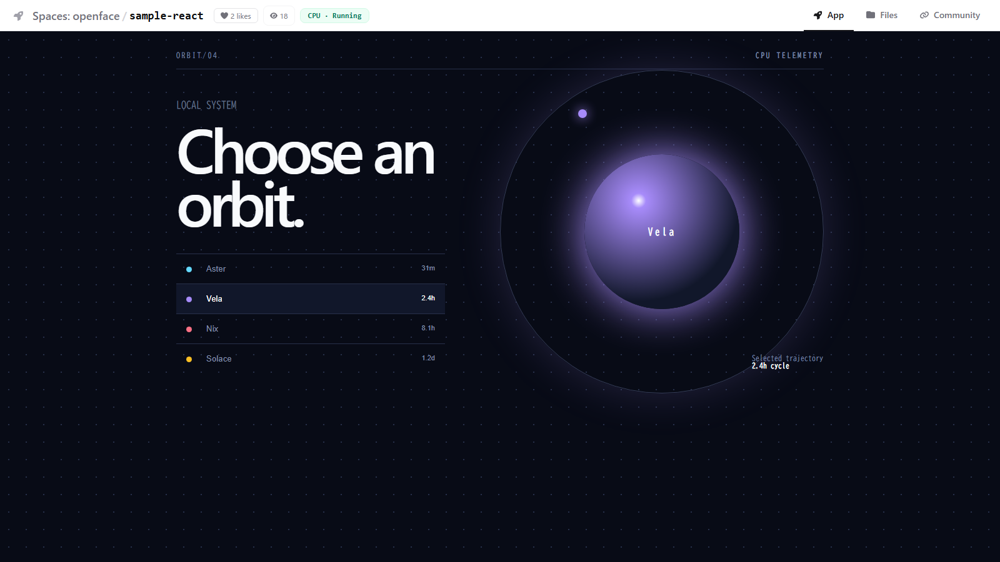

# Spaces scalability verification evidence

このディレクトリには、Spaces一覧のスケーラビリティ改善を実際のOpenFace環境で検証した証拠を保存しています。検証用リポジトリは撮影後に削除し、最終状態は24件すべてRunningへ復元しています。

## 1. 48件ページング

| 1ページ目（48件） | 2ページ目（49–54件） |
|---|---|
|  |  |

- URL: `/spaces`、`/spaces?page=2`
- 実測: 1ページ目48件、2ページ目6件、合計54件
- 前へ／次へ、現在ページ、表示範囲を確認

## 2. メトリクス・Docker状態の一括取得

- [リクエスト数の記録](02-batched-requests.txt)
- メトリクス一括API: 1回
- `/runner-api/spaces`: 1回
- カード単位のメトリクス・状態API: 0回

## 3. READMEの5分キャッシュ

- [コールド／ウォーム取得の記録](03-readme-cache.txt)
- コールド表示: README 24件取得
- TTL内の再表示: README取得0件
- ページングにより対象は最大48件

## 4. 24コンテナ上限とOn demand起動

| 起動前 | 詳細を開いて自動起動 |
|---|---|
|  |  |

- [同時起動数とLRU停止の記録](04-running-capacity.txt)
- 起動前: 24 Running + 1 On demand
- 25件目を開いた後: Runningは24のまま
- 最終アクセスが最古の1件だけを停止

## 5. 最終回帰確認

| 復元後の一覧 | 既存React Space |
|---|---|
|  |  |

- 最終状態: 24リポジトリ、24 Running
- 既存のDocker Space埋め込み、閲覧数、ナビゲーションを確認
