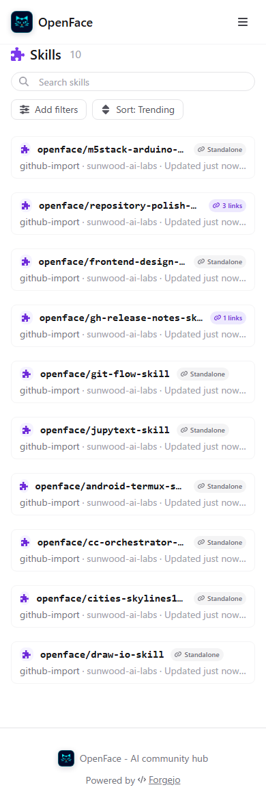
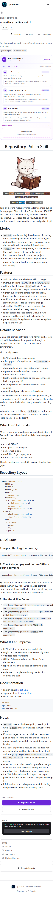
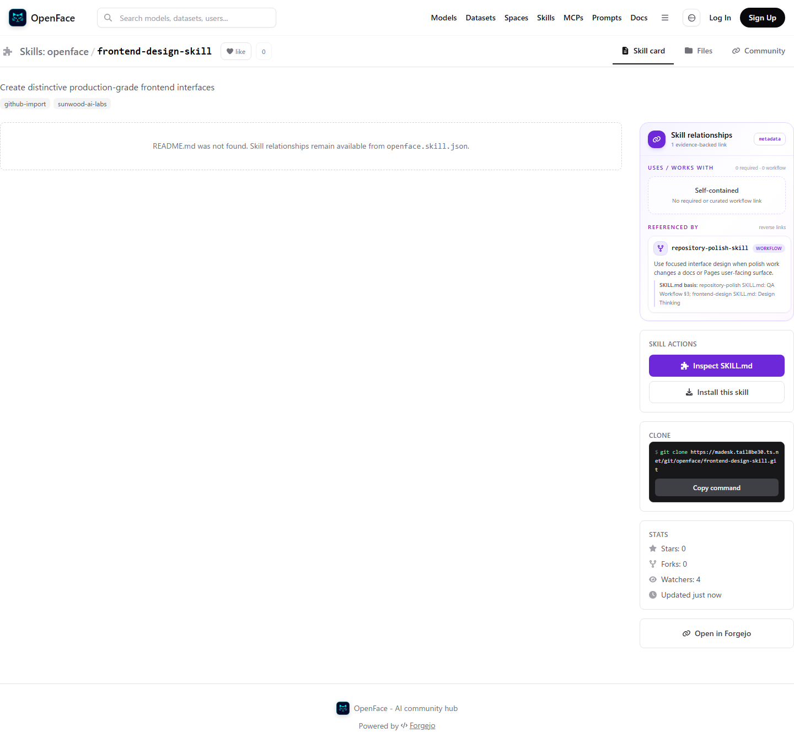
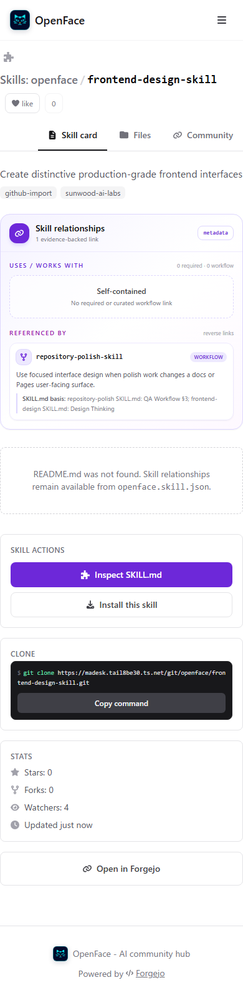

# Skill relationship visual verification

Verified against the Docker Compose deployment after reading the complete root
`SKILL.md` of all ten public Skill repositories and seeding editable,
evidence-backed `openface.skill.json` metadata.

## Results

- 6/6 targeted route and viewport captures passed.
- The Skills directory displays a workflow-link count or `Standalone` for every
  seeded Skill.
- The repository-polish detail displays three optional workflow links in the
  desktop sidebar, including their exact `SKILL.md` section basis.
- A target with no `README.md` still renders its reverse link in the sidebar.
- Desktop verification asserts the visible panel is inside `<aside>`; mobile
  verification asserts the panel is in the main content flow.
- Desktop and 390 px mobile captures report no horizontal overflow.
- Browser interaction verified directory → Skill detail → dependency target →
  `openface.skill.json` file navigation on the public Tailscale URL.

| Directory | Relationship sidebar |
| --- | --- |
|  |  |

| Mobile directory | Mobile relationship map |
| --- | --- |
|  |  |

## README-independent rendering

| Desktop | Mobile |
| --- | --- |
|  |  |

Content-level decisions: [Skill content relationship audit](../../research/skill-relationship-audit.md).

Metadata schema and editing instructions: [Skill relationship metadata](../../skill-relationships.md).
