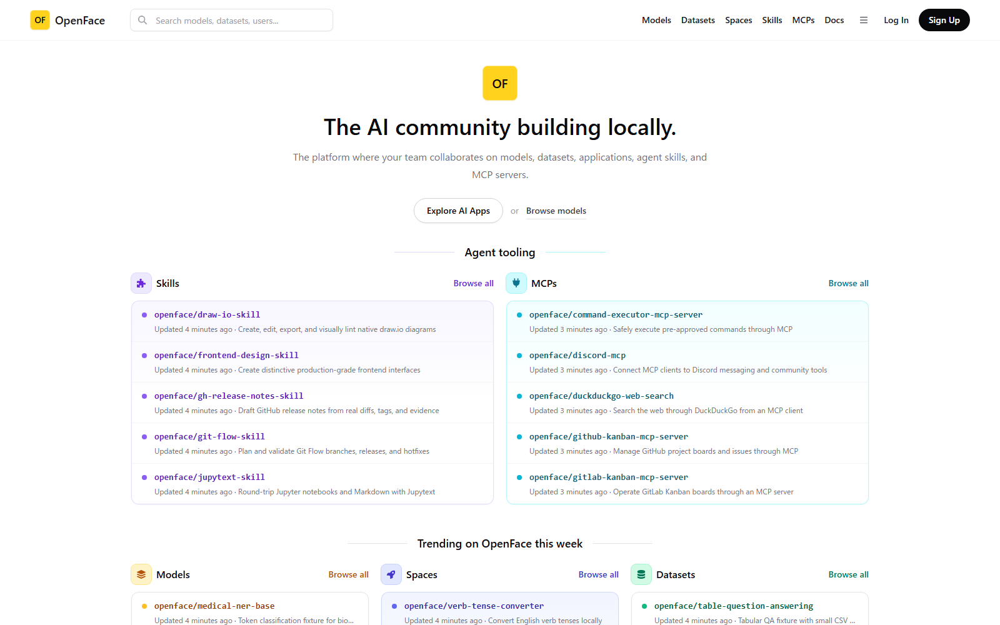
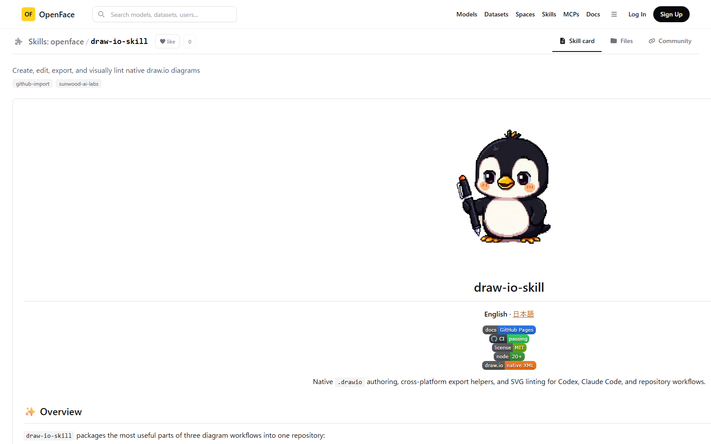

# Skills / MCPs verification evidence

Verified on 2026-07-14 against the running Docker Compose stack at
`http://localhost:8090`.

## What was verified

- `/skills` returns exactly 10 repositories classified with the `skill` topic.
- Every Skill repository contains a root `SKILL.md`.
- `/mcps` returns exactly 10 repositories classified with the `mcp` topic.
- Every MCP repository contains `package.json` or `pyproject.toml` plus a server
  or entry-point implementation.
- All 20 repositories contain real source trees cloned from the public
  [`Sunwood-ai-labs`](https://github.com/Sunwood-ai-labs) GitHub account.
- The home page exposes both categories under **Agent tooling**.
- A Skill detail page is labeled **Skill card**, links back to `/skills`, renders
  its real README, and resolves relative README images through local Forgejo.
- The frontend production build and seed shell syntax both pass.
- Re-running the seed job exits successfully and preserves existing local repositories.

The selected upstream sources are documented in
[`docs/research/skill-mcp-sources.md`](../../research/skill-mcp-sources.md), and
the reproducible import list lives in
[`seed/catalog/sunwood-ai-labs.json`](../../../seed/catalog/sunwood-ai-labs.json).

## Screenshots

### Home

### Skills directory

### MCP directory

### Skill detail

