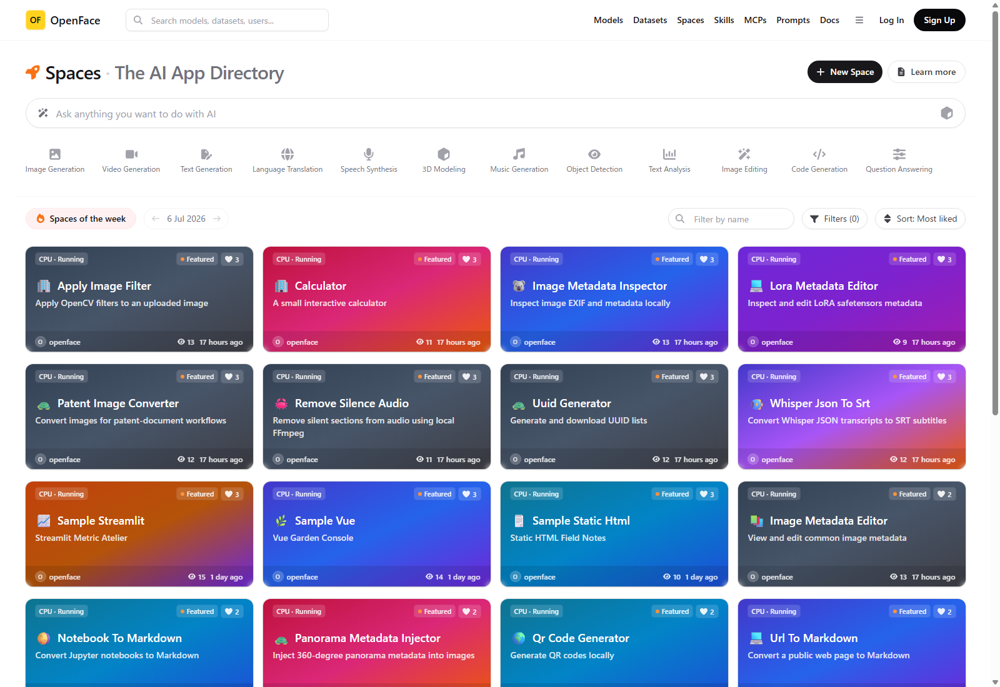

# Space sorting verification

Verified by selecting **Sort: Most liked** on the Spaces directory.

## Result

- The current catalog has **24 public Spaces**.
- The metrics batch was requested for all 24 repositories before rendering the ranking.
- The top eleven repositories each have **3 likes**; the next displayed group has **2 likes**. The captured page reflects that boundary.
- `sort=stars` now loads the entire public Space topic set, ranks by local like count (then updated time/name for a stable tie-break), and only then slices the requested 48-item page. It therefore remains globally correct once the catalog grows beyond one page.

The normal `updated` sort continues to use Forgejo's paged, server-side metadata ordering.
