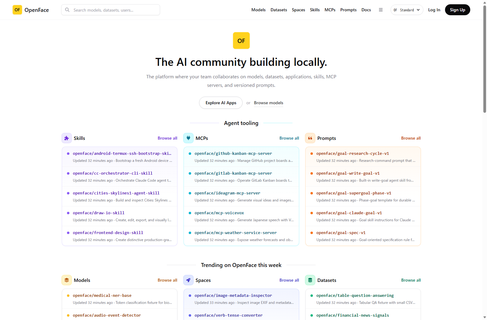
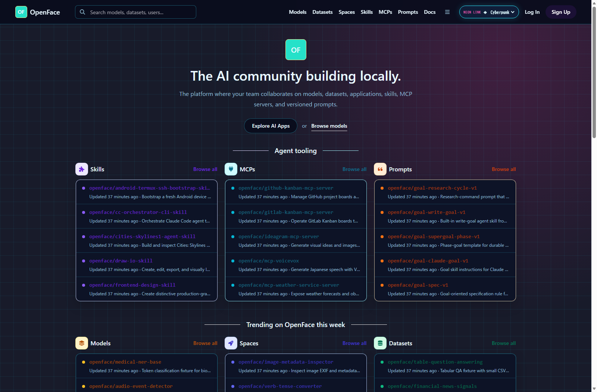
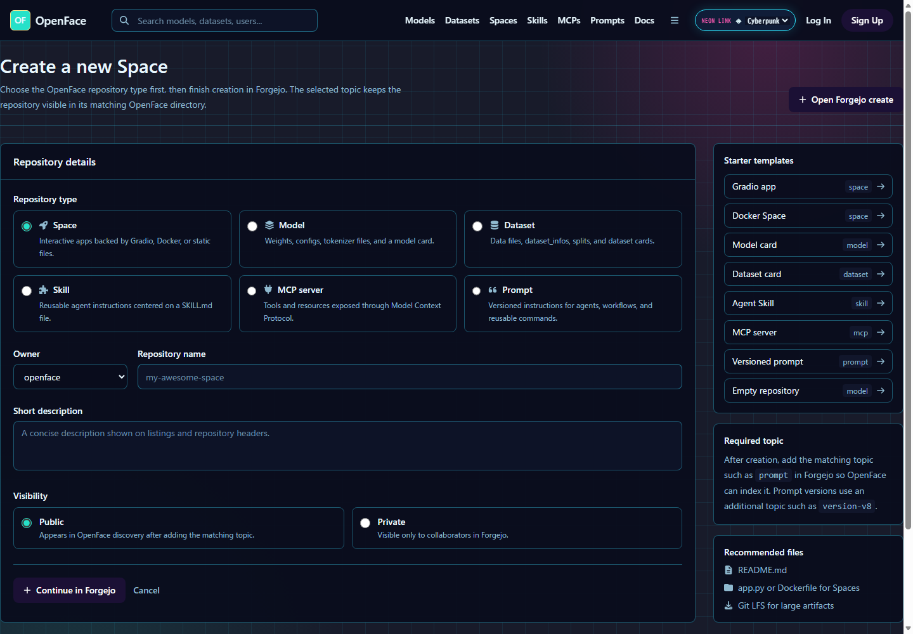

# Theme verification evidence

実行環境: `https://localhost:8443/`（Docker Compose の gateway 経由）

## 操作確認

ヘッダー右上の `OpenFace theme` セレクタを実際に操作して、各状態で次の値が一致することを確認しました。

| 選択 | `data-openface-theme` | `localStorage.openface-theme` | セレクタ値 |
|---|---|---|---|
| Standard | 属性なし（`standard`） | `standard` | `standard` |
| Solarpunk | `solarpunk` | `solarpunk` | `solarpunk` |
| Cyberpunk | `cyberpunk` | `cyberpunk` | `cyberpunk` |

その後、同じブラウザプロファイルでページを再読込しても選択したテーマが表示されることを確認しました。テーマ値を読むインラインスクリプトをレイアウトの先頭に置いているため、初期描画で標準テーマが一瞬表示されることを避けています。

## 実画面

| Standard | Solarpunk | Cyberpunk |
|---|---|---|
|  |  |  |

Solarpunk は温かい紙面、植物の緑、日光の黄を使います。Cyberpunk は濃いインク面、シアンのグリッド、マゼンタの光を使い、一覧カードも暗色パネルへ揃えて可読性を保ちます。

## ルート横断の画面監査

1440×1000 の実ブラウザ画面で、Standard / Solarpunk / Cyberpunk の各テーマを選択し、以下の全ルートを個別にレンダリングして確認しました。背景、見出し、カード、境界線、補助テキスト、フィルター、ボタン、フォーム、詳細サイドバー、Spaceランナー外枠を確認対象にしています。

| 画面 | ルート | 結果 |
|---|---|---|
| ホーム | `/` | 3テーマで確認済み |
| モデル一覧 | `/models` | 3テーマで確認済み |
| データセット一覧 | `/datasets` | 3テーマで確認済み |
| Spaces一覧 | `/spaces` | 3テーマで確認済み |
| Skills一覧 | `/skills` | 3テーマで確認済み |
| MCPs一覧 | `/mcps` | 3テーマで確認済み |
| Prompts一覧 | `/prompts` | 3テーマで確認済み |
| 新規リポジトリ作成 | `/new` | 3テーマで確認済み（Cyberpunkフォームを修正） |
| Space詳細 / ランナー | `/openface/qr-code-generator` | 3テーマで確認済み |
| データセット詳細 | `/openface/table-question-answering` | 3テーマで確認済み |

監査中に見つかった唯一の破綻は、Cyberpunkの新規作成画面でネイティブ入力欄が白い背景のまま残る点でした。`input` / `textarea` / `select` の面、プレースホルダ、ラジオ・チェックボックスをテーマ化し、修正後に再撮影して確認しました。

