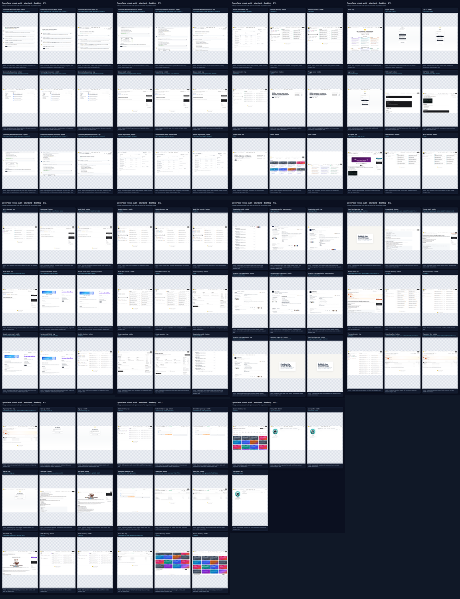
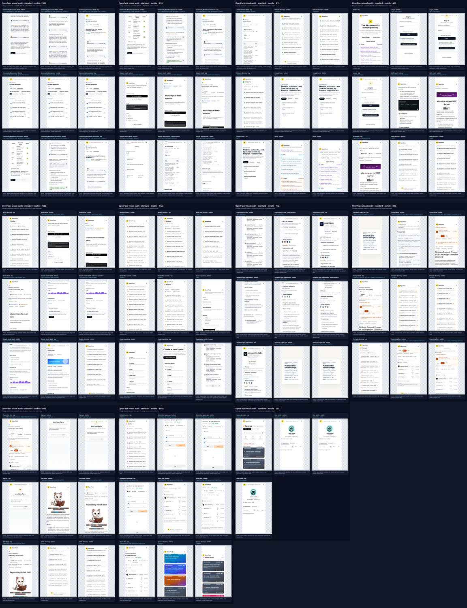
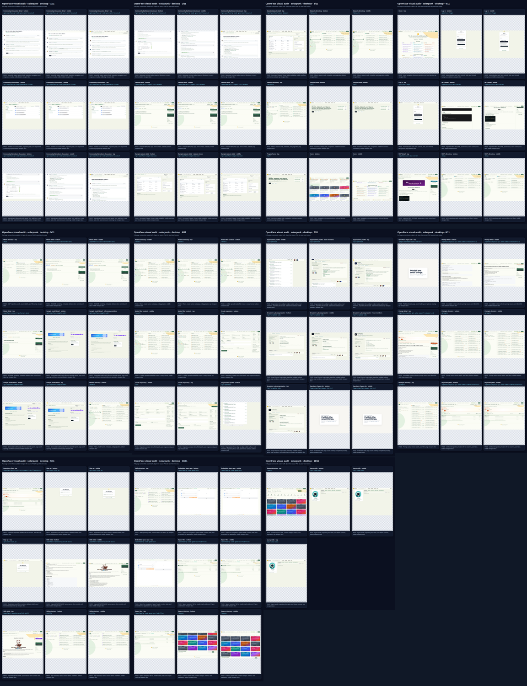
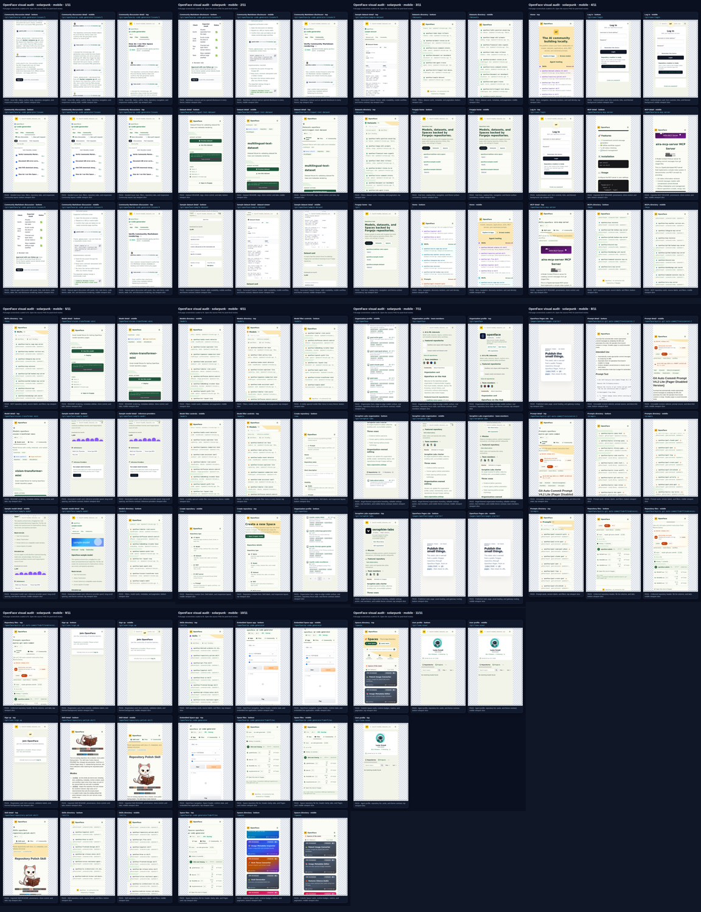
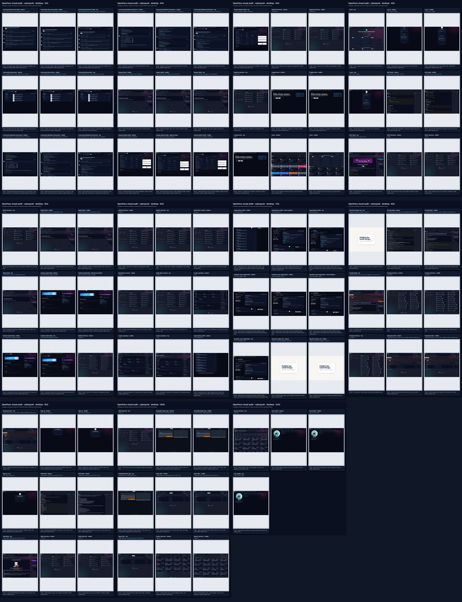
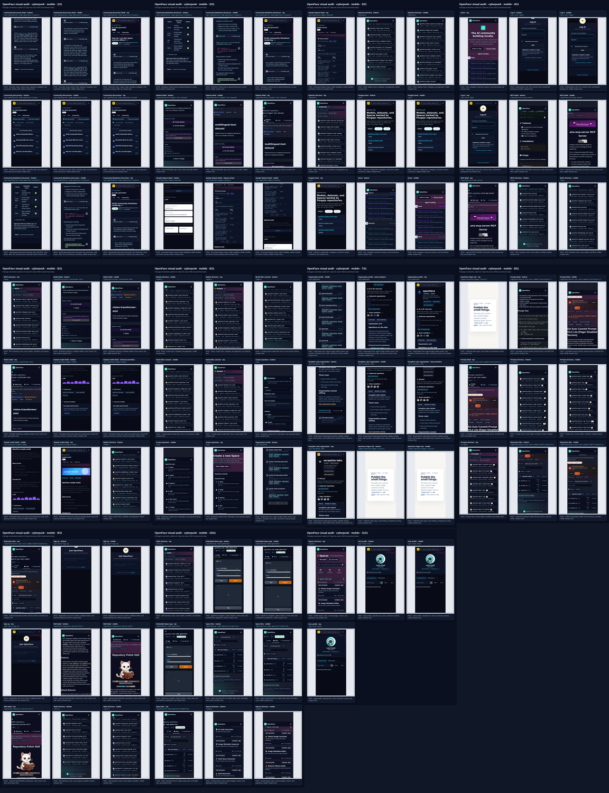

# Three-theme character-art visual audit — 2026-07-18

This audit verifies the character-art Seraphim update at source commit `2e9d98b` using the real Docker Compose stack.

- GitHub Actions run: [Visual QA #29642943281](https://github.com/Sunwood-ai-labs/OpenFace/actions/runs/29642943281)
- Base capture: **60 / 60 passed**
- Full-page theme matrix: **180 / 180 passed**
- Scroll checkpoints: **564 / 564 passed**
- Matrix: Standard, Solarpunk, and Cyberpunk × desktop and mobile × 30 routes
- Manual inspection: all 24 full-page contact sheets and all 6 theme/viewport scroll overviews

## What was checked

- home, Models, Datasets, Spaces, Skills, Prompt, and Pages routes;
- catalog, detail, Files, Community, authentication, user, and organization pages;
- top, middle, and bottom scroll positions, including direct Dataset Viewer, Inference Providers, and Team members checkpoints;
- OpenFace and Seraphim Labs organization profiles and owner-only editing screens;
- mobile navigation, native disclosure open/close, comment menus, code Copy buttons, Like redirect, and App/Files/Community tab navigation;
- horizontal overflow, broken media, theme leakage, clipped content, unreadable highlights, member-count mismatches, and placeholder avatars.

## Result

No visual anomaly was found in the reviewed matrix. The organization audit reported four rendered members for each organization, zero placeholder members, zero side overflow, and a repository focus contrast ratio of **11.56:1**. Both organization editing forms passed on desktop and mobile with zero horizontal overflow. The interaction audit passed on Chromium desktop/mobile and WebKit mobile.

The checkerboard around some contact-sheet cells is review-canvas padding, not application UI. The Pages example intentionally keeps its own static-site palette instead of inheriting the Hub theme.

## Scroll overviews

| Theme | Desktop | Mobile |
|---|---|---|
| Standard |  |  |
| Solarpunk |  |  |
| Cyberpunk |  |  |

## Machine and interaction evidence

The archived workflow artifact contains the authoritative `manifest.json`, `THEME_MATRIX.md`, `SCROLL_AUDIT.md`, organization reports, interaction report, individual screenshots, and 90 contact sheets. Automated PASS status was treated as a guardrail; the contact sheets and the formerly problematic semantic checkpoints were also inspected visually.
