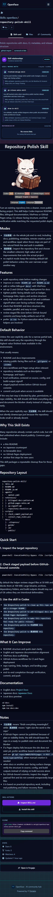
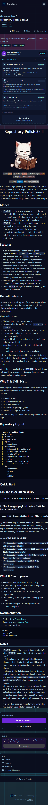
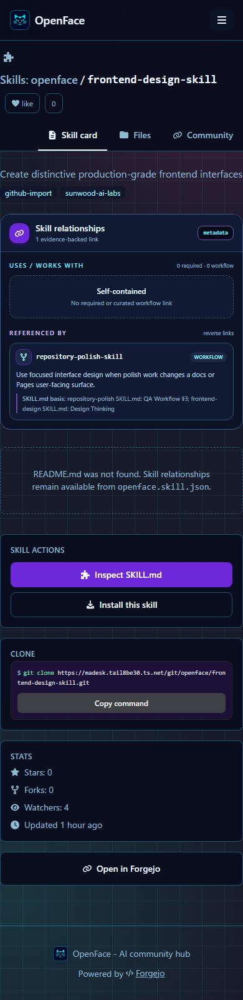
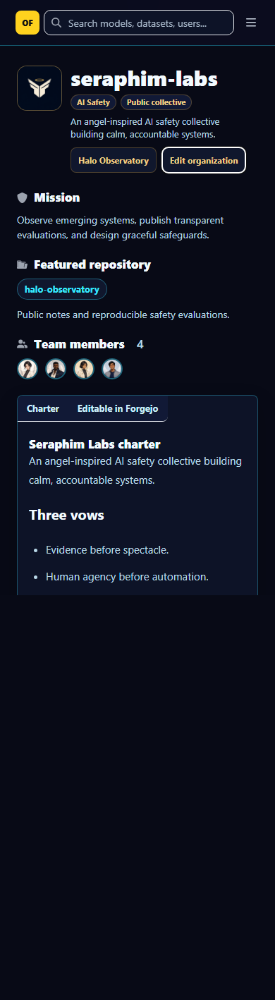
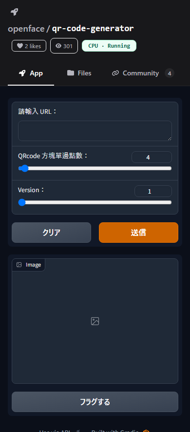
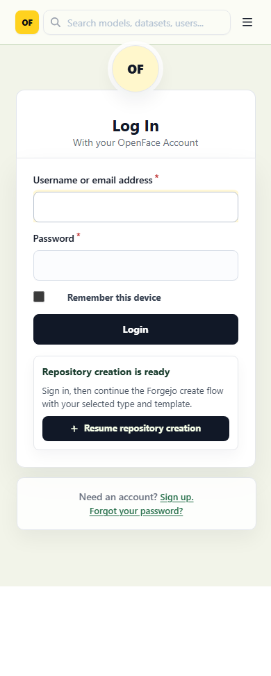

# 全テーマ・全ページ コントラスト監査（2026-07-19）

OpenFace の全登録画面について、テーマだけでなく OS の明暗設定も独立して切り替え、デスクトップ／モバイルの両方で WCAG コントラスト計算と実スクリーンショット確認を行いました。

## 結果

| 項目 | 結果 |
|---|---:|
| テーマ | Standard / Solarpunk / Cyberpunk |
| OS カラースキーム | light / dark |
| ビューポート | desktop 1440×1000 / mobile 390×844 |
| 登録ルート | 31 |
| 組み合わせ | 3 × 2 × 2 × 31 = **372** |
| 合格 | **372 / 372** |
| 計算した可視テキストノード | **19,654** |
| 画像背景として分離したテキストノード | **9,392** |
| 最小しきい値余裕 | **1.01×** |
| 目視確認 | **48 枚の全 contact sheet** |

通常テキストは 4.5:1、大文字・太字の大きなテキストは 3:1 を合格基準にしています。半透明色は実際の背景色へ合成してから計算します。画像背景上の文字は単一の背景色に還元すると誤判定になるため数値監査から分離し、原寸スクリーンショットと contact sheet で確認しました。

## 修正した主な箇所

- Cyberpunk の Skill 本文、関係カード、バッジ、Markdown
- Standard dark の Space 稼働状態バッジ
- Solarpunk のログイン継続リンク
- Cyberpunk dark の組織タブ
- Forgejo のリポジトリ一覧、Dataset Viewer、認証、組織、コミュニティ画面
- OS の `prefers-color-scheme` が選択中テーマへ混入する組み合わせ

## 代表スクリーンショット

| Cyberpunk / dark OS / Skill | Cyberpunk / light OS / Skill | Cyberpunk / dark OS / Skill relationships |
|---|---|---|
|  |  |  |

| Cyberpunk organization | Standard / dark OS / Space | Solarpunk / dark OS / Login |
|---|---|---|
|  |  |  |

## 再実行

```bash
npm ci --prefix visual-tests
npm exec --prefix visual-tests -- playwright install chromium
npm run capture:themes --prefix visual-tests
```

成果物は `visual-tests/artifacts/theme-matrix/` に生成されます。`manifest.json` に全ノードの計算結果、`screenshots/` に372枚の原寸画像、`contact-sheets/` に48枚の一覧画像が入ります。
