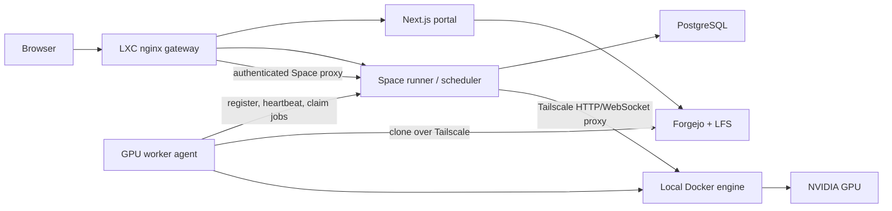
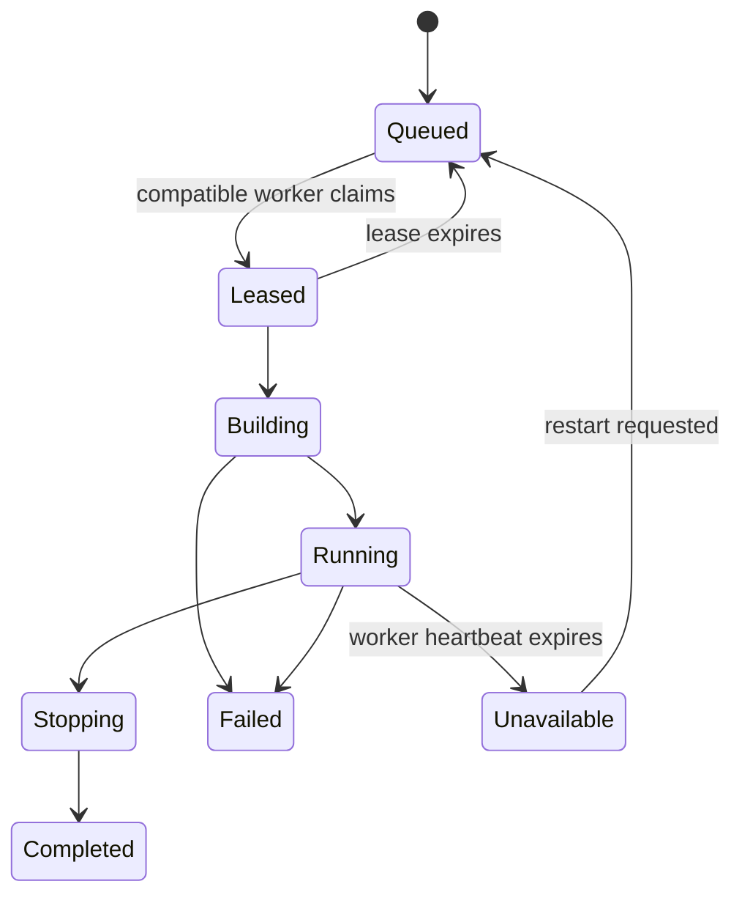

# Remote GPU workers

This document records the implemented architecture and operating plan for
using GPUs on local machines without moving the OpenFace control plane out of
its Proxmox LXC.

> [!TIP]
> The pull protocol, PostgreSQL persistence, capability scheduler, leases,
> HTTP/WebSocket runtime proxy, and separate Docker Compose stack are
> implemented. The feature defaults to disabled, so CPU placement does not
> change until an administrator enables it.

## Implementation status

| Capability | Status |
|---|---|
| One-time enrollment and revocable worker credentials | Implemented |
| Heartbeats, GPU capabilities, and VRAM constraints | Implemented |
| FIFO claim, short leases, and expiry recovery | Implemented |
| Commit-pinned clone, Docker build, and GPU run | Implemented |
| Authenticated HTTP/WebSocket runtime gateway | Implemented |
| Remote stop and container cleanup | Implemented |
| Multiple workers and per-worker concurrency limits | Implemented |
| Drain/revoke controls in the admin UI | Planned |
| Dynamic VRAM reservations | Planned; claim-time free VRAM is enforced |

The implementation is split across `spaces-runner/gpu_control.py`,
`gpu-worker/worker.py`, and `docker-compose.gpu-worker.yml`.

## Goals

- Keep Forgejo, PostgreSQL, the portal, authentication, and scheduling state on
  the LXC.
- Run selected Space, inference, and benchmark workloads on one or more trusted
  GPU machines.
- Reuse Tailscale for private connectivity.
- Preserve the current `/run/{owner}/{repo}/` URL and OpenFace permission
  checks.
- Allow a GPU machine to disappear without losing repositories or durable
  platform state.
- Add more GPU machines later without redesigning the control plane.

The first version does not attempt public multi-tenant isolation, automatic
cross-cloud scheduling, distributed training, or transparent migration of a
running container between workers.

## Target architecture



The LXC is the **control plane**. A GPU machine is an **ephemeral execution
node**. The worker initiates outbound requests to OpenFace and claims work; the
LXC never receives the worker's Docker socket.

## Responsibility boundaries

| Component | Responsibility |
|---|---|
| LXC `gateway` | Public URL, TLS, authentication entrypoint, HTTP/WebSocket proxy |
| LXC `frontend` | Catalog, worker/runtime status, controls, and repository presentation |
| LXC `spaces-runner` | Scheduling, authorization, worker registry, job state, and route selection |
| LXC Forgejo/LFS | Source repositories, revisions, large durable artifacts, issues, and permissions |
| LXC PostgreSQL | Worker inventory, heartbeats, leases, jobs, runtime routes, and audit events |
| GPU worker | Capability reporting, job claim, clone/build/run, logs, and cleanup |
| GPU Docker engine | Per-Space containers, image layers, and disposable build cache |

Durable results should return to Forgejo/LFS or another LXC-managed store.
Worker-local checkouts, images, and caches must be reproducible and disposable.

## Network and security model

Use the existing Tailscale tailnet for LXC-to-worker traffic. Do not expose the
Docker daemon, Docker socket, PostgreSQL, or an unauthenticated worker port to
the LAN or tailnet.

The recommended protocol is pull-based:

1. An administrator creates a one-time worker enrollment token.
2. The worker exchanges it for a revocable worker credential.
3. The worker registers a stable ID and reports GPU capabilities.
4. It sends a heartbeat and asks for a compatible job.
5. The scheduler returns a short lease for one job.
6. The worker reports build, runtime, health, and completion events.

Worker credentials should be scoped to worker endpoints, stored outside Git,
hashed at rest where possible, and individually revocable. Runtime proxy
requests must still pass the existing Forgejo permission check.

## Capability and scheduling model

The worker heartbeat should report:

- worker ID and display name;
- operating system and architecture;
- Docker availability and version;
- GPU vendor, model, count, and total/free VRAM;
- driver and CUDA runtime compatibility;
- current jobs, configured concurrency, and disk availability;
- supported workload features, such as `nvidia`, `cuda`, or `cpu`.

Repository topics such as `gpu`, `cuda`, `vram-12gb`, and `local-gpu` remain
useful for discovery. Scheduling requirements and administrator overrides
belong in OpenFace's database rather than a rigid repository-specific schema.
An initial scheduler can use:

1. explicit administrator override;
2. `gpu` or `cpu` topic;
3. required minimum VRAM;
4. an online compatible worker with available capacity;
5. FIFO order among otherwise equal jobs.

CPU Spaces continue to use the LXC runner by default. GPU jobs wait when no
compatible worker is online instead of silently falling back to CPU.

## Job lifecycle



Every transition should record the worker, repository revision, image ID,
timestamps, and a concise reason. A heartbeat timeout marks the runtime
unavailable; it must not report a stale Space as running.

## Proposed worker API

All endpoints are private, authenticated, versioned, and rate-limited.

| Endpoint | Purpose |
|---|---|
| `POST /api/v1/workers/enroll` | Exchange a one-time token for worker credentials |
| `POST /api/v1/workers/register` | Register identity and initial capabilities |
| `POST /api/v1/workers/{id}/heartbeat` | Refresh liveness, resources, and active jobs |
| `POST /api/v1/workers/{id}/jobs/claim` | Claim one compatible queued job with a lease |
| `POST /api/v1/workers/{id}/jobs/{job}/events` | Report build, health, logs, and terminal state |
| `POST /api/v1/workers/{id}/jobs/{job}/lease` | Renew an active job lease |
| `DELETE /api/v1/workers/{id}` | Revoke a worker and prevent new claims |

The worker should send bounded log chunks rather than giving the LXC arbitrary
filesystem access. API requests need idempotency keys so retrying after a
network interruption does not start duplicate containers.

## Local GPU host

For a Windows GPU machine, prefer Docker with WSL2 GPU support or a dedicated
Linux installation with the NVIDIA Container Toolkit. Verify GPU access before
enrolling the worker:

```powershell
docker run --rm --gpus all nvidia/cuda:12.6.3-base-ubuntu24.04 nvidia-smi
```

The `docker-compose.gpu-worker.yml` stack remains separate from the LXC stack:

```yaml
services:
  gpu-worker:
    build: ./gpu-worker
    restart: unless-stopped
    environment:
      OPENFACE_URL: https://openface-lxc.tail8be30.ts.net
      WORKER_NAME: local-gpu-01
      WORKER_TOKEN_FILE: /run/secrets/openface-worker-token
      MAX_GPU_JOBS: "1"
    volumes:
      - /var/run/docker.sock:/var/run/docker.sock
      - gpu-worker-cache:/data
      - ./secrets:/run/secrets:ro

volumes:
  gpu-worker-cache:
```

The worker, not individual Space repositories, applies the GPU device request
when it starts a validated workload container. Default to one GPU job until
VRAM accounting and cancellation have been exercised under load.

## Setup

### 1. Verify the GPU host

```powershell
nvidia-smi
docker run --rm --gpus all nvidia/cuda:12.6.3-base-ubuntu24.04 nvidia-smi
```

### 2. Enable the control plane

Add these values to the LXC `.env`, then rebuild the runner:

```dotenv
OPENFACE_GPU_WORKERS_ENABLED=true
OPENFACE_GPU_WORKER_LEASE_SECONDS=90
OPENFACE_GPU_WORKER_STALE_SECONDS=120
```

```bash
docker compose up -d --build spaces-runner gateway
```

### 3. Issue a one-time enrollment token

Issue the token on the LXC so it is never exposed to a browser:

```bash
docker compose exec -T spaces-runner python -c \
  "import gpu_control; print(gpu_control.issue_enrollment_token('local-gpu-01')['token'])"
```

Save it on the GPU host as `secrets/openface-worker-enrollment-token`. The
token is consumed during enrollment and the durable worker credential is
stored in the worker volume.

### 4. Start the GPU worker

```powershell
Copy-Item gpu-worker/.env.example gpu-worker/.env
docker compose --env-file gpu-worker/.env `
  -f docker-compose.gpu-worker.yml up -d --build
```

Set `OPENFACE_URL` to the Tailscale URL that reaches the LXC and
`WORKER_PUBLIC_URL` to the worker tailnet URL that the LXC can reach. Bind
`GPU_WORKER_BIND_ADDRESS` only to the GPU host's Tailscale IPv4 address.

### 5. Route a Space to the GPU

Give the repository both `space` and `gpu` topics. Add `nvidia`, `cuda`, or a
constraint such as `vram-12gb` when needed. The normal Start action queues a
GPU job for a compatible worker while preserving `/run/{owner}/{repo}/`.

## Interactive Space routing

The browser keeps using `/run/{owner}/{repo}/`. The LXC runner looks up the
active runtime:

- LXC runtime: proxy to the existing local container;
- GPU runtime: proxy HTTP and WebSocket traffic to the worker's tailnet
  endpoint;
- offline or expired worker: render an explicit unavailable/restart state.

Only ports created for a leased OpenFace job may be proxied. Worker route
records need short lifetimes and must be removed when the job stops.

## Delivery plan and current status

### Phase 0 — host readiness

- Confirm Tailscale reachability from the GPU machine to the LXC.
- Confirm Docker GPU access with `nvidia-smi`.
- Record GPU, VRAM, driver, CUDA, storage, and expected online schedule.
- Choose one non-sensitive GPU Space as the end-to-end fixture.

**Status: complete.** `gpu-worker/fixtures/gpu-diagnostic` is verified on real
GPUs.

### Phase 1 — control-plane foundation

- Add worker, capability, heartbeat, job, lease, and audit tables.
- Add token enrollment and authenticated worker endpoints.
- Add a worker status page without changing current CPU scheduling.
- Add stale-heartbeat cleanup and idempotency tests.

**Status: implemented.** Workers, jobs, events, and leases are migrated into
the `openface_metrics` database at service startup.

### Phase 2 — one pull-based worker

- Add the standalone `gpu-worker` service and Compose example.
- Implement claim, clone, build, GPU run, health, logs, stop, and cleanup.
- Pin jobs to an exact Forgejo commit SHA.
- Verify restart, cancellation, build failure, and worker-disconnect behavior.

**Status: implemented.** Credentials and runtime routes persist in the worker
volume, and running containers are adopted after a worker restart.

### Phase 3 — interactive proxy

- Route `/run/` HTTP and WebSocket traffic through the existing LXC gateway.
- Preserve session and repository authorization checks.
- Show queued, building, running, offline, and failed states in the portal.
- Add a manual administrator override for CPU or a named worker.

**Status: partially complete.** HTTP/WebSocket proxying and state APIs are
implemented. The named-worker override UI remains planned.

### Phase 4 — multiple workers and operations

- Add capability-aware selection, concurrency limits, and VRAM reservations.
- Add per-worker drain, disable, and revoke controls.
- Add metrics for queue time, build time, runtime health, failures, and GPU use.
- Document backup, token rotation, upgrade, and incident procedures.

**Status: foundation implemented; operations UI remains.** Multiple workers,
limits, revocable credentials, and audit events are available.

## Verification

Protocol E2E without a physical GPU:

```powershell
powershell -ExecutionPolicy Bypass -File scripts/test-gpu-worker-e2e.ps1
```

NVIDIA E2E that passes real GPUs into a Space container:

```powershell
powershell -ExecutionPolicy Bypass -File scripts/test-gpu-worker-nvidia-e2e.ps1
```

The 2026-07-24 hardware run completed enrollment, two-GPU discovery, claim,
build, runtime proxy, stop, and cleanup. The Space container reported:

- NVIDIA GeForce RTX 3060 — 12,288 MiB
- NVIDIA GeForce RTX 4090 — 24,564 MiB
- runtime response: `openface-remote-gpu`

## Acceptance criteria

The first production-ready increment is complete when:

- existing CPU Spaces behave exactly as before;
- a GPU Space is built and served by the local GPU machine through the normal
  OpenFace URL;
- Forgejo permissions still protect start, stop, files, and runtime access;
- the GPU container can see only the assigned GPU resources;
- worker shutdown changes the Space to unavailable within the heartbeat window;
- reconnecting does not create duplicate containers or jobs;
- LXC reboot and worker reboot recover predictably;
- no Docker API, database port, or reusable plaintext enrollment token is
  exposed;
- logs and audit history identify the repository SHA and worker used;
- screenshot and interaction QA cover desktop and mobile runtime states.

## Rollback

The worker feature should be guarded by a server-side feature flag. Disabling
it stops new remote claims, marks remote runtimes unavailable, and returns
scheduling to the current LXC-only behavior. Removing a worker must not delete
Forgejo repositories, LFS objects, metrics, or job audit records.
