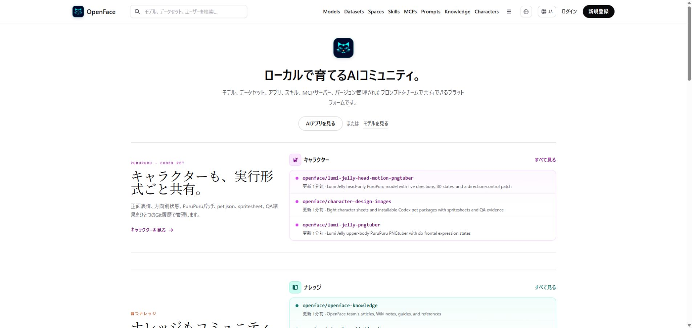
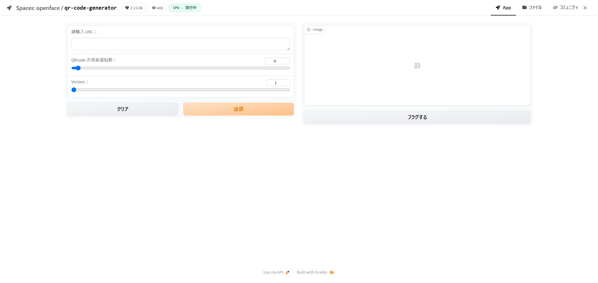

# Proxmox LXC deployment

The verified deployment uses a dedicated, privileged Ubuntu 24.04 LXC. OpenFace
still runs as one Docker Compose project inside the container, while Proxmox
provides resource limits, snapshots, and host boot integration.

## Verified profile

| Setting | Value |
|---|---|
| LXC ID / hostname | `101` / `openface` |
| CPU / memory / swap | 6 cores / 8 GiB / 4 GiB |
| Root disk | 80 GiB on `local-lvm` |
| Network | `vmbr0`, DHCP |
| Container mode | privileged |
| Features | `nesting=1,keyctl=1` |
| Boot | `onboot=1` |

OpenFace Spaces build and start sibling Docker containers, so nested Docker must
work. Add these lines to `/etc/pve/lxc/<VMID>.conf` and restart the LXC:

```ini
features: nesting=1,keyctl=1
lxc.apparmor.profile: unconfined
lxc.cgroup2.devices.allow: a
lxc.cap.drop:
```

This relaxes isolation for this LXC. Treat it as a trusted application host and
do not allow untrusted users to publish runnable Space Dockerfiles.

## Install the runtime

Run inside the LXC:

```bash
apt-get update
apt-get install -y ca-certificates curl git openssh-server rsync
curl -fsSL https://get.docker.com | sh
systemctl enable --now docker ssh
docker run --rm alpine echo nested-docker-ok
```

Clone and configure OpenFace:

```bash
git clone https://github.com/Sunwood-ai-labs/OpenFace.git /opt/openface
cd /opt/openface
cp .env.example .env
sed -i 's|^PUBLIC_BASE_URL=.*|PUBLIC_BASE_URL=https://<LXC-IP>:8443|' .env
docker compose up -d --build
```

Open `https://<LXC-IP>:8443` or use
`http://<LXC-IP>:8090` for local webviews that reject self-signed certificates.

## PostgreSQL persistence

Compose starts one PostgreSQL 17 service with three databases:

| Database | Owner |
|---|---|
| `forgejo` | Forgejo repositories, users, issues, PRs, and Actions metadata |
| `openface_metrics` | browser views, agent views, likes, and agent identities |
| `openface_maintenance` | webhook delivery and maintenance job state |

Repository files, LFS objects, tokens, agent credentials, and runner registration
remain in named Docker volumes. Back up both PostgreSQL and those volumes.

```bash
docker exec openface-postgres pg_dump -U openface -Fc forgejo \
  -f /tmp/forgejo.dump
docker exec openface-postgres pg_dump -U openface -Fc openface_metrics \
  -f /tmp/openface_metrics.dump
docker exec openface-postgres pg_dump -U openface -Fc openface_maintenance \
  -f /tmp/openface_maintenance.dump
```

The repository includes `scripts/restore_lxc_deployment.sh` for restoring the
three dumps and the named-volume archives into a prepared checkout. Secrets stay
in `.env` and the selected Z.AI environment file; never commit either file.

## Verified result

The migration preserved 105 repositories, 53 issues, 280 repository-view rows,
and 25 maintenance jobs. The QR Code Generator Space was built inside the LXC,
served through the gateway, and remained `running` after a full LXC restart.

| LAN home | Running Docker Space |
|---|---|
|  |  |

