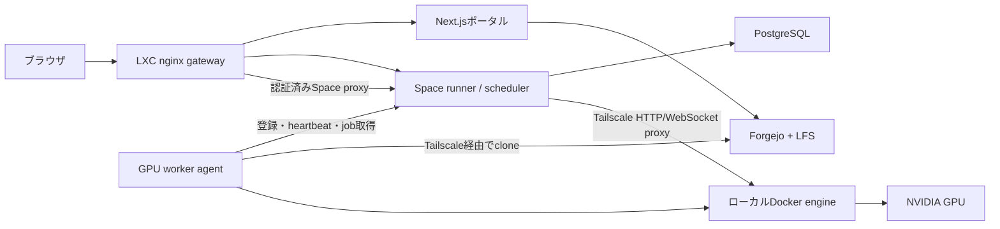
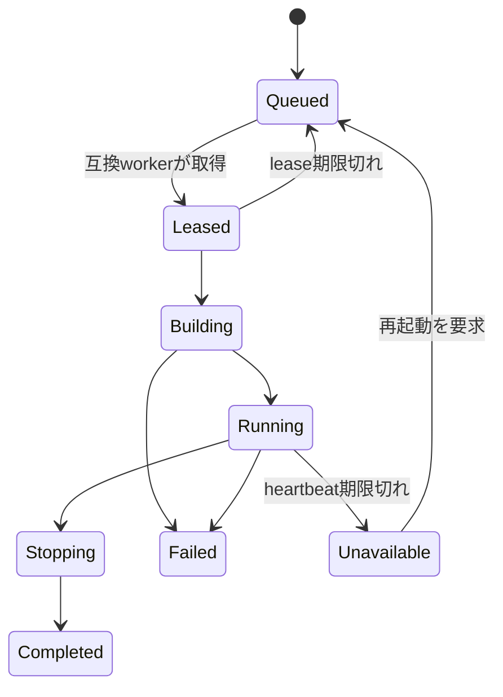

# リモートGPUワーカー

この文書は、OpenFaceの管理本体をProxmox LXCから移動せず、ローカルマシンの
GPUを利用する実装構成と運用手順を記録します。

> [!TIP]
> pull型worker protocol、PostgreSQL永続化、capability scheduler、lease、
> HTTP／WebSocket runtime proxy、独立Docker Composeは実装済みです。
> `OPENFACE_GPU_WORKERS_ENABLED=false`が既定なので、既存CPU Spaceの配置は
> 明示的に有効化するまで変わりません。

## 実装状況

| 項目 | 状態 |
|---|---|
| worker enrollmentと失効可能なcredential | 実装済み |
| heartbeat、GPU capability、VRAM条件 | 実装済み |
| FIFO claim、短期lease、期限切れ回収 | 実装済み |
| commit SHA固定のclone、Docker build、GPU run | 実装済み |
| 認証付きHTTP／WebSocket runtime gateway | 実装済み |
| stop要求とcontainer cleanup | 実装済み |
| 複数worker／workerごとの同時実行上限 | 実装済み |
| 管理画面でのworker drain／revoke | 未実装（API・DB拡張予定） |
| VRAMの動的予約 | 未実装（現在はclaim時の空きVRAM判定） |

実装は`spaces-runner/gpu_control.py`、`gpu-worker/worker.py`、
`docker-compose.gpu-worker.yml`に分離されています。

## 目的

- Forgejo、PostgreSQL、ポータル、認証、スケジュール状態をLXCに残す。
- 選択したSpace、推論、ベンチマークを1台以上の信頼できるGPUマシンで実行する。
- 接続には既存のTailscaleを使う。
- 現在の`/run/{owner}/{repo}/` URLとOpenFaceの権限確認を維持する。
- GPUマシンが停止しても、リポジトリや永続状態を失わない。
- 後からGPUマシンを追加しても、管理本体を再設計しなくてよい構成にする。

初期版では、不特定ユーザー向けの強固なマルチテナント隔離、クラウド横断の
自動配置、分散学習、実行中コンテナのワーカー間移動は対象外です。

## 目標アーキテクチャ



LXCを**コントロールプレーン**、GPUマシンを**一時的な実行ノード**として扱います。
ワーカー側からOpenFaceへ接続してjobを取得し、LXCからワーカーのDocker socketを
直接操作しません。

## 責務の分離

| コンポーネント | 役割 |
|---|---|
| LXC `gateway` | 公開URL、TLS、認証入口、HTTP/WebSocket中継 |
| LXC `frontend` | カタログ、ワーカー状態、実行状態、操作UI |
| LXC `spaces-runner` | スケジュール、認可、ワーカー登録、job状態、経路選択 |
| LXC Forgejo/LFS | ソース、revision、大きな永続成果物、Issue、権限 |
| LXC PostgreSQL | ワーカー、heartbeat、lease、job、runtime経路、監査イベント |
| GPU worker | capability報告、job取得、clone/build/run、log、cleanup |
| GPU Docker engine | Spaceコンテナ、image layer、破棄可能なbuild cache |

永続成果物はForgejo/LFSまたはLXC管理のストレージへ戻します。ワーカー上の
checkout、image、cacheは再生成でき、削除可能でなければなりません。

## ネットワークとセキュリティ

LXCとワーカーの通信には既存のTailscale tailnetを使います。Docker daemon、
Docker socket、PostgreSQL、認証のないワーカーポートをLANやtailnetへ公開しません。

推奨するのはpull型のプロトコルです。

1. 管理者が一度だけ使えるワーカー登録tokenを発行する。
2. ワーカーが登録tokenを失効可能なワーカーcredentialへ交換する。
3. 安定したworker IDとGPU capabilityを登録する。
4. heartbeatを送り、実行可能なjobを問い合わせる。
5. schedulerが1件のjobと短いleaseを返す。
6. build、runtime、health、完了状態をワーカーが報告する。

ワーカーcredentialはworker APIだけに限定し、Git外で管理し、可能なものはhash化して
保存します。個別に失効できる必要があります。runtime proxyも既存のForgejo権限確認を
必ず通します。

## capabilityとスケジュール

heartbeatでは次を報告します。

- worker IDと表示名
- OSとarchitecture
- Dockerの利用可否とversion
- GPU vendor、model、台数、合計／空きVRAM
- driverとCUDA runtimeの互換性
- 実行中job、同時実行上限、空きdisk
- `nvidia`、`cuda`、`cpu`などの対応feature

`gpu`、`cuda`、`vram-12gb`、`local-gpu`のようなrepository topicは検索と分類に
利用します。実際の配置要件と管理者overrideは、自由度を損なう固定schemaではなく
OpenFaceのdatabaseで管理します。初期schedulerは次の順で判定します。

1. 管理者が指定した実行先
2. `gpu`または`cpu` topic
3. 最低VRAM
4. onlineかつ空き容量のある互換worker
5. 同条件ならFIFO

CPU Spaceは従来どおりLXCを既定にします。互換GPUワーカーがない場合はCPUへ
黙ってfallbackせず、待機状態にします。

## job lifecycle



各遷移にはworker、repository revision、image ID、時刻、理由を記録します。
heartbeatが途絶えたruntimeはUnavailableに変更し、停止中のSpaceをRunningと表示しません。

## ワーカーAPI案

全endpointをprivate、認証必須、version付き、rate limit付きにします。

| endpoint | 目的 |
|---|---|
| `POST /api/v1/workers/enroll` | 一度限りのtokenをworker credentialへ交換 |
| `POST /api/v1/workers/register` | identityと初期capabilityを登録 |
| `POST /api/v1/workers/{id}/heartbeat` | 生存、resource、実行jobを更新 |
| `POST /api/v1/workers/{id}/jobs/claim` | 互換jobを1件lease付きで取得 |
| `POST /api/v1/workers/{id}/jobs/{job}/events` | build、health、log、完了状態を報告 |
| `POST /api/v1/workers/{id}/jobs/{job}/lease` | 実行中jobのleaseを延長 |
| `DELETE /api/v1/workers/{id}` | workerを失効して新規job取得を停止 |

ワーカーは上限付きのlog chunkを送信し、LXCへ任意のfilesystem accessを与えません。
APIにはidempotency keyを付け、通信再試行でcontainerが重複起動しないようにします。

## ローカルGPUホスト

WindowsのGPUマシンでは、WSL2のGPU対応Docker、またはNVIDIA Container Toolkitを
導入したLinuxを推奨します。登録前にGPUを確認します。

```powershell
docker run --rm --gpus all nvidia/cuda:12.6.3-base-ubuntu24.04 nvidia-smi
```

`docker-compose.gpu-worker.yml`はLXC本体のComposeから分離されています。

```yaml
services:
  gpu-worker:
    build: ./gpu-worker
    restart: unless-stopped
    environment:
      OPENFACE_URL: https://openface-lxc.tail8be30.ts.net
      WORKER_NAME: local-gpu-01
      WORKER_TOKEN_FILE: /run/secrets/openface-worker-token
      MAX_GPU_JOBS: "1"
    volumes:
      - /var/run/docker.sock:/var/run/docker.sock
      - gpu-worker-cache:/data
      - ./secrets:/run/secrets:ro

volumes:
  gpu-worker-cache:
```

個々のSpaceではなく、ワーカーが検証済みcontainerを起動するときにGPU deviceを
割り当てます。VRAM管理とcancelを負荷環境で確認するまでは同時GPU jobを1件にします。

## セットアップ

### 1. GPUホストを確認

```powershell
nvidia-smi
docker run --rm --gpus all nvidia/cuda:12.6.3-base-ubuntu24.04 nvidia-smi
```

### 2. コントロールプレーンを有効化

LXCの`.env`へ追加し、runnerを再構築します。

```dotenv
OPENFACE_GPU_WORKERS_ENABLED=true
OPENFACE_GPU_WORKER_LEASE_SECONDS=90
OPENFACE_GPU_WORKER_STALE_SECONDS=120
```

```bash
docker compose up -d --build spaces-runner gateway
```

### 3. 一度限りのenrollment tokenを発行

tokenをブラウザへ露出しないよう、LXC上で発行します。

```bash
docker compose exec -T spaces-runner python -c \
  "import gpu_control; print(gpu_control.issue_enrollment_token('local-gpu-01')['token'])"
```

GPUホストに`secrets/openface-worker-enrollment-token`として保存します。tokenは
enrollment成功時に消費され、永続credentialはworker volumeへ保存されます。

### 4. GPU workerを起動

```powershell
Copy-Item gpu-worker/.env.example gpu-worker/.env
docker compose --env-file gpu-worker/.env `
  -f docker-compose.gpu-worker.yml up -d --build
```

`OPENFACE_URL`にはLXCへ到達できるTailscale URL、`WORKER_PUBLIC_URL`にはLXCから
到達できるworkerのtailnet URLを指定します。`GPU_WORKER_BIND_ADDRESS`はworker PCの
Tailscale IPv4に限定します。

### 5. SpaceをGPUへ配置

対象repositoryへ`space`と`gpu` topicを付けます。必要に応じて`nvidia`、`cuda`、
`vram-12gb`のようなtopicを加えます。OpenFaceの通常のStart操作でGPU jobがqueuedに
なり、互換workerがclaimします。ブラウザURLは従来どおり
`/run/{owner}/{repo}/`です。

## 対話型Spaceの中継

ブラウザは従来どおり`/run/{owner}/{repo}/`へ接続します。LXC runnerが実行先を
参照します。

- LXC runtime：既存のローカルcontainerへproxy
- GPU runtime：workerのtailnet endpointへHTTP/WebSocketをproxy
- offlineまたは期限切れ：明示的なUnavailable／再起動状態を表示

leaseされたOpenFace jobが作成したportだけを中継します。経路情報には短い有効期限を
設け、job停止時に削除します。

## 導入計画と現在地

### Phase 0 — ホスト準備

- GPUマシンからLXCへTailscaleで到達できることを確認する。
- Docker container内で`nvidia-smi`を確認する。
- GPU、VRAM、driver、CUDA、storage、想定稼働時間を記録する。
- 機密性のないGPU SpaceをE2E fixtureとして1本選ぶ。

**状態：完了。** `gpu-worker/fixtures/gpu-diagnostic`を追加し、実GPUで検証済みです。

### Phase 1 — コントロールプレーン

- worker、capability、heartbeat、job、lease、audit tableを追加する。
- token登録と認証付きworker endpointを追加する。
- 現在のCPU配置を変えず、worker状態画面を追加する。
- stale heartbeat cleanupとidempotency testを追加する。

**状態：実装済み。** worker、job、event、leaseは`openface_metrics` databaseへ
起動時migrationされます。

### Phase 2 — pull型ワーカー1台

- 独立した`gpu-worker` serviceとCompose例を追加する。
- claim、clone、build、GPU run、health、log、stop、cleanupを実装する。
- Forgejoの正確なcommit SHAへjobを固定する。
- restart、cancel、build失敗、worker切断を検証する。

**状態：実装済み。** credentialとruntime routeはworker volumeに保存され、
再起動時に実行中containerを再採用します。

### Phase 3 — 対話型proxy

- 既存LXC gateway経由で`/run/`のHTTPとWebSocketを中継する。
- sessionとrepository権限確認を維持する。
- Queued、Building、Running、Offline、Failedをポータルに表示する。
- CPUまたは特定workerを選べる管理者overrideを追加する。

**状態：一部完了。** HTTP／WebSocket中継と状態APIは実装済みです。管理画面からの
worker固定overrideは今後追加します。

### Phase 4 — 複数workerと運用

- capability選択、同時実行上限、VRAM予約を追加する。
- workerのdrain、disable、revokeを追加する。
- queue時間、build時間、runtime health、失敗、GPU使用率を記録する。
- backup、token rotation、upgrade、incident手順を文書化する。

**状態：基盤実装済み、運用UIは未完了。** 複数worker、上限、失効可能credential、
監査eventは利用できます。

## 検証

GPUを必要としないprotocol E2E：

```powershell
powershell -ExecutionPolicy Bypass -File scripts/test-gpu-worker-e2e.ps1
```

NVIDIA GPUを実際にSpace containerへ渡すE2E：

```powershell
powershell -ExecutionPolicy Bypass -File scripts/test-gpu-worker-nvidia-e2e.ps1
```

2026-07-24の実機検証では、worker登録、2 GPU検出、単一deviceのclaim、build、
runtime proxy、stop、cleanupが完走しました。schedulerはjobの空きVRAM要件を
満たすGPUを1基だけ選び、Space container内からは割り当てresourceだけを確認しました。

- NVIDIA GeForce RTX 4090 — 24,564 MiB
- runtime response：`openface-remote-gpu`


## 完了条件

最初のproduction-ready版は次を満たした時点で完了です。

- 既存CPU Spaceの動作が変わらない。
- GPU SpaceがローカルGPUマシンでbuild・実行され、通常のOpenFace URLで表示できる。
- start、stop、files、runtime accessをForgejo権限で保護できる。
- GPU containerから割り当てたGPU resourceだけが見える。
- worker停止後、heartbeat期限内にSpaceがUnavailableへ変わる。
- 再接続でcontainerやjobが重複しない。
- LXC再起動とworker再起動から予測可能に復旧する。
- Docker API、database port、再利用可能な平文登録tokenを公開しない。
- logとauditからrepository SHAとworkerを特定できる。
- PC／モバイルのruntime状態をスクリーンショットと操作テストで確認する。

## rollback

worker機能はserver-side feature flagで無効化できるようにします。無効化時は新規remote
claimを止め、remote runtimeをUnavailableへ変更し、現在のLXC-only配置へ戻します。
workerを削除してもForgejo repository、LFS object、metrics、job auditを削除しません。
