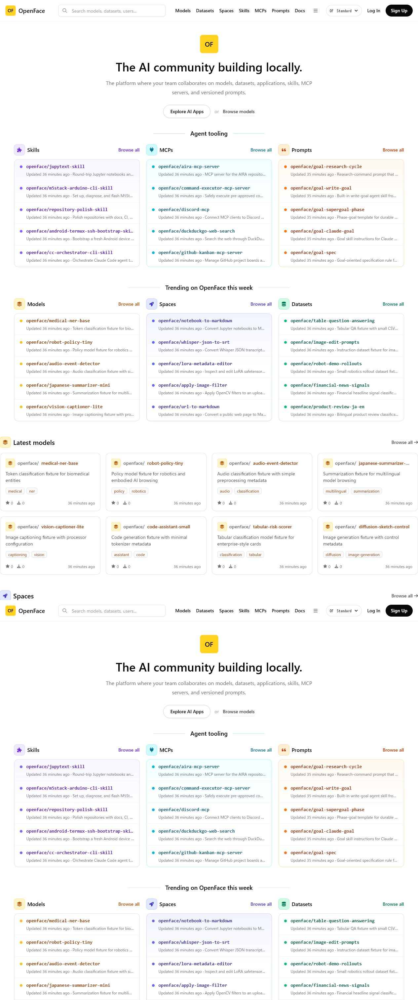
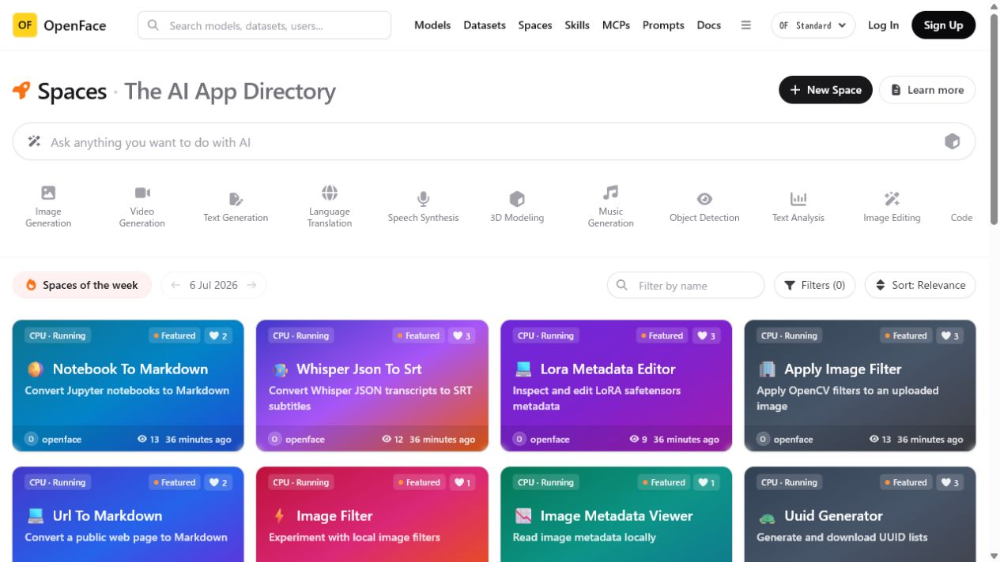
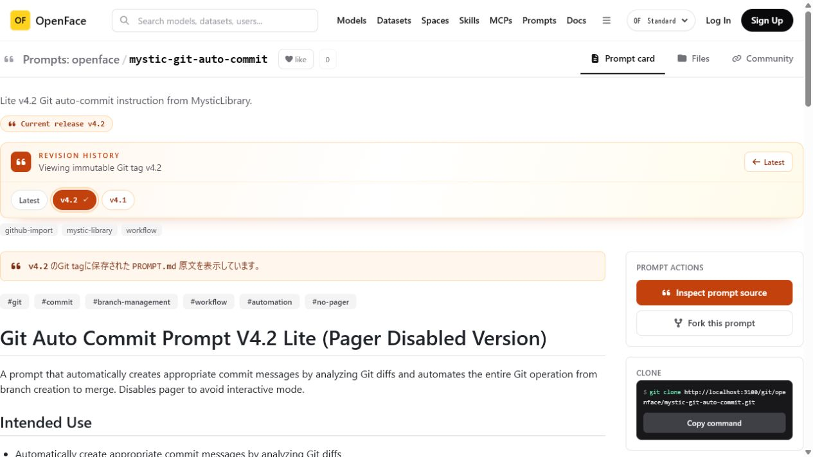
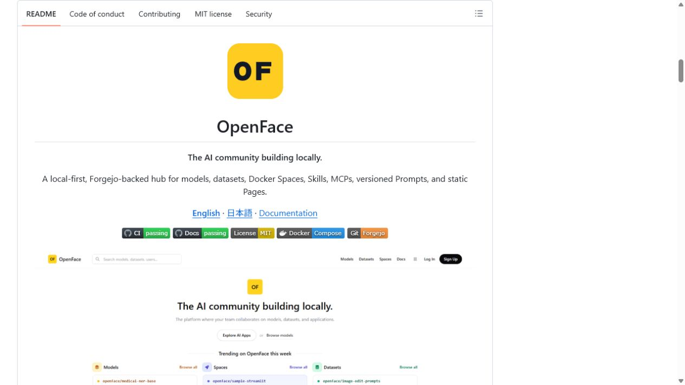

# Repository polish verification

Verified: 2026-07-17

This record captures the final public-repository and browser checks performed for the `repository-polish` `完全整備` pass.

## Skill installation

- Source: `Sunwood-ai-labs/repository-polish-skill`
- Verified Git commit: `89e98c167fb3d9475763311b562e15bfc62e8970`
- Installed path: `C:\Users\makim\.codex\skills\repository-polish`
- Result: all 34 installed files matched a fresh official-installer download by SHA-256.

## OpenFace runtime after the framework upgrade

The Compose frontend was rebuilt as a Docker image, recreated, and verified through the gateway. A temporary HTTP-only QA container using the same built image and internal services was used for browser screenshots because a new automated browser tab does not trust the gateway's self-signed development certificate.

| Home | Spaces directory |
|---|---|
|  |  |

The home exposed the expected Models, Datasets, Spaces, Skills, MCPs, and Prompts navigation without horizontal overflow. The Spaces directory rendered 24 cards, with visible `CPU · Running` status labels and persisted view/like counts.

### Immutable Prompt revision

The URL `?revision=v4.2` rendered the `v4.2` release badge, selected revision history button, immutable-tag message, and V4.2 prompt content without horizontal overflow.

## Published GitHub Pages documentation

| English | 日本語 |
|---|---|
|  |  |

Verified routes:

- `https://sunwood-ai-labs.github.io/OpenFace/`
- `https://sunwood-ai-labs.github.io/OpenFace/ja/`
- English to Japanese: `/OpenFace/ja/`
- Japanese to English: `/OpenFace/`
- no horizontal page overflow at the tested desktop viewport

## GitHub repository landing page

The public GitHub view rendered the OpenFace identity, English/Japanese/Docs links, passing CI and Docs badges, license badges, and the primary product screenshot. The repository sidebar also displayed the Docs homepage, topics, MIT license, conduct, contribution, and security links.

## Mechanical and remote checks

- `docker compose config --quiet`
- frontend `npm ci`, TypeScript check, Next.js production build, and Docker image build
- documentation `npm ci` and VitePress production build
- Python `compileall` for `spaces-runner`
- GitHub CI on `main`
- GitHub Pages build and deployment
- GitHub Community Profile: 100%
- staged payload inspection before every repository-polish commit
- public repository description, homepage, topics, MIT license, and governance files

The high-severity production dependency audit passes. npm currently reports two moderate PostCSS advisories inherited from the latest stable Next.js 16.2.10; its automatic forced fix would downgrade Next.js to 9.3.3. This incompatible downgrade was not applied, and compatible updates remain monitored by Dependabot.

See [qa-inventory.md](qa-inventory.md) for the claim-to-evidence map used during signoff.
